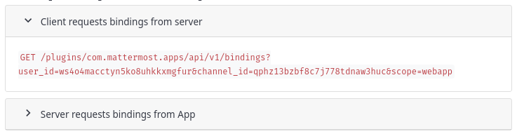
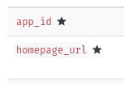
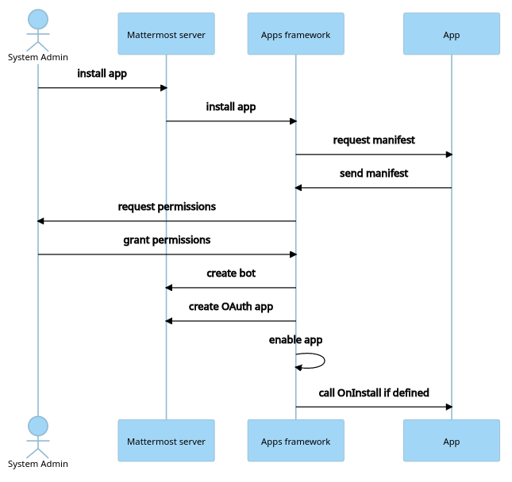
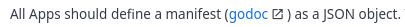
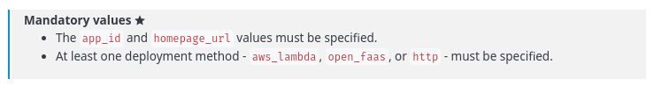

# Mattermost developer documentation [](https://circleci.com/gh/mattermost/mattermost-developer-documentation/tree/master)

Website for Mattermost developer documentation, built using [Hugo](https://gohugo.io/). The `master` branch is continuously deployed to [developers.mattermost.com](https://developers.mattermost.com/).

## Contribute

### Prerequisites

- Golang v1.18+ [(_download_)](https://go.dev/dl)
- NodeJS v14+ [(_download_)](https://nodejs.org/en/download/)
- cURL [(_download_)](https://curl.se/download.html)
  - (_optional_) Used to update Compass Icons

### Set up your environment

1. Follow the [Hugo documentation](https://gohugo.io/getting-started/installing/) to install Hugo. This repo uses Hugo v0.101.0 to build the docs.

    ```shell
    # For example, on macOS:
    brew install hugo
    
    # Snapcraft on Linux:
    snap install hugo
   
    # or using golang directly:
    go install github.com/gohugoio/hugo@v0.101.0
    ```

2. Fork the repository and clone the fork to your machine. Change directories to the cloned repo when it has finished.

    ```shell
    git clone git@github.com:<yourgithubname>/mattermost-developer-documentation.git
    cd mattermost-developer-documentation
    ```

3. Generate JSON plugin docs; this must be done at least once.

    ```shell
    make plugin-data
    ```

4. Start the Hugo development server.

    ```shell
    make run
    ```

5. Open [http://localhost:1313](http://localhost:1313) in a new browser tab to see the docs

You're all set! You can start making changes as desired; the development server will automatically re-render affected docs pages.

**Note:** Before pushing changes to your fork, run a full build of the docs using `make dist` to make sure there are no build errors. 

## Best practices

- The Mattermost developer documentation uses several custom Hugo [shortcodes](https://gohugo.io/content-management/shortcodes/) to control its presentation. Shortcodes are preferred over using raw HTML and should be used where possible.
- Links that navigate away from `developers.mattermost.com` should use the [newtabref shortcode](#open-links-in-a-new-tab).

### Hugo shortcodes

#### Collapse

The `collapse` shortcode creates a collapsible text box.

```gotemplate

`GET /plugins/com.mattermost.apps/api/v1/bindings?user_id=ws4o4macctyn5ko8uhkkxmgfur&channel_id=qphz13bzbf8c7j778tdnaw3huc&scope=webapp`

```



Note that the `id` attribute of the shortcode must be unique on the page.

#### Compass icon

The `compass-icon` shortcode displays an icon from the [Compass Icon](https://mattermost.github.io/compass-icons/) set. The shortcode takes 2 arguments: the ID of the icon and an optional icon description which is used as alt text.

```gotemplate

```



#### Mermaid

The `mermaid` shortcode allows embedding [Mermaid](https://mermaid-js.github.io/mermaid/#/) diagram syntax into the page.
Each page that uses a Mermaid diagram must also have a `mermaid: true` property set in the page's frontmatter.

```gotemplate

sequenceDiagram
    actor System Admin
    System Admin->>Mattermost server: install app
    Mattermost server->>Apps framework: install app
    Apps framework->>App: request manifest
    App->>Apps framework: send manifest
    Apps framework->>System Admin: request permissions
    System Admin->>Apps framework: grant permissions
    Apps framework->>Mattermost server: create bot
    Apps framework->>Mattermost server: create OAuth app
    Apps framework->>Apps framework: enable app
    Apps framework->>App: call OnInstall if defined

```



#### Open links in a new tab

The `newtabref` shortcode creates a link that opens in a new browser tab. The link text is followed by a Compass Icon which indicates the link will open in a new tab.

```gotemplate
All Apps should define a manifest () as a JSON object.
```



#### Note

The `note` shortcode displays a styled message box suitable for a note. The shortcode accepts 3 arguments: the title of the node, an optional Compass Icon ID, and an optional description for the Compass Icon.

```gotemplate
 
- The `app_id` and `homepage_url` values must be specified.
- At least one deployment method - `aws_lambda`, `open_faas`, or `http` - must be specified.

```



#### Tabbed content

A combination of the `tabs` and `tab` shortcodes create a section of tabbed content.
The `tabs` shortcode defines the list of available tabs in the tab "selection bar", each with a unique ID and name.
The `tab` shortcode defines the content for an individual tab.

Example of using tabbed content shortcodes: 

```gotemplate


- Content for tab #1


- Content for tab #2

```

##### `tabs` shortcode

The `tabs` shortcode creates the top portion of tabbed content: a list of available tabs, each with a click handler.

The general format of the shortcode is:

```gotemplate

```

To ensure tabs in one group don't affect another group, a unique `tab_group_name` is required.
The available tabs in the group are defined in a single string of the format:

`tab1_id,tab1_name;tab2_id,tab2_name;...`

The following example defines a group of two tabs named `Android` and `iOS`:

```gotemplate

```

The `initial_tab_id` specifies the ID of the tab that should be active when the page loads.

##### `tab` shortcode

The `tab` shortcode defines a section of content for a specific tab.

The general format of the shortcode is:

```gotemplate

...tab content defined here...

```

The `tab_id` must correspond to a tab ID defined in a `tabs` shortcode.
The `initial_tab_style` is used to display the initial active tab's content by specifying a value of `display: block;`.

The following example defines content for two tabs with IDs `tab1_id` and `tab2_id`:

```gotemplate

- Content for tab #1


- Content for tab #2

```

##### Limitations of tabbed content

Due to the implementation of the `tab` shortcode, there are some limitations on what information can be rendered:

- `note` shortcodes cannot contain bulleted lists
