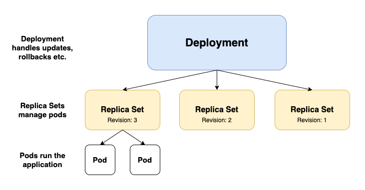

# Migrating thousands of Mattermost installations to new Kubernetes Custom Resources

More than a year after the release of Mattermost Operator 1.0 with `ClusterInstallation` Custom Resources (CRs) in version `v1alpha1`, with many lessons learned in the process we decided it is time to migrate CRs to the new `v1beta1` version.

This blog post mentions some challenges we have encountered during the migration and describes how we solved them.


## Objectives

As part of [Mattermost Cloud offering](https://mattermost.com/mattermost-cloud/), we have thousands of Mattermost instances running in our Kubernetes clusters and each of them is represented as a Custom Resource managed by the Mattermost Operator.

Mattermost Operator is also one of [the encouraged ways of installing Mattermost](https://docs.mattermost.com/guides/administrator.html#installing-mattermost) for non-cloud customers.

Those facts put some constraints on our migration story and we boiled them down to the following:
- No downtime of Mattermost instance during the migration.
- As little manual intervention as possible.
- Ability to run the migration for several installations at the same time.


## Changing the Custom Resource

After using Mattermost Operator for quite some time, we have learned some lessons and decided to simplify some things.

However, removing some features and adding new ones was not the biggest change in the migration process.

Our initial CRs representing Mattermost installations were called `ClusterInstallation`, which made sense from the domain perspective of Mattermost Cloud but did not really follow good practices of the Kubernetes ecosystem.
For a `v1beta1` specification we decided to change the whole CR to simply `Mattermost`.


## Migration challenges

### Changing resource Kind

The usual way of migrating CRs to the new version is by using [Conversion Webhooks](https://kubernetes.io/docs/tasks/extend-kubernetes/custom-resources/custom-resource-definition-versioning/#webhook-conversion) which give the ability to convert the CR specification "on the fly" by creating a webhook used by the API Server. This mechanism allows users to operate on several versions of resource while only one version is stored in etcd database.

Conversion webhooks however are designed to handle the migration from one version to another but the Custom Resource name and group cannot change it this process as those are the identifying properties of Custom Resource Definition (CRD). 

Unfortunately, this did not apply to our case as in addition to the change of version, we also changed both resource Group and Kind, effectively creating a whole new CR - `Mattermost`.


#### Migrating to the new resource

When the `ClusterInstallation` CR is created, the Mattermost Operator spins up a new instance of the application. This includes Kubernetes Deployments which are running the actual Mattermost application. When the CR is deleted all the resources are deleted together with it thanks to [Owner References](https://kubernetes.io/docs/concepts/workloads/controllers/garbage-collection/#owners-and-dependents).

This prevents us from simply running the script that would delete `ClusterInstallation` and create `Mattermost` in its place as it would cause the downtime of the Mattermost application (unless we chose to orphan all resources).

To "exchange" the existing resources between different CRs as well as support both resources for some time, we decided to run two [Controllers](https://kubernetes.io/docs/concepts/architecture/controller/) as part of Mattermost Operator and make them perform the desired migration. As we wanted to retain some control over Mattermost instances that are being migrated we decided to introduce a new field to the `ClusterInstallation` Spec that would be a signal for the Operator to start the migration.

```yaml
apiVersion: mattermost.com/v1alpha1
kind: ClusterInstallation
metadata:
  name: my-mattermost
spec:
  ...
  migrate: "true"  # New field added to ClusterInstallation. Setting it to 'true' instructs the controller to start the migration.
```

This way we can perform the migration in the following way:
- When the controller for `ClusterInstallation` sees that the `spec.migrate` is set to `true`, it stops regular reconciliation of the CR and starts the migration by converting the old resource to the new one.
- Immediately after the `Mattermost` resource is created, the controller for `Mattermost` sees it and starts to adjust existing resources like Services and Deployments to the new CR, making small changes and overriding owner references.
- When we are sure that the controller for `Mattermost` successfully finished its work and Mattermost Pods are ready to serve traffic, the old `ClusterInstallation` is deleted, and voila!
- As in the second phase the controller was just checking new Pods health, it could just do it once and requeue the resource for latter reconciliation while starting the migration for the next one.

The migration process has another advantage, that is if anything goes wrong it can be easily reverted just by setting `spec.migrate` back to `false` and removing the newly created `Mattermost` CR. The controller for `ClusterInstallation` will then claim the resources back and continue to monitor them.


### Dealing with immutable fields

"Exchanging" the Kubernetes resources ownership between two Custom Resources worked fine in most cases but not for all of them.

Old Mattermost Deployments created by the Operator used the following `spec.selector`:
```yaml
apiVersion: apps/v1
kind: Deployment
...
spec:
  selector:
    matchLabels:
      app: mattermost
      v1alpha1.mattermost.com/installation: my-mattermost
      v1alpha1.mattermost.com/resource: my-mattermost
...
```

It is understandable that when we set out to migrate to version `v1beta` we wanted to get rid of `v1alpha1` from everywhere and change it as well.

Kubernetes Deployments have some awesome features like [rolling updates](https://kubernetes.io/docs/tutorials/kubernetes-basics/update/update-intro/) that we use all the time when we change environment variables, versions, or other configuration of our installations. It allows for updating Pods sequentially keeping some of them running while others are being updated.

Unfortunately, the `spec.selector` field is immutable so we could not just update the Deployment. 
We also cannot have two Deployments of the same name in the same namespace and we did not want to change the names of resources created by the Operator.
Simply running the [Client Go](https://github.com/kubernetes/client-go) equivalent of `kubectl delete deployment...` and creating it from scratch was not an option either as it would cause the deletion of all Pods running Mattermost and result in a brief downtime to Mattermost instance managed by the Mattermost Operator and it would violate one of our objectives.

#### Recreating Deployments without downtime

However, we can still delete the Deployment without deleting the Pods by using proper [deletion propagation policy](https://kubernetes.io/docs/concepts/workloads/controllers/garbage-collection/#controlling-how-the-garbage-collector-deletes-dependents) and orphaning them.
In fact, the resources we orphan are not directly Pods but rather [Replica Sets](https://kubernetes.io/docs/concepts/workloads/controllers/replicaset/) that manage Pods on behalf of Deployment.




Although Replica Sets (RS) `spec.selector` field is also immutable and we will have to eventually delete them, Replica Sets names are not as unique as the Deployments are. They contain a random suffix attached after the Deployment name they are connected to, for example: `my-mattermost-8599f77fcb` (the suffix is also a part of Pods name suffix managed by the RS).

```
❯ kubectl get deployments.apps
NAME      READY   UP-TO-DATE   AVAILABLE   AGE
mm-abcd   2/2     2            2           22h

❯ kubectl get replicasets.apps
NAME                 DESIRED   CURRENT   READY   AGE
mm-abcd-6fccc4f76f   0         0         0       22h
mm-abcd-9df98d568    2         2         2       16m

❯ kubectl get pods
NAME                      READY   STATUS    RESTARTS   AGE
mm-abcd-9df98d568-q8z6g   1/1     Running   0          16m
mm-abcd-9df98d568-vdxjx   1/1     Running   0          16m
```

It allows us to recreate Deployment and for a moment simultaneously have Replica Sets for both old Deployment and the new one. As a result, our installations experience no downtime whatsoever.

There are some minor drawbacks to this approach such as that after the migration we lose previous revisions of the Deployment or at some point in time there will be twice as many Pods running for migrating Mattermost installation but none of those was a deal-breaker for us.


## Managing the migration

For thousands of installations running as part of Mattermost Cloud, the migration was almost fully automated and performed by [our managing service](https://github.com/mattermost/mattermost-cloud).

There we already have all building blocks for managing all those Custome Resources for version updates etc. All we had to do was to add some code that would perform the update on `ClusterInstallation` resource (set `spec.migrate` to `true`) and wait for the new `Mattermost` resource to reach the `stable` state while Mattermost Operators perform their magic.

For customers using Mattermost Operator directly in most cases, the migration is as easy as running [one kubectl command](https://github.com/mattermost/mattermost-operator/blob/master/docs/migration.md).


## Summing up

The migration went fairly smooth with some minor bumps along the way but nothing that caused any downtime to customers or any headaches to us.

The `ClusterInstallation` CR will still be supported by the Operator until version `2.0` but new features are not added there. If you manage your Mattermost with Mattermost Operator and still use `ClusterInstallation` check out [this guide on how to migrate](https://github.com/mattermost/mattermost-operator/blob/master/docs/migration.md).
