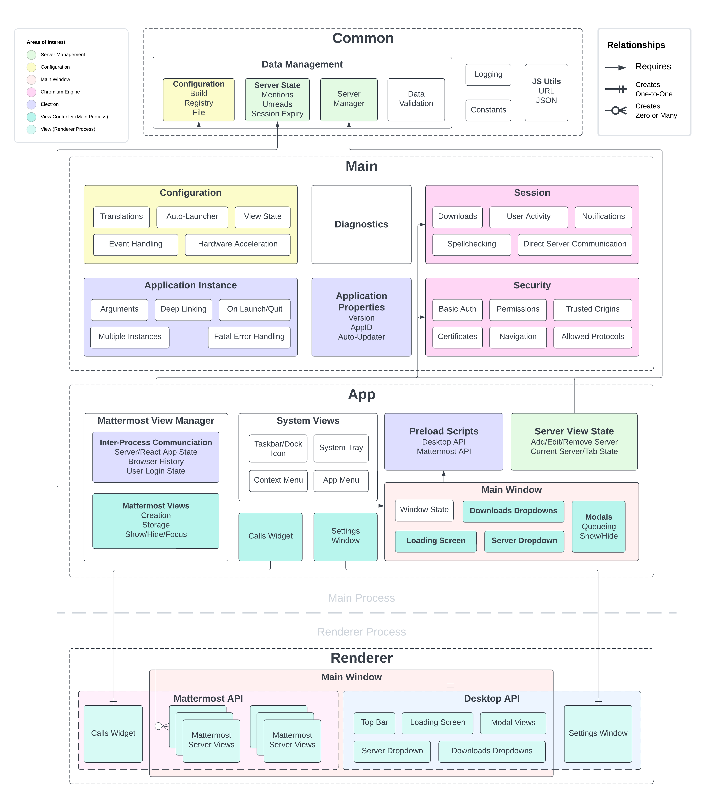

### Overview
The Desktop App is broken down into four primary modules:
- **Common**: Handles the users configuration, data validation and various other self-contained modules and utilities for the application.
- **Main**: The entry-point of the app that sets up the core of the application and handles various systems that the application can use. Also responsible for handing much of the Electron application functionality.
- **App**: Contains the code that creates and manages the user-facing views of the application, and any other modules that pertain to the view state of the application.
- **Renderer**: Holds the front-facing React app and all of the components and styles that are rendered to the screen for the user to interact with.



### Directory structure
The directory structure is broken down into a few pieces to best organize the code:

```
Mattermost Desktop
├── e2e/ - E2E tests
│   ├── modules/ - Setup code for the E2E tests
│   ├── specs/ - E2E tests themselves
│   └── utils/ - E2E test utility functions, mostly for reporting
├── fastlane/ - Contains the Fastfile for publishing the application to the Mac App Store
├── i18n/ - Translation strings
├── resources/ - Assets such as images or sound files that the Desktop App uses
├── scripts/ - Automated scripts used for building or packaging the Desktop App
└── src/ - Application source code
    ├── assets/ - Assets such as images or sound files that the Desktop App uses
    ├── app/ - App module code
    ├── common/ - Common module code
    ├── jest/ - Unit test setup code
    ├── main/ - Main module code
    ├── renderer/ - Renderer module code
    └── types/ - Common types for use between all of the individual modules
```