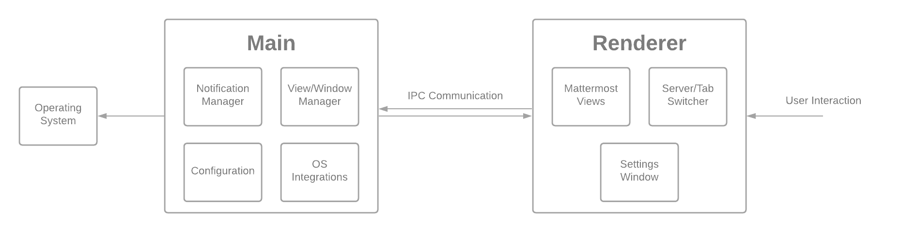

#### Electron
The Desktop App, like all Electron apps, is broken into two pieces: the **main** process and the **renderer** process.

The **main** process is a NodeJS process that has access to operating system functions, and governs the creation and management of several renderer processes.  
- The **renderer** processes are Chromium instances that perform different functions. In our app, each Mattermost server is its own renderer process.



In order to facilitate communication between the two processes, there's a communication layer in which information can be sent between. We expose *ONLY* the communication API to the renderer process so that we don't allow any malicious server to wreak havoc on a user's computer.

You can read more about the Process Model .

#### Directory structure
The directory structure is broken down into a few pieces to best organize the code:

```
Mattermost Desktop
├── docs/ - Documentation for working on the Desktop App
├── e2e/ - E2E tests
│   ├── modules/ - Setup code for the E2E tests
│   └── specs/ - E2E tests themselves
├── resources/ - Assets such as images or sound files that the Desktop App uses
├── scripts/ - Automated scripts used for building or packaging the Desktop App
└── src/ - Application source code
    ├── assets/ - Assets such as images or sound files that the Desktop App uses
    ├── common/ - Common objects and utility functions that aren't specifically tied to Electron
    ├── main/ - The majority of the main process code, including setup for the Electron app
    ├── renderer/ - The web code for all of the main application wrapper, modals. and server dropdown views that are used by the renderer process
    └── types/ - Common types for use between all of the individual modules
```