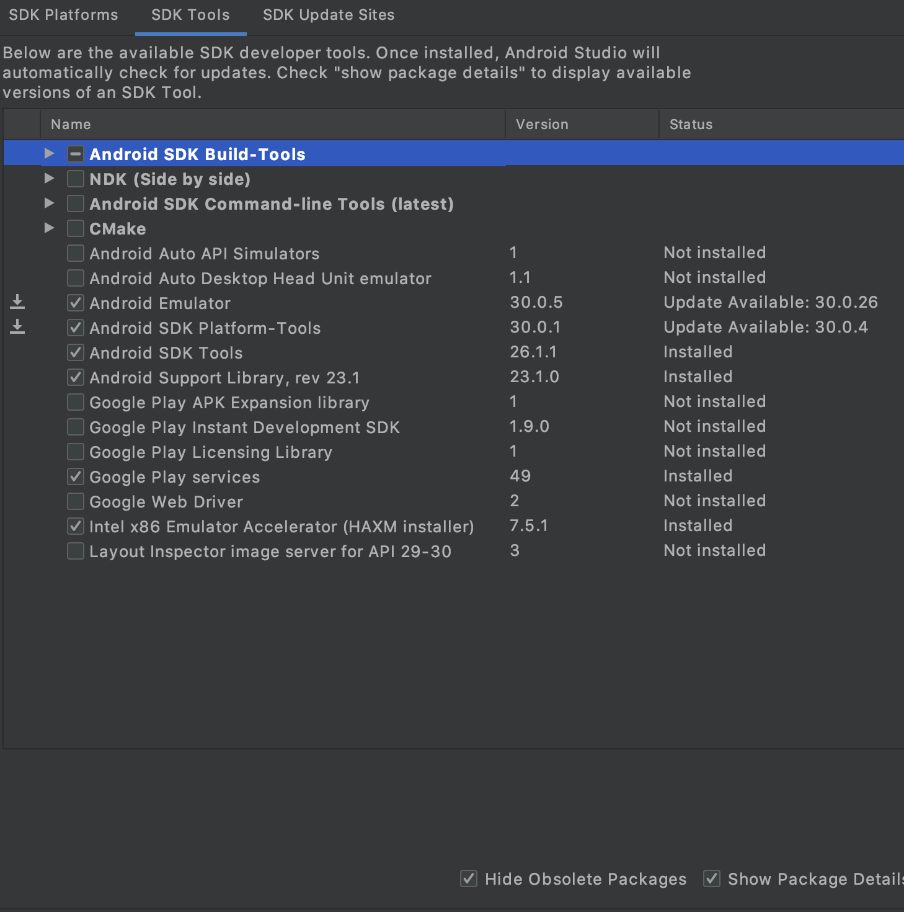
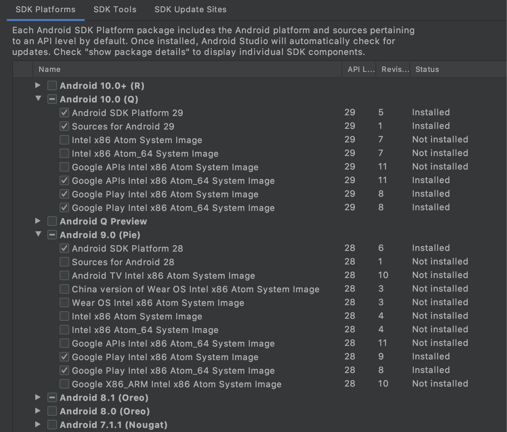

The following instructions apply to the mobile apps for iOS and Android built in React Native.
Download the iOS version  and the Android version .
Source code can be found at the .

If you run into any issues getting your environment set up, check the  section of the product docs for common solutions.


A macOS computer is required to build the Mattermost iOS mobile app.


## Environment setup

The following instructions apply to both iOS and Android mobile apps.
On macOS, we recommend using  as a package manager.

### Install Cygwin (Windows only)

- ?
- Install Cygwin from .
- Make sure to install the `make` and `patch` packages while installing Cygwin.

### Install NodeJS and NPM

We recommend using NodeJS v18 and npm v8. Many of our team use  to manage npm and NodeJS versions.



To install NodeJS using Homebrew, open a terminal and execute:

```sh
brew install node@18
```


There are three available options for installing NodeJS on Linux:

- Install using your distribution's package manager.
- Using NVM by following the instructions .
- Download and install the package from the .

The version of NodeJS that your distribution's package manager supports may not be the recommended version to build Mattermost mobile apps.
Please make sure that NodeJS installed by the package manager is at the recommended version.



There are two available options for installing NodeJS on Windows:
- Download and install the package from the 
- Using 


### Install Watchman

 is a file watching program.
When a file changes, Watchman triggers an action, such as re-running a build command if a source file has changed.

The minimum required version of Watchman is 4.9.0.



To install Watchman using Homebrew, open a terminal and execute:

```sh
brew install watchman
```


Download the latest package from .

Note that you need to increase your `inotify` limits for Watchman to work properly.



Download the latest package from .


### Install `react-native-cli` tools

```sh
npm -g install react-native-cli
```

### Install Ruby



A version of Ruby is automatically installed on macOS.


Install Ruby using your distribution's package manager.


Install Ruby from .


### Install the Ruby `bundler` gem

```sh
gem install bundler --version 2.0.2
```

### Install Git



To install Git using Homebrew, open a terminal and execute:

```sh
brew install git
```


Some distributions come with Git preinstalled but you'll most likely have to install it yourself. For most distributions the package is simply called `git`.


Install git from 


## Additional setup for iOS

Install  to build and run the app on iOS. The minimum required version is 11.0.

### Additional setup for iOS on M1 macs

1. Follow the  docs until the `cocoapods` point, then stop. 
2. Specify the correct version of Xcode in the terminal: `sudo xcode-select --switch /Applications/Xcode.app`
3. In the Rosetta terminal, change to the `mattermost-mobile/ios` directory and run:
   ```sh
   sudo arch -x86_64 gem install ffi
   sudo gem install cocoapods
   arch -x86_64 pod install
   ```
4. If you need to use the Xcode app (e.g., to build, sign, and transfer the app to an iOS device), be sure to start it in Rosetta mode.

## Additional setup for Android

### Download and install Android Studio or Android SDK CLI tools

Download and install the 


This documentation assumes you chose the default path for your Android SDK installation. If you chose a different path, adjust the environment variables below accordingly.


#### Environment variables

Make sure you have the following environment variables configured for your platform:



- Set `ANDROID_HOME` to where Android SDK is located (likely `/Users/<username>/Library/Android/sdk` or `/home/<username>/Android/Sdk`)
- Make sure your `PATH` includes `ANDROID_HOME/tools` and `ANDROID_HOME/platform-tools`


On Mac, this usually requires adding the following lines to your `~/.bash_profile` file:

```sh
export ANDROID_HOME=$HOME/Library/Android/sdk
export PATH=$ANDROID_HOME/emulator:$ANDROID_HOME/platform-tools:$ANDROID_HOME/tools:$PATH
```

Then reload your bash configuration:

```sh
source ~/.bash_profile
```


Depending on the shell you're using, this might need to be put into a different file such as `~/.zshrc`. Adjust this accordingly.



On Linux the home folder is located under `/home/<username>` which results in a slightly different path:

```sh
export ANDROID_HOME=/home/<username>/Android/Sdk
export PATH=$ANDROID_HOME/platform-tools:$PATH
export PATH=$ANDROID_HOME/tools:$PATH
```

Then reload your configuration

```sh
source ~/.bash_profile
```


Depending on the shell you're using, this might need to be put into a different file such as `~/.zshrc`. Adjust this accordingly.



### Install the SDKs and SDK tools

In the SDK Manager using Android Studio or the , ensure the following are installed:

- SDK Tools (you may have to click "Show Package Details" to expand packages):
  - Android SDK Build-Tools 29.0.2
  - Android Emulator
  - Android SDK Platform-Tools
  - Android SDK Tools
  - Google Play services
  - Intel x86 Emulator Accelerator (HAXM installer)
  - Support Repository
    - Android Support Repository
    - Google Repository

  

- SDK Platforms (you may have to click "Show Package Details" to expand packages)
  - Android 7 (Nougat) or above
    - Google APIs
    - SDK Platform
      - For Android Q or above > Android SDK Platform 29 or above
    - Intel or Google Play Intel x86 Atom\_64 System Image
  - Any other API version that you want to test

  


We've dropped Android 5/6 Support since December 2018; you may still continue to use 1.14 for Android 5/6 devices. See the following GitHub issue for more information: 


## Obtain the source code

In order to develop and build the Mattermost mobile apps, you'll need to get a copy of the source code. Forking the `mattermost-mobile` repository will also make it easy to contribute your work back to the project in the future.

1. Fork the  repository on GitHub.

2. Clone your fork locally:

   - Open a terminal
   - Change to a directory you want to hold your local copy
   - Run `git clone https://github.com/<username>/mattermost-mobile.git` if you want to use HTTPS, or `git clone git@github.com:<username>/mattermost-mobile.git` if you want to use SSH

     
`<username>` refers to the username or organization in GitHub that forked the repository
     

3. Change the directory to `mattermost-mobile`.

   ```sh
   cd mattermost-mobile
   ```

4. Install the project dependencies with `npm install`

## Environment troubleshooting

### `PhaseScriptExecution` failure

When building `ios` targets and using `nvm` to manage `node`, you may encounter an error like:

```
The following build commands failed:
    PhaseScriptExecution [CP-User]\ Generate\ Specs /Users/user/Library/Developer/Xcode/DerivedData/Mattermost-ahgfkbexhhzwuycanwlxiauwkxlt/Build/Intermediates.noindex/ArchiveIntermediates/Mattermost/IntermediateBuildFilesPath/Pods.build/Release-iphoneos/FBReactNativeSpec.build/Script-46EB2E0002D370.sh (in target 'FBReactNativeSpec' from project 'Pods')
(1 failure)
[08:00:31]: Exit status: 65
```

Check the following things:

* Ensure you are running the latest version of `nvm` using the .
* Ensure you have set your desired version of node in the file `~/.nvmrc`.  E.g.,
  ```sh
  echo v16.2.0 > ~/.nvmrc
  ```
