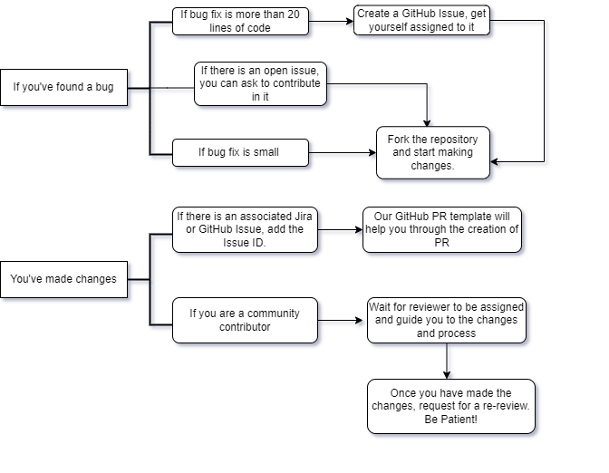
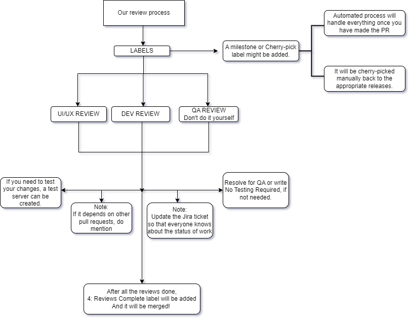
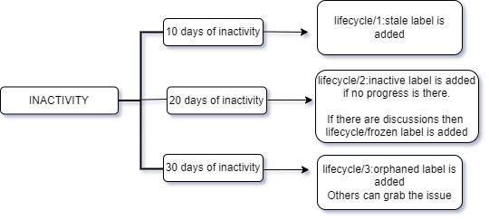

There are many reasons you might be motivated to contribute to Mattermost:

- [You've found a bug](#youve-found-a-bug)
- [You want to help with content](#you-want-to-help-with-content)
- [You want to make something more inclusive or accessible](#you-want-to-make-something-more-inclusive-or-accessible)
- [You have a feature idea](#you-have-a-feature-idea)
- [You're looking to practice your skills or give back to the community](#youre-looking-to-practice-your-skills-or-give-back-to-the-community)
- [You want to help with product translation](#you-want-to-help-with-product-translation)
- [You want to help test new features](#you-want-to-help-test-new-features)

## You’ve found a bug

1. If the bug fix that you’re proposing would be larger than 20 lines of code, .

    - You can speed up the process by asking about the issue in the  [Contributors](https://community.mattermost.com/core/channels/tickets) or  [Developers](https://community.mattermost.com/core/channels/developers) channels on the Mattermost Community Server.

    - [Here’s a good example of a contribution](https://github.com/mattermost/mattermost-mobile/pull/364/commits/7a97451b62fee4022edac4c0395ad0a5cbf1bb66) that is small enough to not need a ticket while still being incredibly helpful.

2. If you’ve volunteered to take the ticket once it's active, or if your fix is too small to warrant the ticket, fork the applicable repository, and start making your changes.

3. Create a PR on the `master` branch of the applicable repository. If there is an associated [Jira](https://mattermost.atlassian.net/issues/?jql=) or GitHub issue, your PR should begin with the issue ID (e.g.  `[MM-394]` or  `[GH-394]`). Our GitHub PR template will walk you through the creation of your PR.

4. If you’re a community contributor, the team at Mattermost will handle most of the review process for you. You can wait for a reviewer to be assigned and for them to review your work.

    - Generally the process works like you’d expect: they’ll make suggestions, you’ll implement them, and together you'll discuss changes in PR comments. If you’re having trouble getting a reviewer to be assigned to your PR, take a look at GitHub’s suggested reviewers and reach out to them in the [Community workspace](http://community.mattermost.com).

5. Here is an overview of how our review process works listed in the order in which things happen. If you’re a core contributor, you can manage the process yourself.

    - **Labels will be added to your PR**, such as  `1: UX Review`,  `2: Dev Review`, and  `3: QA Review`, as applicable. See [the list of labels]() for details.

    - **A milestone or a `cherry-pick` label may be added to your PR**. Many PRs don’t need this step, and will simply ship once merged. However, if there are upcoming milestones, some reviewers are going to prioritize reviews attached to those milestones. Adding a milestone is mandatory for bug fixes that must be cherry-picked.

    - In many cases, you'll know whose code you’re changing and can **assign the appropriate Product Manager, Designer, or Technical Writer to review your PR** from a UI/UX perspective. When in doubt, somebody is better than nobody, as reviewers can always reassign. Once reviewers approve your PR, the `1: UX Review` label will be removed.

    - **Request two core committers to review your PR**  — one with experience solving that particular type of issue or in that particular language, and another with expertise in the domain of your changes. Don’t request the same people over and over again unless they’re the only people with the necessary expertise. Once they give their approval, the `2: Dev Review` label will be removed.

    - **Request a QA tester** from the team that owns the code that you’re changing. They’ll decide the necessary scope of testing. Make sure you’ve defined what the expected results are so they know when their tests are successful. Once they give their approval, the `3: QA Review` label will be removed. The QA tester may add the `QA Review Done` label as well.
     We recommend that you generally avoid doing QA testing yourself, unless it’s obvious that it’s not necessary. The best way to help Mattermost QA is to clearly explain your changes and expected outcomes in the PR.
    

    - Once all outstanding requests are completed, and all involved have approved of the PR, **the `4: Reviews Complete` label will be added** which signals Mattermost core committers to merge the PR into `master`, and delete the old branch. If your pull request depends on other pull requests, note this as a PR comment so that the  `Do Not Merge/Awaiting PR`  label can be added to avoid merging prematurely.

    - If this is a cherry-picked PR, **automated processes should handle everything from here on out**. If the automated cherry-pick fails, the PR will be cherry-picked manually back to the appropriate releases. If the release branches have not been cut yet, labels are left as-is and the PR is cherry-picked once the branch has been cut. The release manager will provide reminders to finish cherry-picks. The  `CherryPick/Done`  label is applied the end of a cherry-pick process.

    - **Update the appropriate Jira ticket** so everybody knows where the project stands. Resolve the ticket for QA from the **Ready for QA** button, and include QA test steps, or note **No Testing Required** if no QA testing is needed.

    - If you need to test your changes on a test server, an [appropriate label]() can be added to the PR. **Request this label as a comment in your PR to create a test server**. After about three to five minutes, a test server is created, and a bot will send a link and credentials in the form of a comment on the PR. The test server is destroyed when the label is removed.

   

6. Once you address suggestions a reviewer has made, re-request a review from them. Their initial review was technically completed, so it’s no longer in a reviewer's queue until you re-request.

   
Give reviewers time — they may have long queues and different schedules. If you’ve been assigned a reviewer but haven’t heard from them in five business days, you can politely bring focus back to your PR by mentioning them in a PR comment.
   

7. Mattermost has a system to categorize the inactivity of contributions. Invalid PRs don’t need to go through this cycle at the Community Coordinator’s discretion.

    - **After ten days of inactivity**: A contribution becomes stale, and a bot will add the  `lifecycle/1:stale` label to the PR. It’s the job of the Community Coordinator to nudge the right people to get a stale PR active again, even if that means clarifying requests so the contributor has more information to work with.

    - **After 20 days of inactivity**: A contribution becomes inactive, and a bot will add the `lifecycle/2:inactive` label to the PR.

        - The Community Coordinator warns everybody involved how much time they have before the contribution is closed and again tries to reach out to the blocking party to help.

        - The Community Coordinator also ensures that it’s not the reviewers taking the PR to this point — contributions should only ever be inactive because of no response from the contributor.

        - When contributions are inactive, but there's a good reason (for example, when the team is actively discussing a major design decision but they haven’t decided on anything yet), `lifecycle/frozen` would be a better label.

        - Inactive contributions are eligible to be picked up by another community member.

    - **After 30 days of inactivity**: A contribution becomes orphaned, the `lifecycle/3:orphaned` label is added to the now-closed PR. The associated `Help Wanted` ticket is given back its `Up For Grabs` status so others can pick up the issue.

   

## You want to help with content

Good product and developer documentation content is as important as good code! If you notice and fix a content error in the documentation, in a repository README, or in another open source article describing Mattermost, we consider you to be as valued a member of our contributor community as those who contribute to core code.

1. If you see a problem with Mattermost [developer](https://developers.mattermost.com/) or  documentation, you have a few options:

    - If you have time to fix the mistake and it only affects a single page, navigate to the applicable page and select **Edit in GitHub** at the top right. You'll be walked through the process of creating a fork so that you can then follow the steps under the section titled [“You’ve found a bug”]() in this guide.

    - If you don’t have time to fix the mistake, copy the file path you’re on, and create a GitHub issue about the problem you found on the applicable repository. Make sure to include the file path and fill out the issue template completely to maximize clarity.

    - If you’re not up for creating a GitHub issue right now, that’s alright too! In the bottom-right corner of every product documentation page is the question “Did you find what you were looking for?” Use this to quickly provide direct feedback about any page you’re viewing.

    - If you want to fix a larger problem that affects multiple pages or the structure of the docs, you should first report it as an issue on the appropriate GitHub repository, and follow the steps under  [“You’ve found a bug”](). The [developer](https://developers.mattermost.com/) and [product](https://docs.mattermost.com/) documentation repositories contain instructions on how to build and modify the sites locally so you can test larger changes more efficiently.

    - Find a list of the Mattermost documentation specific repos on the [Contributor expectations page]() of this guide.

         
        The best place to discuss problems with the writing team is in the  where you can ping our technical writers with the group `@docsteam`.
        

2. If you’d like to contribute to our blog, website, or social media content, you also have a few options:
    
    -  You can get paid to write technical content for developers through the Mattermost .
    - If you see a problem with any webpages, blog posts, or other content on , you can notify us via  on the Mattermost Community Server.

    - If you see a problem with any webpages, blog posts, or other content on [Mattermost.com](https://mattermost.com), you can notify us via [the Content channel](https://community.mattermost.com/core/channels/mattermost-blog) on the Mattermost Community Server.

    - Share your contributor or user experience! Mention us when you promote your work within our community, and we’ll amplify the message through Mattermost social media platforms.

    - Want to lead a social community? We can provide advice and resources to help you in the [Community channel](https://community.mattermost.com/core/channels/community-team) on the Mattermost Community Server.

## You want to make something more inclusive or accessible

Accessibility is one of the most overlooked yet most important features of modern software development, and we’re eager to improve on the accessibility of the features in our open source project and its documentation.

- Problems with the accessibility or the inclusivity of both features in the codebase, as well as problems with pieces of content describing Mattermost, are bugs, so we treat them as such in our development process.

- When you contribute a change that incorporates an adjustment based on the principles of accessibility and inclusivity, please circle back to this guide to back you up in the PR, ticket, or post.

## You have a feature idea

Thank you for your enthusiasm! You can act on feature ideas in a few ways:

1. Take a look at our [product roadmap](https://mattermost.com/roadmap/). There’s a chance we might already be building the thing you want.

2. [Provide input on features](https://portal.productboard.com/mattermost/33-what-matters-to-you/tabs/117-potential-future-offerings) we’re considering to let us know what matters the most to you.

3. [Participate in a survey](https://portal.productboard.com/mattermost/33-what-matters-to-you/tabs/115-help-us-learn-more-through-surveys) to help us better understand how to meet the needs of our users.

4. Discuss your idea with our community in the [Feature Proposals channel](https://community.mattermost.com/core/channels/feature-ideas).

5. Build an app! Mattermost has a rich framework full of tools to help you add the features you want that don’t quite work as core additions to Mattermost.

    - [Webhooks]() are the easiest type of app to create and enable you to integrate with the vast majority of modern web tools.

    - [Slash commands]() are apps that respond to triggers sent as messages inside Mattermost.

    - More complicated Apps can be built as standard HTTP services in any programming language using a robust API. [Get started here]().

    - If you’re willing to deal with more complex development overhead, [plugins]() enable you to alter every component of the Mattermost experience.

## You’re looking to practice your skills or give back to the community

We love developers who are passionate about open-source!

If you’re looking to tackle an interesting problem, we’ve got you covered! Feel free to check out the . To take one on, just comment on the issue, and follow the process outlined in [You've found a bug](#youve-found-a-bug) of this guide. You can find a list of the Mattermost repositories on the [Contributor expectations page]() of this guide.

## You want to help with product translation

We’re honored that you’d like to help people use Mattermost in their native language, so we treat all translators as full-fledged contributors alongside engineers and authors.

Each localization community is going to have specific guidelines on how to maintain Mattermost’s distinctive voice across language barriers. Read these guides thoroughly before starting to translate , , or .

To get started:

1. Join  and the  on the Mattermost Community Server.

   - If your preferred language already exists on the translation server, you can start making translations or translation suggestions immediately *there on the translation server*. Don’t try to do this manually through GitHub.
   - If your language is absent from the translation server, ask on the  for it to be added.
   - Visit the  to learn more about getting started with product translation at Mattermost.

2. Each language in whole is assigned one quality level, and with each release cycle, it can be upgraded or downgraded if necessary.

    - **Official** — 100% of the language’s translations are verified both by a Mattermost functionality expert and by an expert speaker of the target language. Officially supported languages have at least one official reviewer who updates all of the strings that have changed in the English source text, and they have successfully kept all of the translated strings updated since the last release cycle. The language has been in use for at least three full release cycles.

    - **Beta** — At least 90% of the language’s translations are verified by at least one Mattermost functionality expert who is fluent in the target language. If a language is at risk for ongoing maintenance, Mattermost can raise the threshold closer to 100%. Up to 10% of the translations may not be synchronized with the latest English source text.

    - **Alpha** — The language does not meet the qualifications for the Beta level.

3. Every Monday, PRs gets opened for all updates. These PRs will be checked for unexpected character insertions and security problems. Reviewers should always “merge commit” or “rebase and merge” into the PR, but never, ever “squash and commit”. Once approved, PRs are merged into the proper repositories.

4. Every contribution will be written with the ICU syntax. Please read [this guide](https://formatjs.io/docs/core-concepts/icu-syntax/) so you can get familiar with how it works, and focus especially on how plural terms are handled since that topic comes up quite often. See the [Mattermost Handbook's Localization page](https://handbook.mattermost.com/contributors/join-us/localization#message-syntax) for best practice recommendations on working with ICU syntax.

5. Don’t hesitate to use tools like the [Online ICU Message Editor](https://format-message.github.io/icu-message-format-for-translators/editor.html), which can help you see how your string will look in context.

6. If you’re not sure how to translate a technical term, you can search for it elsewhere in your language on the translation server, check [how Microsoft has translated it](https://www.microsoft.com/en-us/language/Search), and feel free to ask for additional string context in the localization channel.

## You want to help test new features

The QA team keeps all contributions up to Mattermost’s high standards. That big responsibility earns QA reviewers the same status as all other contributors.

- If you’d like to earn some prizes, join our periodic bug bashes run on the [QA Contributors channel](https://community.mattermost.com/core/channels/qa-contributors) on the Mattermost Community Server.

- Standalone [exploratory testing](https://github.com/mattermost/quality-assurance/issues/2) is highly encouraged too! Remember to report your findings in the [QA Contributors channel](https://community.mattermost.com/core/channels/qa-contributors).

Test-writing is also a valuable part of the development process, and is a great way to start contributing to the Mattermost project.

- Get started by learning about our testing ethos, the categories of tests that exist, situations where tests should and should not be made, and how to write tests on the [Test guidelines]() page.
