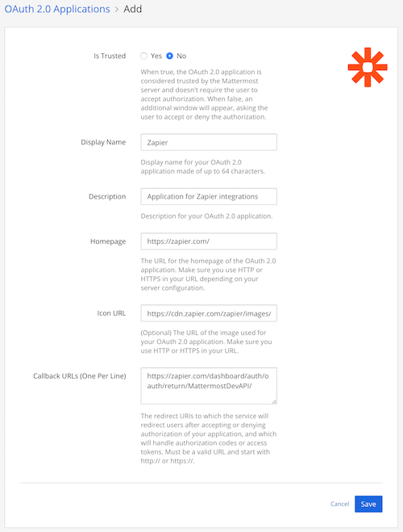
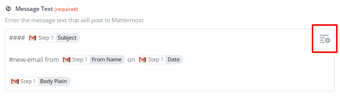
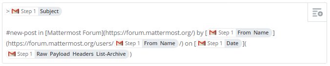
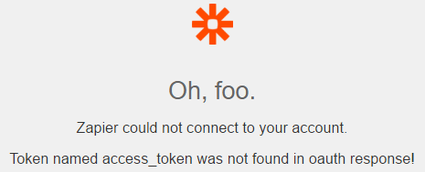
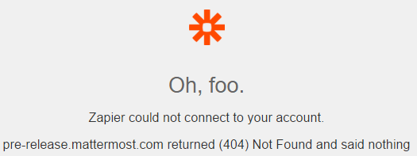
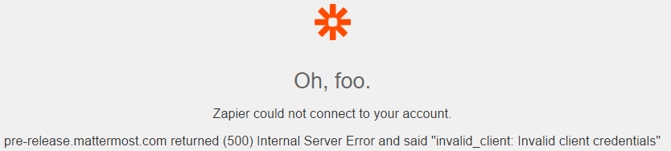
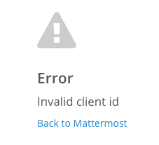
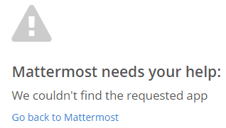

You can create "zaps" that contain a trigger and an action for a task that you want to perform repeatedly. Zapier regularly checks your trigger for new data and automatically performs the action for you.

Using Zapier you can integrate over 700 apps into Mattermost, including [Email](https://zapier.com/zapbook/email-parser), [GitHub](https://zapier.com/zapbook/github), [Jira](https://zapier.com/zapbook/jira), [Wufoo](https://zapier.com/zapbook/wufoo), [Salesforce](https://zapier.com/zapbook/salesforce), [Twitter](https://zapier.com/zapbook/twitter), [Gmail](https://zapier.com/zapbook/gmail), and [many more](https://zapier.com/zapbook).

## Zapier Setup Guide

Zapier is authorized using OAuth2.0. The setup guide requires that a System Admin register the Zapier app on their Mattermost server and can then optionally allow any users with a Zapier account to create integrations.

### Enable Zapier

The first time you set up Zapier on your Mattermost instance you'll be required to enable an OAuth 2.0 application which can be used by everyone on your server. Your System Admin must execute these steps.

To learn more about OAuth 2.0 applications, including what permissions they have access to, see the [OAuth 2.0 documentation](../admin-oauth2).

#### Enable OAuth 2.0

1. Open **Main Menu > System Console**.
2. Under **Integrations > Integration Management**:
    - Set [Enable OAuth 2.0 Service Provider](https://docs.mattermost.com/administration/config-settings.html#enable-oauth-2-0-service-provider) to **True**.
    - If you’d like to allow Zapier integrations to post with customizable usernames and profile pictures, then set [Enable integrations to override usernames](https://docs.mattermost.com/administration/config-settings.html#enable-integrations-to-override-usernames) and [Enable integrations to override profile picture icons](https://docs.mattermost.com/administration/config-settings.html#enable-integrations-to-override-profile-picture-icons) to **True**.

#### Register Zapier as an OAuth 2.0 Application

1. Go to **Main Menu > Integrations**.
2. Select **OAuth 2.0 Applications > Add OAuth 2.0 Application** and enter the following fields:
   - **Is Trusted:** No
   - **Display Name:** `Zapier`
   - **Description:** `Application for Zapier integrations`
   - **Homepage:** `https://zapier.com/`
   - **Icon URL:** `https://cdn.zapier.com/zapier/images/logos/zapier-logomark.png`
   - **Callback URLs:** `https://zapier.com/dashboard/auth/oauth/return/MattermostDevAPI/`
3. Select **Save** to create the application.

You'll be provided with a **Client ID** and **Client Secret**. Save these values, or share them with your team to connect Zapier in the steps below.



### Create a Zap

1. [Sign up](https://zapier.com/sign-up) for a free Zapier account or [log in](https://zapier.com/app/login) if you already have one.
2. On your [Zapier dashboard](https://zapier.com/app/dashboard) select **Make a Zap!**.
3. **Trigger App**: Events in this app will trigger new messages in Mattermost.
   - **Select a Trigger App:** This will trigger new messages in Mattermost. If the app you’re looking to connect isn’t supported on Zapier, consider firing in-app events to a Gmail account and then connecting Gmail to Mattermost using Zapier.
   - **Select the Trigger Event:** New messages in Mattermost will fire depending on these selected events in conjunction with any filters you apply.
   - **Connect the Trigger Account:** Connect the account from which you’d like to trigger events and **Test** it to ensure Zapier can connect successfully.
4. **Filtering:** (Optional) Exclude certain events from triggering new messages. Learn more about using [Zapier custom filtering](https://zapier.com/learn/how-to-use-zapier/custom-filters).
   - Add a filter by selecting the small **+** icon before the **Action** step.
   - Zapier supports **AND** and **OR** filters. Use the dropdown selectors to choose what events will allow the trigger to send a Mattermost message.
5. **Mattermost Action:** Connect your Mattermost Account and then specify posting details.
   - **Select the Action App:** Search for “Mattermost”.
   - **Select the Action Event:** Select **Post a Message**. The Mattermost team plans to expand the actions available here.
   - **Connect the Action Account:** Select **Connect a New Account** and enter the following fields:
     - **Mattermost URL:** This is the URL you use to access your Mattermost site. Don't include a slash at the end of the URL and don't append a team to the end of the server URL. For example, `https://community.mattermost.com/core` is the entire URL to the Contributors team on our community server. The **Mattermost URL** entered here would be `https://community.mattermost.com`.
     -  **Client ID/Secret:** If Zapier has been enabled as an OAuth application as per the steps above, then these values can be found by navigating to one of your Mattermost teams, then **Main Menu > Integrations > OAuth 2.0 Applications**. Select **Show Secret** next to the Zapier app, then obtain the Client ID and Client Secret.
     -  **Log in to Mattermost:** After completing the above fields you will be prompted to log in to your Mattermost account if you're not logged in already. If you’re having trouble connecting then please read our troubleshooting guide.
     -  You'll then be prompted to allow Zapier to access your Mattermost account. Select **Allow**.
      - **Message Post Details:** Specify the formatting of the messages and the team/channel where messages will be posted.
      - **Team:** Choose the team where new messages will post. The dropdown should contain all teams you have access to on Mattermost.
      - **Channel:** Choose the channel where new messages will post. The dropdown contains all channels that you belong to. Zapier cannot post into Direct Message channels.
     - **Message Text:** Enter the message text that will post to Mattermost. This text can be formatted using [Markdown](https://docs.mattermost.com/help/messaging/formatting-text.html) and include the dynamic fields offered by your selected trigger app. Read our message formatting tips below.



 4. **Username:** This is the username that Zapier will post as. Zapier integrations will always appear with a `BOT` tag next to the username. In order for bots to override the username of the authorized user, your System Admin must set [Enable integrations to override usernames](https://docs.mattermost.com/administration/config-settings.html#enable-integrations-to-override-usernames) to **True**.
5. **Icon URL:** This is the profile picture of the bot that Zapier will post as. In order for bots to override the profile picture of the authorized user, your System Admin must set [Enable integrations to override profile picture icons](https://docs.mattermost.com/administration/config-settings.html#enable-integrations-to-override-profile-picture-icons) to **True**.
6. **Test the Zap:** You may want to test your zap formatting in a Private Channel before posting in a channel that is visible to your entire team.

## Message Formatting Tips

Here are some useful tips we recommend to get the most out of Zapier integration:

- **Markdown:** Mattermost supports the use of [Markdown](https://docs.mattermost.com/help/messaging/formatting-text.html) in Zapier integrations. For example, use [heading markdown](https://docs.mattermost.com/help/messaging/formatting-text.html#headings) for Jira issue titles.
- **Custom Icons:** Use different icons for different services and Zapier integrations.
- **Hashtags:** Use hashtags to make your Zapier posts searchable. Use different hashtags for different services and Zapier integrations. For example, use the dynamic fields available in Zapier to include ticket a Jira ticket number in hashtags. This makes all conversation on a specific ticket instantly searchable by selecting the hashtag.
- **Quick Links:** Link back to the service that fired the zap through the use of Markdown [embedded links](https://docs.mattermost.com/help/messaging/formatting-text.html#links). For example, in our zaps we embed a link back to the service within the timestamp so it’s easy to take action on any zap.

### Examples

The Mattermost team has over 50 zaps integrated on our [Community Contributors team](https://community.mattermost.com/core) used for internal communication and interacting with contributors. The [Community Heartbeat channel](https://community.mattermost.com/core/channels/community-heartbeat) integrates all our community services in one accessible location. These zaps are formatted in two ways depending on the service:

**GitHub Issues and Comments, UserVoice Suggestions and Comments, GitLab MM Issues, GitLab Omnibus MM Issues**

```
    #### [Title of issue]

    #[searchable-hashtag] in [external service](link to service) by [author](link to author profile) on [time-stamp](link to specific issue or comment)

    [Body of issue or comment]
```

.. image:: ../images/zapier-ch1.png

**Forum Posts, Jira Comments, Hacker News Mentions, Tweets**

```
     > [forum post, media mention, or tweet]

     #[searchable-hashtag] in [external service](link to service) by [author](link to author profile) on [time-stamp](link to specific forum post, media mention or tweet)
```



## Troubleshooting Guide

Possible solutions to common issues encountered during setup.

### Cannot connect a Mattermost account

1. `"Token named access_token was not found in oauth response!"`
  a. Possible Solution: Try removing any trailing `/`'s on the end of your **Mattermost URL**.
    - Correct: `https://community.mattermost.com`
    - Incorrect: `https://community.mattermost.com/`



2. `"[Server URL] returned (404)"`
  a. Possible Solution: The **Mattermost URL** cannot have a team appended to the end of the server URL.
    - Correct: `https://community.mattermost.com`
    - Incorrect: `https://community.mattermost.com/core`



3. `"[Server URL] returned (500) Internal Server Error"`
  a. Possible Solution: The **Client Secret** might be incorrect. Verify this value in **Main Menu > Integrations > OAuth 2.0 Applications**, or check with your System Admin.

 

4. `"Error Invalid client id"`
  a. Possible Solution: The **Client ID** and/or **Client Secret** might have trailing spaces in them when copied and pasted into the form. Verify there are no trailing spaces in the **Client ID** and **Client Secret** fields then try again.



5. `"Mattermost needs your help: We couldn't find the requested app"`
  a. Possible Solution: The **Client ID** might be incorrect. Verify this value in **Main Menu > Integrations > OAuth 2.0 Applications**, or check with your System Admin.



### Deauthorize the Zapier App

If you'd like to deauthorize Zapier so it can no longer post through your connected account, go to **Account Settings > Security > OAuth 2.0 Applications**, then select **Deauthorize** on the Zapier app.


