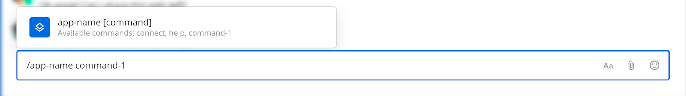
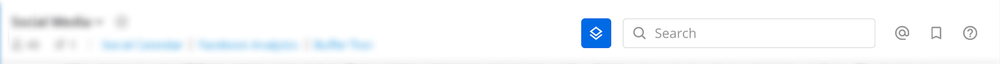
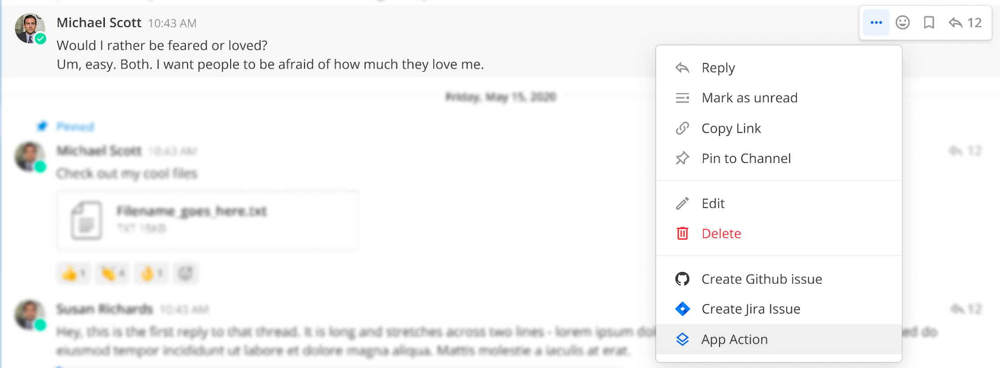

Apps are lightweight, interactive add-ons to Mattermost. They are hosted as their own service, as opposed to plugins which run directly alongside the server process.

Apps can:

- Display interactive, dynamic modal forms and message actions.
- Be written in any language.
- Attach themselves to locations in the Mattermost user interface (e.g. channel bar buttons, post menu, channel menu, commands), and add their custom slash commands with full autocomplete.
- Receive webhooks from Mattermost, and third-parties, and use the Mattermost REST APIs to post messages, etc.
- Work on both Mobile and Desktop clients. This way, developers can focus on the features of their Apps without writing code for each specific platform.
- Include dynamic fields, code as an on-demand function, and interactive modals.

When you develop using the Apps framework, your Apps can:

- Create slash commands

  

- Post messages to channels (and anything else possible with )

  

- Add buttons to channel headers and post menus

  

  

Apps are now generally available and we always appreciate your feedback! Share constructive feedback in the  on our Mattermost community instance.

We have quick start guides for [TypeScript](), [Go](), and [Python]() to learn how to write your first App.

## FAQ

### What version of Mattermost is needed?
    
For v1.0 of the apps framework, the minimum Mattermost Server version is v6.6.
For v1.2.0 of the apps framework, Mattermost Server v7.2 or later is needed.
For v1.2.1 of the apps framework, Mattermost Server v7.7.0 or later is needed.
    
### When would you build an App vs. a custom slash command vs. a webhook vs. a plugin?

That depends on your use case, as they each have benefits.

Each type of existing integration is sort of a la carte, whereas the App framework is an all-in-one package that supports its own version of some of those out of the box. Meaning when you install an App, you don't need to go create a separate bot account, OAuth app, webhooks etc. Some pieces are reused, such as the bot account mechanism, but some pieces were remade and are not reused, such as webhooks.

In the case of webhooks, the existing mechanism is only able to create posts, and only accepts an [incoming webhook]() payload. It does not support other logic for handling arbitrary data structures from external systems.

A plugin should be used when you need to [directly alter the UI]() in Mattermost or you have a feature that requires low latency with the server (such as replacing characters in any message [before it is saved]()).


Plugins have several [UX hooks]() that Apps cannot access. Please see the [plugin documentation]() for more information.


### What's the difference between the Apps framework and the plugin framework?

The Apps framework provides a few differences from plugins, including:

-   Interactive elements are easier to use and develop.
-   Compatible with both Mobile and Desktop clients without any extra code.

### What language should I use to write Apps?

Any language you want. We currently have an .

### How and where will my App be hosted?

1. **** Apps. Cloud
   customers can use Apps from Mattermost Marketplace. Marketplace Apps are
   deployed as AWS Lambda functions, and their usage is included in the service.
   You can find more information about the Marketplace . Example AWS Lambda Apps can be
   found
   
   (Go).
2. **External** (HTTP) Apps. Apps can be hosted as publicly (or privately) available HTTP
   services, the choice of hosting provider is yours. A self-managed Mattermost
   customer would be able to install your App from a URL. External Apps are not
   currently accepted in the Mattermost Marketplace.
3. **Customer-deployable** Apps. An App can be packaged as a bundle, deployable
   by the customer in their own hosting environment. Currently, ,
   , and 
   are supported, with plans for more serverless platforms, Kubernetes, and
   docker compose. Customer-deployable Apps are not yet distributed via the
   Mattermost Marketplace.

### Can I write "internal" organization-specific Apps?

Yes. They can be packaged as "customer-deployable" bundles and then deployed on
the supported serverless platforms, or run as HTTP services on the
organization's own hosting infrastructure.
