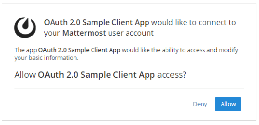
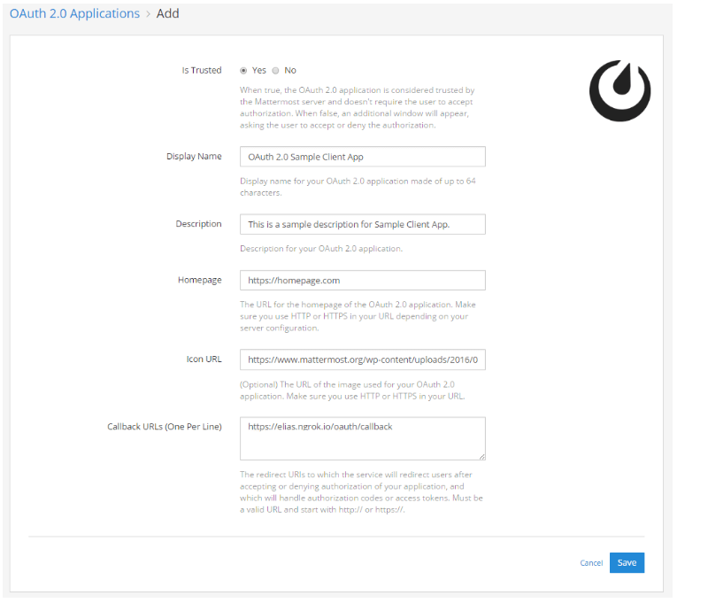
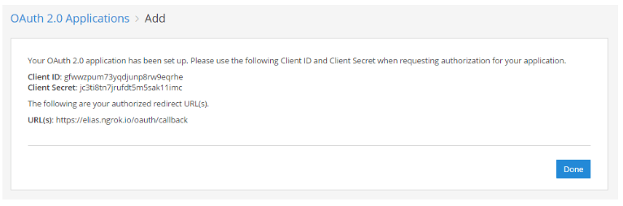
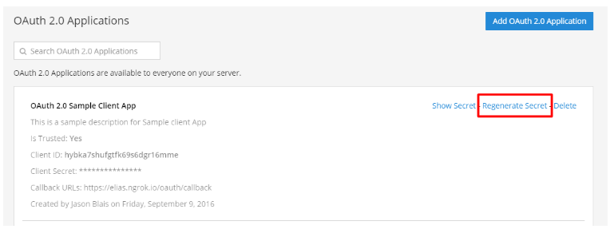
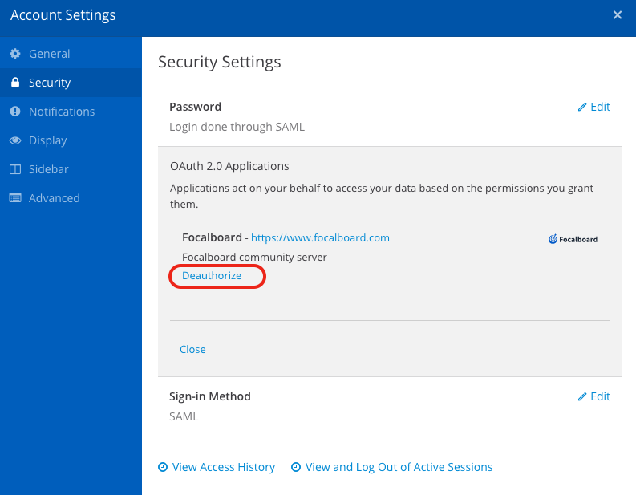

The authorization allows:

- Users with an account on a Mattermost server to sign in to third-party applications. You can find a  to test the functionality.
- A Mattermost server to authenticate requests to a third-party API. One popular application is Zapier integration which allows you to integrate more than 700 applications with Mattermost through OAuth 2.0. See our [Zapier documentation]() to learn more.

## Understanding client types

Mattermost supports two types of OAuth 2.0 clients as defined in :

### Confidential clients

- **Authentication**: Have a `client_secret` that must be kept secure
- **Use cases**: Server-side applications, trusted backends
- **Token endpoint auth method**: `client_secret_post`
- **Created**: Via UI (default) or Dynamic Client Registration (DCR)
- **Security**: Can securely store credentials on the server side

### Public clients

- **Authentication**: No `client_secret` (uses auth method `none`)
- **Use cases**: Single-Page Applications (SPAs), mobile apps, browser-based applications that cannot securely store secrets
- **Security**: MUST use PKCE for authorization code flow
- **Token endpoint auth method**: `none`
- **Created**: Via API with `is_public: true` parameter, or via DCR with `token_endpoint_auth_method: "none"`
- **Limitations**: Do not receive refresh tokens (access tokens only)

## Register your application in Mattermost

You must register your application in Mattermost to generate OAuth 2.0 credentials (client ID and secret for confidential clients, or just client ID for public clients), which your application can use to authenticate API calls to Mattermost, and which Mattermost uses to authorize API requests from the application.

If you'd like to set up a Zapier integration with OAuth 2.0, see our [Zapier documentation]() to learn more.

### Enable OAuth 2.0 applications

OAuth 2.0 applications are off by default and can be enabled by the System Admin as follows:

1. Log in to your Mattermost server as the System Administrator.
2. Go to **System Console > Integrations > Integration Management**.
3. Set  to **True**.
4. (Optional) If you'd like to allow external applications to post with customizable usernames and profile pictures, then set  and  to **true**.
5. (Optional) If you'd like to allow users on your system who are not System Admins to create OAuth 2.0 applications, then set  to **False**.
6. (Optional) To enable Dynamic Client Registration, set **Enable Dynamic Client Registration** to **True** in **System Console > Integrations > Integration Management**. See the [Dynamic Client Registration](#dynamic-client-registration) section for important security considerations.

### Register an OAuth 2.0 application

1. Go to **Product menu > Integrations**.
2. Select **OAuth 2.0 Applications**, then choose **Add OAuth 2.0 Application**.
3. Set **Is Trusted**: When set to **Yes**, your application is considered trusted by Mattermost. This means Mattermost doesn't require users to accept authorization when signing to third-party applications. When set to **No**, users will be provided with the following page to accept or deny authorization when authenticating for the first time.

    

    Only System Admins can set OAuth 2.0 applications as trusted.

4. Set **Is Public Client**: When set to **Yes**, your application is registered as a public client (for SPAs, mobile apps, etc.). Public clients do not receive a client secret and must use PKCE for the authorization code flow. When set to **No** (default), your application is registered as a confidential client with a client secret.
5. Specify the **Display Name**: Enter a name for your application made of up to 64 characters. This is the name users will see when granting access to the application, when viewing a list of authorized applications in **Settings > Security > OAuth 2.0 Applications** and when viewing a list of OAuth 2.0 applications in the **Integrations** menu.
6. Add **Description**: This is a short description of your application that users will see when viewing a list of authorized applications in **Settings > Security > OAuth 2.0 Applications**.
7. Specify the **Homepage**: This is the homepage of the OAuth 2.0 application and lets users visit the app page to learn more what it does. The URL must be a valid URL and start with `http://` or `https://` depending on your server configuration.
8. (Optional) Add **Icon URL**: The image users will see when viewing a list of authorized applications in **Settings > Security > OAuth 2.0 Applications** and when viewing a list of OAuth 2.0 applications in the **Integrations** menu. Must be a valid URL and start with `http://` or `https://`.
9. Add **Callback URLs**: These are the URL(s) to which Mattermost will redirect users after accepting or denying authorization of your application, and which will be the only URL(s) that handle authorization codes or access tokens. If more than one URL is specified, users will be redirected to the URL used for the initial authorization of the app. Each URL must be on a separate line and start with `http://` or `https://`.
10. Select **Save** to create the application.

    

11. You'll be provided with a **Client ID**, **Client Secret**, and the authorized redirect URLs. Save these values and use them in your application to connect it to Mattermost.

    

     **Client Secret** can be regenerated by the application creator or System Admin. Tokens created with the old secret will remain valid and authorization of existing users will continue to work; however, new authorizations and requests for new tokens will fail until the client secret has been updated in your app configuration.
    

    

## Grant permissions to your application

Once you have created an OAuth 2.0 application, all users on the Mattermost server are automatically given access to it.

The application does not automatically have permissions based on the user who registers the app - the permissions are based on which users go through the OAuth flow, which could be the user who registers the app or anyone else on the system.

If the application was registered as a trusted OAuth 2.0 app on the Mattermost server, authorization from users is not required. Otherwise, the following page will be provided to accept or deny authorization when authenticating the app for the first time.

Once authorized, the application receives an access token to perform requests on behalf of that user. The application can then perform any action for which the user has permission.

Users can view a list of authorized apps from **Settings > Security > OAuth 2.0 Applications**, and revoke authorization from this setting.

## Supported OAuth flows

Mattermost supports the  and  grant flows for OAuth 2.0 applications.

### Flow support by client type

| Client Type         | Authorization Code Flow | Implicit Flow | PKCE Required        |
|---------------------|-------------------------|---------------|----------------------|
| Public Client       | Supported               | Supported     | YES (code flow only) |
| Confidential Client | Supported               | Supported     | Optional             |

**Key notes:**

- Public clients **cannot** use the refresh token grant type - they only receive access tokens, not refresh tokens
- Implicit flow does **not** require PKCE (no code exchange happens)
- Confidential clients can optionally use PKCE; if initiated with `code_challenge`, it will be enforced throughout the flow

## PKCE (Proof Key for Code Exchange)

 is a security extension that protects against authorization code interception attacks. It's especially important for public clients like single-page applications and mobile apps that cannot securely store client secrets.

### When PKCE is required

- **Public clients**: MUST use PKCE when using the authorization code flow. The Mattermost server will reject authorization requests from public clients that don't include PKCE parameters.
- **Confidential clients**: PKCE is optional. However, if you include PKCE parameters in the authorization request, you must complete the PKCE flow in the token request.

### How PKCE works

PKCE adds two parameters to the OAuth flow:

1. **Authorization request**: Include a `code_challenge` (a hashed value) and `code_challenge_method` (Mattermost supports `S256` only)
2. **Token request**: Include the `code_verifier` (the original unhashed value)

The server verifies that the `code_verifier` matches the original `code_challenge`, ensuring the same client that started the authorization is completing it.

## Dynamic Client Registration

Dynamic Client Registration (DCR) allows applications to programmatically register OAuth clients without requiring manual configuration by a System Admin. This follows .

### Enabling DCR

DCR is disabled by default and can be enabled by a System Admin:

1. Go to **System Console > Integrations > Integration Management**
2. Set **Enable Dynamic Client Registration** to **True**


When DCR is enabled, the registration endpoint is **publicly accessible** without authentication. This means anyone can register OAuth clients on your Mattermost server. Only enable DCR if you understand and accept this security model, or have additional network-level access controls in place.


### Using DCR

When enabled, applications can register themselves as either public or confidential clients by making a request to the registration endpoint (`/api/v4/oauth/apps/register`). The application specifies its redirect URIs and authentication method:

- `token_endpoint_auth_method: "none"` creates a public client (no client secret)
- `token_endpoint_auth_method: "client_secret_post"` creates a confidential client (with client secret)

### Discovery endpoint

Mattermost provides an  endpoint at `/.well-known/oauth-authorization-server` that advertises server capabilities, including whether DCR is enabled and what authentication methods are supported.

## Refresh tokens

**Confidential clients** receive refresh tokens and can use them to obtain new access tokens. **Public clients** do not receive refresh tokens for security reasons.

## OAuth endpoints

- Authorize URI `/oauth/authorize`
- Token URI `/oauth/access_token`
- User info URI `/api/v4/users/me`

## Delete your application

Deleting the application will revoke access from all users. Only the user who created the application or a System Admin can delete the app.
