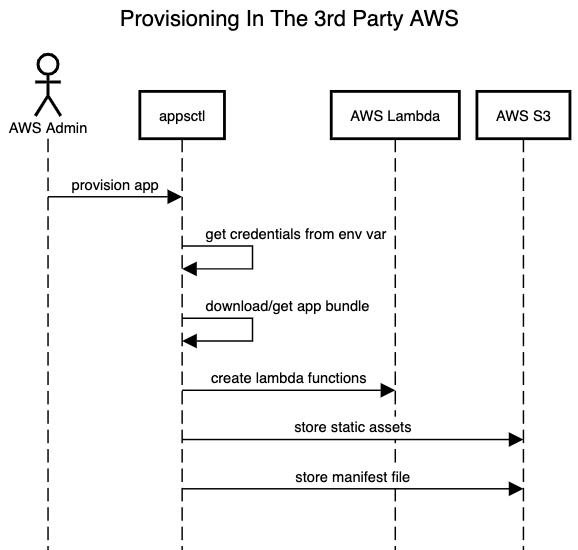
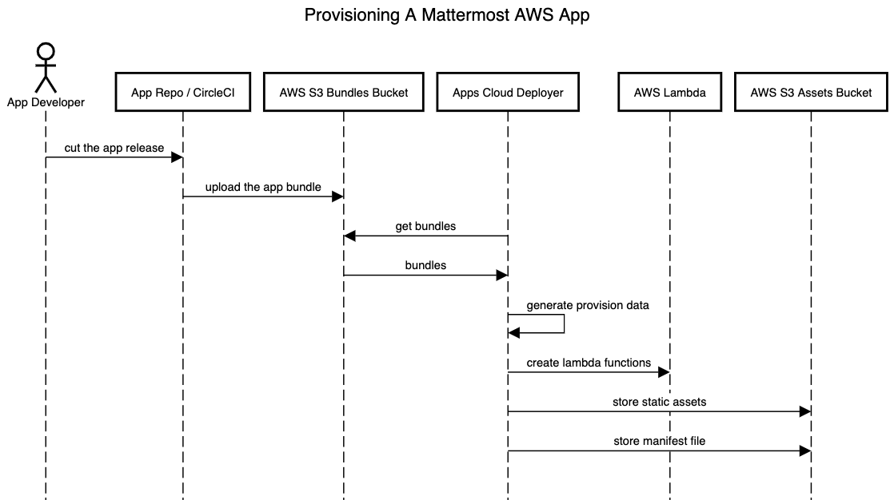

Admins of the on-prem Mattermost instance must prepare both AWS and Mattermost before provisioning and deploying an app.

Note that Mattermost Cloud only allows apps hosted by Mattermost, not ones that are self-hosted.

Provisioning in the AWS cloud environment will be done by the **appsctl** tool described in the AWS Setup section.

We need an app bundle to provision an app. The bundle will be provisioned from S3 and consists of three parts which will be completed via the **appsctl** tool:

1. Creating the lambda functions with appropriate policies.
1. Storing static assets in the dedicated S3 bucket.
1. Storing the app’s manifest file in the same dedicated S3 bucket.

### Mattermost setup

Follow the Prerequisites section of the [JavaScript]() or [Go]() Quick Start Guides to set up your Mattermost instance. Ensure that you install the [apps plugin]() as part of this process.

### AWS setup

### 1. Create AWS S3 bucket

You will need to create an S3 bucket within AWS or use an existing bucket.

1. Visit https://s3.console.aws.amazon.com
1. Create a bucket.
1. **Bucket name**: Give your bucket a name.
1. **AWS Region**:
   1. Select your region
   1. Save the slug value for later (Example: `us-east-1`)
   1. Corresponding Lambdas will be provisioned in the same region
2. **Block Public Access settings for this bucket**
   1. Check **Block *all* public access**
3. Select **Create Bucket**.

#### 2. Create an IAM user access key and secret

You will need an access key and secret so that `appsctl` can provision the app. These credentials can come from creating an IAM user, using a privileged IAM user, or even using the AWS account owners personal access key. Please follow the instructions [provided by AWS](https://aws.amazon.com/premiumsupport/knowledge-center/create-access-key/) to complete these steps and save the `Access key ID` and `Secret access key` values.

#### 3. Set AWS Provision environment variables

Open a terminal where you installed the Apps plugin and set the following variables to the AWS credentials just created and saved:

- `MM_APPS_PROVISION_AWS_ACCESS_KEY`  
- `MM_APPS_PROVISION_AWS_SECRET_KEY`

Set the following environment variables based on bucket name and region

- `MM_APPS_S3_BUCKET`  
- `MM_APPS_AWS_REGION`

#### 4. Initialize the AWS resources

The following command will create a Mattermost invoke user and security policy for use with AWS.

`go run ./cmd/appsctl aws init --create --create-access-key`

The output of the command will contain two "Invoke" environment variables.

#### 5. Set AWS Invoke environment variables

The second set of credentials created from the above initialization step will be used by Mattermost to invoke Apps.  Set these variables in the location of your running Mattermost server repo.

- `MM_APPS_AWS_ACCESS_KEY`
- `MM_APPS_AWS_SECRET_KEY`

### Restart the Mattermost Server

Ensure you have the following environment variables set.

- `MM_APPS_AWS_ACCESS_KEY`
- `MM_APPS_AWS_SECRET_KEY`
- `MM_APPS_S3_BUCKET`
- `MM_APPS_AWS_REGION`

Restart the Mattermost server to complete your Mattermost and AWS setup. You can now deploy an app to AWS.

### Test your AWS configuration and permissions

Run the following commands to test and validate your AWS configuration and permissions.

```bash
go run ./cmd/appsctl aws test lambda
go run ./cmd/appsctl aws test s3
```

## Deploying an app to AWS

After setting up your Mattermost instance, AWS key, and S3 bucket you can now provision your app using `appsctl`. Note that `appsctl` commands are run in the `mattermost-plugin-apps` repo.

### Install appsctl  

`go install github.com/mattermost/mattermost-plugin-apps/cmd/appsctl@latest`

### Provision your app  

`appsctl provision app /PATH/TO/YOUR/APP/BUNDLE.zip`

### Install your app  

The provision command output will show the Mattermost `/apps install` installation command. You can also install a previously provisioned app with the same `/apps install` command. (Example: `/apps install aws hello-lambda demo`)

# Provisioned app details

AWS Lambda functions have semantic names, which means that a function described in the `manifest.json` file translates to AWS as `$appID_$appVersion_$functionName` to avoid collisions with other apps' or other versions' functions. **appsctl** provisions lambda functions using this name. For example the name of a `servicenow` app's lambda function might be `com-mattermost-servicenow_0-1-0_go-function`. **appsctl** handles naming the AWS Lambda functions. The dedicated S3 bucket name is stored in the environment variable: `MM_APPS_S3_BUCKET`.

This also stores all apps' static assets and manifest files.

All files in the static folder of the bundle are considered to be the app's static assets and are stored in the above-mentioned bucket. Stored assets also have semantic keys and are generated using the rule - `static/$appID_$appVersion/filename`. For example the `servicenow` app's static file key can be accessed at `"static/com.mattermost.servicenow_0.1.0_app/photo.png"`.

The `manifest.json` file of an app is stored in the same S3 bucket as the key - `manifests/$appID_$appVersion.json`.



# Provisioning in Mattermost Cloud

In order to be provisioned in Mattermost Cloud an app bundle is uploaded to the specific S3 bucket. On a new app release, a bundle is created by GitLab CI and uploaded to S3. The [Mattermost apps cloud deployer](https://github.com/mattermost/mattermost-apps-cloud-deployer), running as a k8s cron job every hour, detects the S3 upload, and creates appropriate lambda functions, assets, and manifest the same way the **appsclt** does for the third-party accounts.

The deployer needs lambda function names, asset keys, and the manifest key to provision the app. It calls the `aws.GetProvisionDataFromFile(/PATH/TO/THE/APP/BUNDLE)` from the Apps Plugin to get the provision data. Same data can be generated using the command:

`appsctl generate-terraform-data /PATH/TO/YOUR/APP/BUNDLE`


