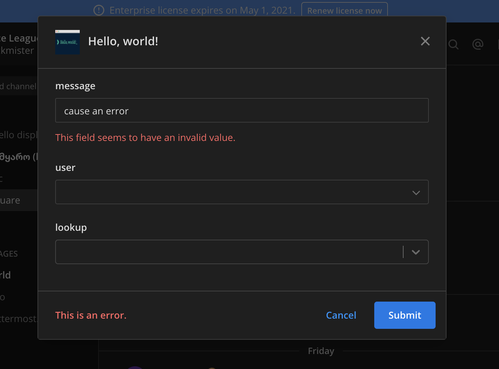

### Modal Forms

Modal Forms ([godoc](https://pkg.go.dev/github.com/mattermost/mattermost-plugin-apps/apps#Form)) open as a modal on the user interface as a result of a Form call response. One example is the `send` form in the [Hello World!](https://github.com/mattermost/mattermost-plugin-apps/blob/master/examples/go/hello-world/send_form.json) app.

They are defined by:

| Name               | Type   | Description                                                                                    |
| :----------------- | :----- | :--------------------------------------------------------------------------------------------- |
| `title`            | string | Title of the form, shown in the modal.                                                         |
| `header`           | string | (Optional) Text used as introduction in the form.                                              |
| `footer`           | string | (Optional) Text used at the end of the modal.                                                  |
| `icon`             | string | (Optional) Either a fully-qualified URL, or a path for an app's static asset.                  |
| `call`             | Call   | Call to perform for this form.                                                                 |
| `submit_buttons`   | string | (Optional) Key of the field to be used as the submit buttons. Must be of type `static_select`. |
| `fields`           | Fields | List of fields in the form.                                                                    |

The types of fields are:

| Name             | Description                                              |
| :--------------- | :------------------------------------------------------- |
| `text`           | Text field.                                              |
| `static_select`  | A dropdown select with static elements.                  |
| `dynamic_select` | A dropdown select that loads the elements dynamically.   |
| `bool`           | A boolean selector represented as a checkbox.            |
| `user`           | A dropdown to select users.                              |
| `channel`        | A dropdown to select channels.                           |
| `markdown`       | Only visible on modal forms. An arbitrary markdown text. |

Markdown fields are a special field that allows you to better format your form. They will not generate any value in the form submission sent to the app. The content is defined in the field description.

All fields include ([godoc](https://pkg.go.dev/github.com/mattermost/mattermost-plugin-apps/apps#Field)):

| Name          | Type      | Description                                            |
| :------------ | :-------- | :----------------------------------------------------- |
| `name`        | string    | Key to use in the values field of the call.            |
| `type`        | FieldType | The type of the field.                                 |
| `is_required` | bool      | (Optional) Whether the field needs to be filled.       |
| `value`       | value     | (Optional) Default value.                              |
| `description` | string    | (Optional) Text to show below the field describing it. |
| `modal_label` | string    | (Optional) Label to name the field in the modal.       |

Text fields may include:

| Name         | Type   | Description                                                                                                                       |
| :----------- | :----- | :-------------------------------------------------------------------------------------------------------------------------------- |
| `subtype`    | string | (Optional) The type of text that will be shown. Available types are one of input, textarea, email, number, password, tel, or URL. |
| `min_length` | int    | (Optional) Validate the field length before performing the call.                                                                  |
| `max_length` | int    | (Optional) Validate the field length before performing the call.                                                                  |

Static select fields include:

| Name      | Type    | Description               |
| :-------- | :------ | :------------------------ |
| `options` | Options | Options for the dropdown. |

Each Option includes:

| Name    | Type   | Description           |
| :------ | :----- | :-------------------- |
| `label` | string | User-facing string.   |
| `value` | string | Machine-facing value. |

All select also include:

| Name      | Type | Description                                                                         |
| :-------- | :--- | :---------------------------------------------------------------------------------- |
| `refresh` | bool | (Optional) Allows the form to be refreshed when the value of a dropdown is changed. |

A modal form performs a lookup call to the call endpoint any time a dynamic dropdown is selected. The lookup call will include in the context the app ID, the user ID, the channel ID, and the team ID. The values will be populated with the current values of the form. The expected response is error or the following:

| Name | Type    | Item    | Description                  |
| :--- | :------ | :------ | :--------------------------- |
| data |         |         |                              |
| -    | `items` | Options | The list of options to show. |

If any select has the refresh value set as `true`, a form call to the call endpoint happens any time the select changes value. The form call will include in the context the app ID, the user ID, the channel ID, and the team ID. The values will be populated with the current values of the form. The expected response is a form response. The whole form will be updated with the new form.

On submit, the submit call to the call endpoint will be sent. The submit call will include in the context the app ID, the user ID, the channel ID, and the team ID. The values will be populated with the current values of the form.

## Commands as forms

Commands arguments are treated as forms. When a leaf command is typed, the arguments of the command are fetched. If the command binding has a form attached, those will be used. If not, a form call will be made to the command call. The call will include in the context the app ID, user ID, the post ID, the root post ID (if any), the channel ID, and the team ID. The call will expect a form response.

A command form is defined as:

| Name     | Type   | Description                                                                                                                    |
| :------- | :----- | :----------------------------------------------------------------------------------------------------------------------------- |
| `fields` | Fields | List of fields in the form.                                                                                                    |
| `call`   | Call   | (Optional) Call to perform on all actions form related (including submit). If not provided, will use the command binding call. |

The type of fields is the same as for Modal forms.

All fields include:

| Name          | Type      | Description                                                             |
| :------------ | :-------- | :---------------------------------------------------------------------- |
| `name`        | string    | Key to use in the values field of the call, and as part of the command. |
| `type`        | FieldType | The type of the field.                                                  |
| `is_required` | bool      | Whether the field needs to be filled.                                   |
| `description` | string    | Text to show on the description line on autocomplete.                   |
| `hint`        | string    | Text to show on the hint line on autocomplete.                          |
| `label`       | string    | Label to name the field in autocomplete.                                |


Options are defined as:

| Name        | Type   | Description                          |
| :---------- | :----- | :----------------------------------- |
| `label`     | string | User-facing string.                  |
| `value`     | string | Machine-facing value.                |
| `icon_data` | string | URL to icon to show on autocomplete. |

When the command is executed, a submit call will be performed on the call endpoint. The call will include in the context the app ID, user ID, the post ID, the root post ID if any, the channel ID, and the team ID.

## Embedded Bindings

Posts can be embedded with bindings. These are used for asynchronous interaction with the user. In order to add an embedded binding you need to add an `app_bindings` property with a list of `EmbeddedBindings`. An `EmbeddedBinding` includes:

| Name       | Type    | Description                |
| :--------- | :------ | :------------------------- |
| `app_id`   | string  | The app ID.                |
| `title`    | string  | Title of the attachment.   |
| `text`     | string  | Text of the attachment.    |
| `bindings` | Binding | List of embedded bindings. |


Bindings are of two types, buttons or selects.
Buttons include:

| Name       | Type   | Description                                                             |
| :--------- | :----- | :---------------------------------------------------------------------- |
| `location` | string | Location name. The whole location path will be provided in the context. |
| `label`    | string | Label that will show in the button.                                     |
| `call`     | Call   | Call to be made when the button is clicked.                             |


Selects include:

| Name       | Type    | Description                                                                                                  |
| :--------- | :------ | :----------------------------------------------------------------------------------------------------------- |
| `location` | string  | Location name. The whole location path will be provided in the context.                                      |
| `label`    | string  | Label that will show in the button.                                                                          |
| `call`     | Call    | (Optional) Call to be made when the button is clicked. If none is provided, all options must include a call. |
| `bindings` | Binding | Options for the select.                                                                                      |

Options bindings include:

| Name       | Type   | Description                                                                                                        |
| :--------- | :----- | :----------------------------------------------------------------------------------------------------------------- |
| `location` | string | Option name. The whole location path will be provided in the context.                                              |
| `label`    | string | User-facing string.                                                                                                |
| `call`     | Call   | (Optional) Call to perform when the option is selected. If none is defined, it will take the call from the select. |

Whenever a button is clicked or a select field is selected, a submit call is performed to the corresponding call endpoint. The call will include in the context the app ID, user ID, the post ID, the root post ID if any, the channel ID and the team ID.

## [Post Menu example]()

## Example data flows

### Clicking Channel Header

<details><summary>Client Submit Request</summary>

`POST /plugins/com.mattermost.apps/api/v1/call`
```json
{
    "path": "/send-modal/submit",
    "context": {
        "app_id": "helloworld",
        "location": "send-button",
        "channel_id": "ytqokpzzcinszf7ywrbdfitusw",
        "team_id": "t35b8k7hginoujwn76tfatue5e",
        "user_agent": "webapp"
    },
    "expand": {}
}
```
</details>

<details><summary>MM Submit Request</summary>

`POST /plugins/com.mattermost.apps/example/hello/send-modal/submit`
```json
{
    "path": "/send-modal/submit",
    "expand": {},
    "context": {
        "app_id": "helloworld",
        "location": "send-button",
        "bot_user_id": "i4wzxbk1hbbufq8rnecso96oxr",
        "acting_user_id": "81bqom3kjjbo7bcjcnzs6dc8uh",
        "team_id": "t35b8k7hginoujwn76tfatue5e",
        "channel_id": "ytqokpzzcinszf7ywrbdfitusw",
        "mattermost_site_url": "http://localhost:8065",
        "user_agent": "webapp",
        "bot_access_token": "sqo3nwt377ys3co78jzye3cwmw"
    }
}
```
</details>

<details><summary>App Form Response</summary>

```json
{
    "type": "form",
    "form": {
        "title": "Hello, world!",
        "icon": "icon.png",
        "fields": [
            {
                "type": "text",
                "name": "message",
                "label": "message"
            },
            {
                "type": "user",
                "name": "user",
                "label": "user",
                "refresh": true
            },
            {
                "type": "dynamic_select",
                "name": "lookup",
                "label": "lookup"
            }
        ],
        "call": {
            "path": "/send"
        }
    }
}
```
</details>


### Selected user in modal

`refresh: true` is used to tell the client to notify the server when a value is selected from this field

<details><summary>Client Form Request</summary>

`POST /plugins/com.mattermost.apps/api/v1/call`

```json
{
    "path": "/send/form",
    "expand": {},
    "values": {
        "message": "This is great!",
        "user": {
            "label": "mickmister",
            "value": "81bqom3kjjbo7bcjcnzs6dc8uh"
        }
    },
    "context": {
        "app_id": "helloworld",
        "location": "/command",
        "bot_user_id": "i4wzxbk1hbbufq8rnecso96oxr",
        "acting_user_id": "81bqom3kjjbo7bcjcnzs6dc8uh",
        "team_id": "t35b8k7hginoujwn76tfatue5e",
        "channel_id": "f45uwdqsejdnzjtyy19ysqr44w",
        "mattermost_site_url": "http://localhost:8065",
        "user_agent": "webapp",
        "bot_access_token": "gcn6r3ac178zbxwiw5pc38e8zc"
    },
    "raw_command": "/helloworld send",
    "selected_field": "user"
}
```
</details>

<details><summary>MM Form Request</summary>

`POST /plugins/com.mattermost.apps/hello/send/form`
```json
{
    "path": "/send/form",
    "expand": {},
    "values": {
        "message": "This is great!",
        "user": {
            "label": "mickmister",
            "value": "81bqom3kjjbo7bcjcnzs6dc8uh"
        }
    },
    "context": {
        "app_id": "helloworld",
        "location": "/command",
        "bot_user_id": "i4wzxbk1hbbufq8rnecso96oxr",
        "acting_user_id": "81bqom3kjjbo7bcjcnzs6dc8uh",
        "team_id": "t35b8k7hginoujwn76tfatue5e",
        "channel_id": "f45uwdqsejdnzjtyy19ysqr44w",
        "mattermost_site_url": "http://localhost:8065",
        "user_agent": "webapp",
        "bot_access_token": "gcn6r3ac178zbxwiw5pc38e8zc"
    },
    "raw_command": "/helloworld send",
    "selected_field": "user"
}
```
</details>

<details><summary>App Form Response</summary>

```json
{
    "type": "form",
    "form": {
        "title": "Hello, world!",
        "icon": "icon.png",
        "fields": [
            {
				"type": "text",
				"name": "message",
				"label": "message"
			},
			{
				"type": "user",
				"name": "user",
				"label": "user",
				"refresh": true
			},
			{
				"type": "dynamic_select",
				"name": "lookup",
				"label": "lookup"
			}
        ],
        "call": {
            "path": "/send"
        }
    }
}
```
</details>


## Dynamic Lookup

<details><summary>Client Lookup Request</summary>

`POST /plugins/com.mattermost.apps/api/v1/call`
```json
{
    "path": "/send/lookup",
    "context": {
        "app_id": "helloworld",
        "location": "/command",
        "root_id": "",
        "channel_id": "f45uwdqsejdnzjtyy19ysqr44w",
        "team_id": "t35b8k7hginoujwn76tfatue5e",
        "user_agent": "webapp"
    },
    "values": {
        "message": null,
        "user": null,
        "lookup": {
            "icon_data": "",
            "label": "Option 1",
            "value": "option1"
        }
    },
    "expand": {},
    "raw_command": "/helloworld send",
    "query": "o",
    "selected_field": "lookup"
}
```
</details>

<details><summary>MM Lookup Request</summary>

`POST /plugins/com.mattermost.apps/example/hello/send/lookup`
```json
{
    "path": "/send/lookup",
    "expand": {},
    "values": {
        "lookup": {
            "icon_data": "",
            "label": "Option 1",
            "value": "option1"
        },
        "message": null,
        "user": null
    },
    "context": {
        "app_id": "helloworld",
        "location": "/command",
        "bot_user_id": "i4wzxbk1hbbufq8rnecso96oxr",
        "acting_user_id": "81bqom3kjjbo7bcjcnzs6dc8uh",
        "team_id": "t35b8k7hginoujwn76tfatue5e",
        "channel_id": "f45uwdqsejdnzjtyy19ysqr44w",
        "mattermost_site_url": "http://localhost:8065",
        "user_agent": "webapp",
        "bot_access_token": "gcn6r3ac178zbxwiw5pc38e8zc"
    },
    "raw_command": "/helloworld send",
    "selected_field": "lookup",
    "query": "o"
}
```
</details>

<details><summary>App Lookup Response</summary>

```json
{
    "type": "ok",
    "data": {
        "items": [
            {
                "label": "Option 1",
                "value": "option1",
                "icon_data": ""
            },
            {
                "label": "Option 2",
                "value": "option2",
                "icon_data": ""
            }
        ]
    }
}
```
</details>

### Submitted Modal

<details><summary>Client Submit Request</summary>

`POST /plugins/com.mattermost.apps/api/v1/call`
```json
{
    "path": "/send/submit",
    "context": {
        "app_id": "helloworld",
        "location": "/command",
        "root_id": "",
        "channel_id": "qxb1zg7eqjn1ixwuwhwtgmt55o",
        "team_id": "t35b8k7hginoujwn76tfatue5e",
        "user_agent": "webapp"
    },
    "values": {
        "message": "the message",
        "user": {
            "label": "mickmister",
            "value": "81bqom3kjjbo7bcjcnzs6dc8uh"
        },
        "lookup": {
            "icon_data": "",
            "label": "Option 1",
            "value": "option1"
        }
    },
    "expand": {},
    "raw_command": "/helloworld send"
}
```
</details>

<details><summary>MM Submit Request</summary>

`POST /plugins/com.mattermost.apps/example/hello/send/submit`
```json
{
    "path": "/send/submit",
    "expand": {},
    "values": {
        "lookup": {
            "icon_data": "",
            "label": "Option 1",
            "value": "option1"
        },
        "message": "the message",
        "user": {
            "label": "mickmister",
            "value": "81bqom3kjjbo7bcjcnzs6dc8uh"
        }
    },
    "context": {
        "app_id": "helloworld",
        "location": "/command",
        "bot_user_id": "i4wzxbk1hbbufq8rnecso96oxr",
        "acting_user_id": "81bqom3kjjbo7bcjcnzs6dc8uh",
        "team_id": "t35b8k7hginoujwn76tfatue5e",
        "channel_id": "qxb1zg7eqjn1ixwuwhwtgmt55o",
        "mattermost_site_url": "http://localhost:8065",
        "user_agent": "webapp",
        "bot_access_token": "gcn6r3ac178zbxwiw5pc38e8zc"
    },
    "raw_command": "/helloworld send"
}
```
</details>

<details><summary>App Submit Response</summary>

```json
{
    "type":"ok",
    "markdown":"Sent survey to mickmister."
}
```
</details>


### Returning a single error

<details><summary>Main Error Response</summary>

```json
{
    "type":"error",
    "error":"This is the error."
}
```
</details>

### Returning errors for specific fields

<details><summary>Field-specific Error Response</summary>

```json
{
    "type":"error",
    "data": {
        "errors":{
            "somefield": "This field seems to have an invalid value."
        }
    }
}
```
</details>

### Returning a main error and errors for specific fields (includes picture)

<details><summary>Main Error and Field-specific Error Response</summary>

```json
{
    "type":"error",
    "error":"This is the error.",
    "data": {
        "errors":{
            "somefield": "This field seems to have an invalid value."
        }
    }
}
```

</details>
