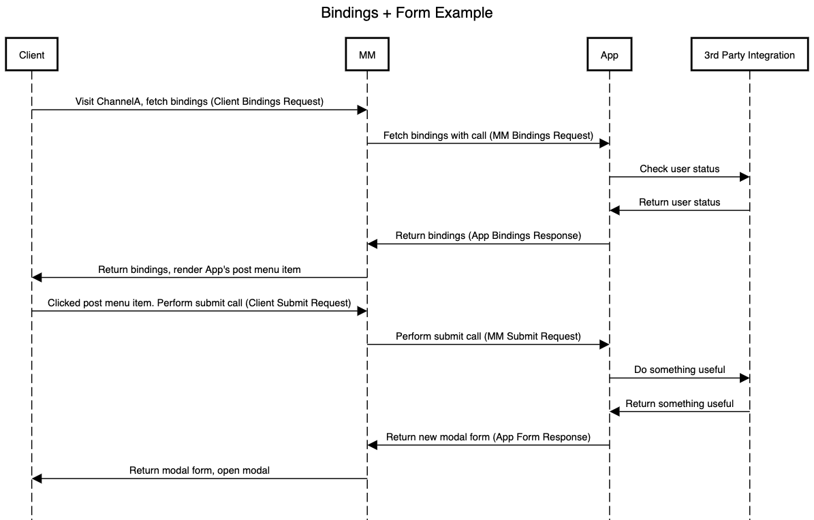

<details><summary>Diagram Source</summary>

https://sequencediagram.org

```
title Bindings + Form Example

Client->MM: Visit ChannelA, fetch bindings (Client Bindings Request)
MM->App:Fetch bindings with call (MM Bindings Request)
App->3rd Party Integration:Check user status
3rd Party Integration->App:Return user status
App->MM:Return bindings (App Bindings Response)
MM->Client:Return bindings, render App's post menu item
Client->MM:Clicked post menu item. Perform submit call (Client Submit Request)
MM->App:Perform submit call (MM Submit Request)
App->3rd Party Integration:Do something useful
3rd Party Integration->App:Return something useful
App->MM:Return new modal form (App Form Response)
MM->Client:Return modal form, open modal
```
</details>

## Fetch bindings

<details><summary>Client Bindings Request</summary>

`GET /plugins/com.mattermost.apps/api/v1/bindings?channel_id=ei748ohj3ig4ijofs5tr47wozh&scope=webapp`
</details>

<details><summary>MM Bindings Request</summary>

`POST /plugins/com.mattermost.apps/example/hello/bindings`
```json
{
    "path": "/bindings",
    "context": {
        "app_id": "helloworld",
        "bot_user_id": "i4wzxbk1hbbufq8rnecso96oxr",
        "acting_user_id": "81bqom3kjjbo7bcjcnzs6dc8uh",
        "user_id": "81bqom3kjjbo7bcjcnzs6dc8uh",
        "team_id": "",
        "channel_id": "ytqokpzzcinszf7ywrbdfitusw",
        "mattermost_site_url": "http://localhost:8065",
        "user_agent": "webapp",
        "bot_access_token": "gcn6r3ac178zbxwiw5pc38e8zc"
    }
}
```
</details>

<details><summary>App Bindings Response</summary>

```json
{
    "type": "ok",
    "data": [
        {
            "location": "/post_menu",
            "bindings": [
                {
                    "location": "send-button",
                    "icon": "icon.png",
                    "label": "send hello message",
                    "call": {
                        "path": "/send-modal",
                        "expand": {
                            "post": "all"
                        }
                    }
                }
            ]
        }
    ]
}
```
</details>

## Clicked post menu item

<details><summary>Client Submit Request</summary>

`POST /plugins/com.mattermost.apps/api/v1/call`
```json
{
    "path": "/send-modal/submit",
    "expand": {
        "post": "all"
    },
    "context": {
        "app_id": "helloworld",
        "location": "send-button",
        "channel_id": "ytqokpzzcinszf7ywrbdfitusw",
        "team_id": "t35b8k7hginoujwn76tfatue5e",
        "post_id": "jysnx7byebf49yxx1uynefajiy",
        "root_id": "",
        "user_agent": "webapp"
    }
}
```
</details>

<details><summary>MM Submit Request</summary>

`POST /plugins/com.mattermost.apps/example/hello/send/submit`
```json
{
    "path": "/send-modal/submit",
    "expand": {
        "post": "all"
    },
    "context": {
        "app_id": "helloworld",
        "location": "send-button",
        "bot_user_id": "i4wzxbk1hbbufq8rnecso96oxr",
        "acting_user_id": "81bqom3kjjbo7bcjcnzs6dc8uh",
        "team_id": "t35b8k7hginoujwn76tfatue5e",
        "channel_id": "ytqokpzzcinszf7ywrbdfitusw",
        "post_id": "jysnx7byebf49yxx1uynefajiy",
        "mattermost_site_url": "http://localhost:8065",
        "user_agent": "webapp",
        "bot_access_token": "sqo3nwt377ys3co78jzye3cwmw",
        "post": {
            "id": "jysnx7byebf49yxx1uynefajiy",
            "create_at": 1616447014367,
            "update_at": 1616447014367,
            "edit_at": 0,
            "delete_at": 0,
            "is_pinned": false,
            "user_id": "81bqom3kjjbo7bcjcnzs6dc8uh",
            "channel_id": "ytqokpzzcinszf7ywrbdfitusw",
            "root_id": "",
            "parent_id": "",
            "original_id": "",
            "message": "Hey I have a question",
            "type": "",
            "props": {},
            "hashtags": "",
            "pending_post_id": "",
            "reply_count": 0,
            "last_reply_at": 0,
            "participants": null
        }
    }
}
```
</details>

<details><summary>App Form Response</summary>

```json
{
    "type": "form",
    "form": {
        "title": "Hello, world!",
        "icon": "icon.png",
        "fields": [
            {
                "type": "text",
                "name": "message",
                "label": "message"
            },
            {
                "type": "user",
                "name": "user",
                "label": "user",
                "refresh": true
            },
            {
                "type": "dynamic_select",
                "name": "lookup",
                "label": "lookup"
            }
        ],
        "call": {
            "path": "/send"
        }
    }
}
```
</details>
