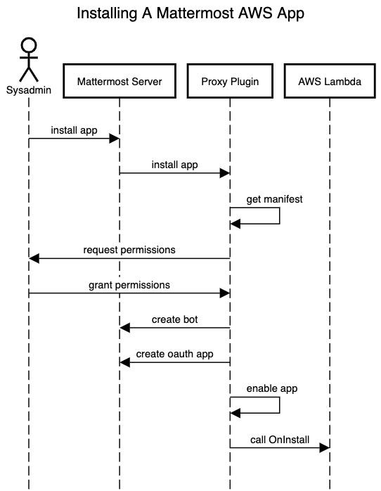

## Install

Installing is a process when a System Admin installs provisioned and already registered/published apps in their Mattermost installation. As mentioned above the list of the registered apps are in the memory of the Apps Plugin. Whenever the System Admin executes an `/install` slash command or selects **Install** in the Marketplace, appropriate permissions are requested and the app is installed. A bot and an OAuth app are created on installation, and an `OnInstall` call is also sent to the app and relevant lambda function (if applicable).

Apps are installed with `/apps install`:

- Manifest > Installed app
  - Consent to permissions, locations, OAuth app type
  - Create Bot+Access Token, OAuth App
  - HTTP: collect app’s JWT secret
- Invoke “OnInstall” callback on the App
  - Admin access token
- Also Uninstall/Enable/Disable per App

## Uninstall

A System Admin can uninstall an app using the `/uninstall` slash command. On uninstallation appropriate bot and an OAuth app are deleted, `OnUninstall` call is sent to the app as well. Worth mentioning that the current implementation is not deleting the user data.

## Upgrade/downgrade considerations

TBD

## Registering

Registering an app in a Mattermost installation means the app will be shown in the Marketplace of the installation, can be installed by the System Admin, and used by the users. On a totally new app registration or on a registration of the new version of the already registered app, a new version of the Apps Plugin is cut. The `manifests.json` file is updated and a new app is added in the listing. Later, the plugin is installed in the appropriate installations (using feature flags if necessary).

After the plugin update Apps Plugin synchronizes the list of the registered apps by downloading appropriate manifests from the S3 bucket and storing them in memory. The Marketplace shows renewed app listings and the System Admin can install a new app (or new version). It's worth mentioning here that Apps Plugin needs AWS credentials to download from S3 as well as to invoke lambda functions. Those credentials are read from the following environment variables:

`APPS_INVOKE_AWS_ACCESS_KEY`

`APPS_INVOKE_AWS_SECRET_KEY`
