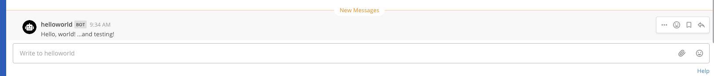

This quick start guide explains the basics of writing a Mattermost app. In this guide you will build an app that:

- Contains a `manifest.json`, declares itself an HTTP application that acts as a bot, and attaches to locations in the user interface.
- Attaches the form `send-modal` in its `bindings` to a button in the channel header, and the form `send` to a `/helloworld` command.
- Contains a `send` function that sends a parameterized message back to the user.
- Contains a `send-modal` function that forces displaying the `send` form as a modal.

You can view an example [here](https://github.com/mattermost/mattermost-plugin-apps/tree/master/examples/js/aws_hello).

## Prerequisites

Before you can start with your app, you first need to set up a local developer environment following the [server](/contribute/server/developer-setup/) and [webapp](/contribute/webapp/developer-setup/) setup guides. You must enable the apps feature flag before starting the Mattermost server by setting the environment variable `MM_FEATUREFLAGS_AppsEnabled` to `true` by e.g. adding `export MM_FEATUREFLAGS_AppsEnabled=true` to your `.bashrc` or using `make run-server MM_FEATUREFLAGS_AppsEnabled=true`.

In the System Console, ensure that the following are set to **true**:

- `Enable Bot Account Creation`
- `Enable OAuth 2.0 Service Provider`

**Note:** Apps do not work with a production release of Mattermost right now. They can only be run in a development environment. A future release will support production environments.

### Install the Apps plugin

The [apps plugin](https://github.com/mattermost/mattermost-plugin-apps) is a communication bridge between your app and the Mattermost server. To install it on your local server, start by cloning the code in a directory of your choice run:

```bash
git clone https://github.com/mattermost/mattermost-plugin-apps.git
```

Then build the plugin using:

```bash
cd mattermost-plugin-apps
make dist
```

Then upload it to your local Mattermost server via the System Console.

## Building the app

Start building your app by creating a directory for the code, setup a new package and install [`node-fetch`](https://www.npmjs.com/package/node-fetch) and [`express`](https://expressjs.com/), which will be used later:

```bash
mkdir my-app
cd my-app
npm init
npm install node-fetch express
```

Then create a file called `app.js` containing a simple HTTP server:

```js
const express = require('express');
const fetch = require('node-fetch'); // for later use

const app = express();
app.use(express.json());
const host = 'localhost';
const port = 8080;

app.listen(port, host, () => {
    console.log(`hello-world app listening at http://${host}:${port}`);
});
```

### Manifest

Your app has to provide a manifest, which declares app metadata. In this example, the following permissions are requested:

- Create posts as a bot.
- Render icons in the channel header.
- Create slash commands.

The app needs to serve the manifest via HTTP. Therefore you need to attach a new HTTP handler to `/manifest.json`:

```js
app.get('/manifest.json', (req, res) => {
    res.json({
        app_id: 'hello-world',
        display_name: 'Hello, world!',
        app_type: 'http',
        icon: 'icon.png',
        root_url: 'http://localhost:8080',
        requested_permissions: [
            'act_as_bot',
        ],
        requested_locations: [
            '/channel_header',
            '/command',
        ],
    });
});
```

### Bindings and locations

Locations are named elements in the Mattermost user interface. Bindings specify how an app's calls should be displayed and invoked from these locations.

The app creates a channel header button, and adds a `/helloworld send` command.

Add a handler for `/bindings`:

```js
app.post('/bindings', (req, res) => {
    res.json({
        type: 'ok',
        data: [
            {
                location: '/channel_header',
                bindings: [
                    {
                        location: 'send-button',
                        icon: 'icon.png',
                        label: 'send hello message',
                        call: {
                            path: '/send-modal',
                        },
                    },
                ],
            },
            {
                location: '/command',
                bindings: [
                    {
                        icon: 'icon.png',
                        label: 'helloworld',
                        description: 'Hello World app',
                        hint: '[send]',
                        bindings: [
                            {
                                location: 'send',
                                label: 'send',
                                call: {
                                    path: '/send',
                                },
                            },
                        ],
                    },
                ],
            },
        ],
    });
});
```

### Functions and form

Functions handle user events and webhooks. The Hello World app exposes two functions:

- `/send` that services the command and modal.
- `/send-modal` that forces the modal to be displayed.

The functions use a simple form with one text field named `"message"`, the form submits to `/send`.

`/send/form` and  `send-modal/submit` both return the same data:

```js
app.post(['/send/form', '/send-modal/submit'], (req, res) => {
    res.json({
        type: 'form',
        form: {
            title: 'Hello, world!',
            icon: 'icon.png',
            fields: [
                {
                    type: 'text',
                    name: 'message',
                    label: 'message',
                },
            ],
            call: {
                path: '/send',
            },
        },
    });
});
```

## Icons 

Apps may include static assets. One example that was already used above is the `icon` for the two bindings. Static assets must be served under the `static` path.

Download an example icon using:

```bash
curl https://github.com/mattermost/mattermost-plugin-apps/raw/master/examples/js/hello-world/icon.png -o icon.png
```

And then add another handler:
```js
app.get('/static/icon.png', (req, res) => {
    res.sendFile(__dirname + '/icon.png');
});
```

### Serving the data

Finally, add the application logic that gets executed when either the slash command is run or the modal submitted:

```js
app.post('/send/submit', async (req, res) => {
    const call = req.body;

    let message = 'Hello, world!';
    const submittedMessage = call.values.message;
    if (submittedMessage) {
        message += ' ...and ' + submittedMessage + '!';
    }

    const users = [
        call.context.bot_user_id,
        call.context.acting_user_id,
    ];

    // Use the app bot to do API calls
    const options = {
        method: 'POST',
        headers: {
            Authorization: 'BEARER ' + call.context.bot_access_token,
            'Content-Type': 'application/json',
        },
        body: JSON.stringify(users),
    };

    // Get the DM channel between the user and the bot
    const mattermostSiteURL = call.context.mattermost_site_url;

    const channel = await fetch(mattermostSiteURL + '/api/v4/channels/direct', options).
        then((res) => res.json())

    const post = {
        channel_id: channel.id,
        message,
    };

    // Create a post
    options.body = JSON.stringify(post);

    fetch(mattermostSiteURL + '/api/v4/posts', options);


    res.json({
        type: 'ok',
        markdown: 'Created a post in your DM channel.'
    });
});
```

The app is a simple HTTP server that serves the files you created above. The only application logic is in `send`, which takes the received `"message"` field and sends a message back to the user as the bot. Also, an ephemeral message is posted in the current channel.

## Installing the app

Run your app using:

```
node app.js
```

Then run the following slash commands on your Mattermost server:

```
/apps install http http://localhost:8080/manifest.json
```

Confirm the installation in the modal that pops up. You can insert any secret into the **App secret** field for now.

## Using the app

Select the "Hello World" channel header button in Mattermost, which brings up a modal:


Type `testing` and select **Submit**, you should see:



You can also use the `/helloworld send` command by typing `/helloworld send --message Hi!`. This posts the message to the Mattermost channel that you're currently in.


## Uninstalling the app

Uninstall the app using:

```
/apps uninstall hello-world
```
