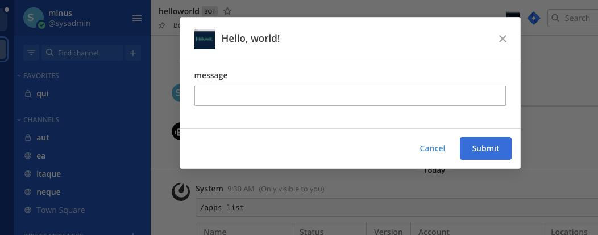

This quick start guide explains the basics of writing a Mattermost app. In this guide you will build an app that:

- Contains a `manifest.json`, declares itself an HTTP application that acts as a bot, and attaches to locations in the user interface.
- Attaches `send-modal` in its `bindings` to a button in the channel header, and `send` to a `/helloworld` command.
- Contains a `send` function that sends a parameterized message back to the user.
- Contains a `send-modal` function that forces displaying the `send` form as a modal.

## Prerequisites

Before you can start with your app, you first need to set up a local developer environment following the [server](/contribute/server/developer-setup/) and [webapp](/contribute/webapp/developer-setup/) setup guides. You must enable the apps feature flag before starting the Mattermost server by setting the enjoinment variable `MM_FEATUREFLAGS_AppsEnabled` to `true` by e.g. adding `export MM_FEATUREFLAGS_AppsEnabled=true` to your `.bashrc`. Please also ensure that `Bot Account Creation` and `OAuth 2.0 Service Provider` are enabled in the System Console.

**Note:** Apps do not work with a production release of Mattermost right now. They can only be run in a development environment. A future release will support production environments.

You also need to install `nodejs` installed. Please follow the guide [here](https://nodejs.org/en/download/) to install the latest version.

### Install the Apps plugin

The [apps plugin](https://github.com/mattermost/mattermost-plugin-apps) is a communication bridge between your app and the Mattermost server. To install it on your local server by cloning the code in a directory of your choice run:

```bash
git clone https://github.com/mattermost/mattermost-plugin-apps.git
```

Then build the plugin using:

```bash
make dist
```

Then upload it via the System Console to your local Mattermost server.

## Building the app

Start building your app by creating a directory for the code:

```bash
mkdir my-app
cd my-app
```

Then create create a file called `app.js` containing a simple HTTP server:

```js
const http = require("http");

const host = "localhost";
const port = 8000;

const requestListener = function (req, res) {
    switch (req.url) {
        // cases will be added later
    }
}

const server = http.createServer(requestListener);
server.listen(port, host, () => {
    console.log(`App is running on http://${host}:${port}`);
});
```

### Manifest

Your app has to provide a so-called manifest. The manifest declares app metadata. In this example the *permission* to act as a bot, and to *bind* itself to the channel header, and to `/` commands is requested.

The apps needs to server the manifest via HTTP. Therefore you need to add a new `case` to `requestListener`:

```js
case "/manifest.json":
    res.setHeader("Content-Type", "application/json");
    res.end(JSON.stringify({
        app_id: "hello-world",
        display_name: "Hello, world!",
        app_type: "http",
        root_url: "http://localhost:8080",
        requested_permissions: [
            "act_as_bot"
        ],
        requested_locations: [
            "/channel_header",
            "/command"
        ]
    }));
    break;
```

### Bindings and locations

Locations are named elements in the Mattermost user interface. Bindings specify how an app's calls should be displayed at, and invoked from, these locations.

The app creates a channel header button, and adds a `/helloworld send` command.

Add another `case` to `requestListener`:

```js
case "/bindings":
    res.setHeader("Content-Type", "application/json");
    res.end(JSON.stringify({
        type: "ok",
        data: [
            {
                location: "/channel_header",
                bindings: [
                    {
                        location: "send-button",
                        icon: "http://localhost:8080/static/icon.png",
                        label: "send hello message",
                        call: {
                            path: "/send-modal"
                        }
                    }
                ]
            },
            {
                location: "/command",
                bindings: [
                    {
                        icon: "http://localhost:8080/static/icon.png",
                        label: "helloworld",
                        description: "Hello World app",
                        hint: "[send]",
                        bindings: [
                            {
                                location: "send",
                                label: "send",
                                call: {
                                    path: "/send"
                                }
                            }
                        ]
                    }
                ]
            }
        ]
    }));
    break;
```

### Functions and form

Functions handle user events and webhooks. The Hello World app exposes two functions:

- `/send` that services the command and modal.
- `/send-modal` that forces the modal to be displayed.

The functions use a simple form with one text field named `"message"`, the form submits to `/send`.

`/send/form` and  `send-modal/submit` both return the same data:

```js
case "/send/form":
case "/send-modal/submit":
    res.setHeader("Content-Type", "application/json");
    res.end(JSON.stringify({
        type: "form",
        form: {
            title: "Hello, world!",
            icon: "http://localhost:8080/static/icon.png",
            fields: [
                {
                    type: "text",
                    name: "message",
                    label: "message"
                }
            ],
            call: {
                path: "/send"
            }
        }
    }));
    break;
```

## Icons 

Apps may include static assets. One example that was already used above is the `icon` for the two bindings. Static assets must be served under the `static` path.

Download an example icon using:

```bash
wget https://github.com/mattermost/mattermost-plugin-apps/raw/master/examples/go/helloworld/icon.png
```

`fs` is used to load the file:

```js
const fs = require("fs").promises;
```

And then add another `case` to handle the icon:
```js
case "/static/icon.png":
    fs.readFile(__dirname + "/icon.png")
        .then(contents => {
            res.setHeader("Content-Type", "image/png");
            res.end(contents);
        })
    break;
```

### Serving the data

Finally, add the application logic that gets executed when either the slash command is run or the modal submitted:

```js
case "/send/submit":
    let body = "";
    req.on("data", chunk => {
        body += chunk;
    });
    req.on("end", () => {
        const call = JSON.parse(body);

        let message = "Hello, world!";
        const user_message = call.values.message;
        if (user_message) {
            message += " ...and " + user_message + "!";
        }

        // Use the app bot to do API calls
        const options = {
            method: "POST",
            headers: {
                "Authorization": "BEARER " + call.context.bot_access_token,
            }
        };
        const users = [
            call.context.bot_user_id,
            call.context.acting_user_id,
        ];

        // Get the DM channel between the user and the bot
        let url = call.context.mattermost_site_url + "/api/v4/channels/direct";
        let mm_req = http.request(url, options, (mm_res) => {
            let body = "";
            mm_res.on("data", chunk => {
                body += chunk;
            });
            mm_res.on("end", () => {
                const channel = JSON.parse(body);

                const post = {
                    channel_id: channel.id,
                    message: message,
                }

                // Create a post
                let url = call.context.mattermost_site_url + "/api/v4/posts";
                let mm_req = http.request(url, options);

                mm_req.write(JSON.stringify(post));
                mm_req.end();
            });
        });
        mm_req.write(JSON.stringify(users));
        mm_req.end();

        res.setHeader("Content-Type", "application/json");
        res.end("{}");
    });
    break;
```

The app is a simple HTTP server that serves the files you created above. The only application logic is in `send`, which takes the revived `"message"` field and sends a message back to the user as the bot.

## Installing the app

Run your app using:

```
node app.js
```

Then run the following slash commands on your Mattermost server:

```
/apps debug-add-manifest --url http://localhost:8080/manifest.json
/apps install --app-id hello-world
```

Confirm the installation in the modal that pops up. You can insert any secret into the **App secret** field for now.

## Using the app

Select the "Hello World" channel header button in Mattermost, which brings up a modal:



Type `testing` and select **Submit**, you should see:


You can also use the `/helloworld send` command by typing `/helloworld send --message Hi!`. This posts the message to the Mattermost channel that you're currently in.


