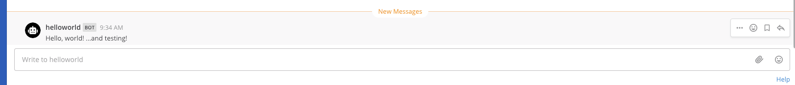
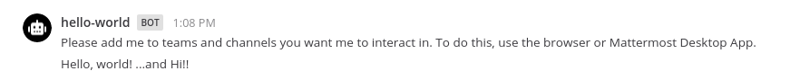

This quick start guide will walk you through the basics of creating a hello world Mattermost App in Go. In this guide you will review an App that:

- Contains a `manifest.json`, declares itself an HTTP application that uses a bot account and attaches UI elements to locations in the Mattermost interface.
- Attaches the form `send-modal` in its `bindings` to a button in the channel header, and the form `send` to a `/helloworld` command.
- Contains a `send` function that sends a parameterized message back to the user.
- Contains a `send-modal` function that forces displaying the `send` form as a modal.

## Prerequisites

Before you can start with your App, you should first set up your environment by following the [developer setup guide]().

You also need Go v1.16 or later installed. Please follow the  to install the latest version.

## Download and start the App

In the same  you cloned via the [developer setup guide]() above, navigate to the  directory and start the Docker container:

```sh
cd golang/hello-world
docker compose up
```

You'll see Docker install the Go modules and then the App will come online and print the following message:

    Use '/apps install http http://mattermost-apps-golang-hello-world:4000/manifest.json' to install the App

## Install the App on Mattermost

Next, access your development Mattermost server at  and use the `/apps install http http://mattermost-apps-golang-hello-world:4000/manifest.json` slash command to install the hello world App. Select `Agree to grant the app access to APIs and Locations` and click `Submit` to finish the installation.

## Use the App

Select the "Hello World" channel header button in Mattermost, which brings up a modal:


Type `testing` and select **Submit**, you should see:



You can also use the `/helloworld send` command by typing `/helloworld send --message Hi!`. This posts the message to the Mattermost channel that you're currently in:



## Review the App

To understand the App, examine the following elements:

### Manifest

The App must provide a manifest, which declares App metadata. In this example, the following permissions are requested via the `/manifest.json` endpoint:

- Create posts as a bot (`act_as_bot`)
- Render icons in the channel header (`/channel_header`)
- Create slash commands (`/command`)

### Bindings and locations

[Bindings]() specify what elements your App will show here, and how your App will receive calls when the user interacts with these elements. Locations are named elements in the Mattermost user interface.

The App creates a channel header button, and adds a `/helloworld send` slash command.

### Call handlers and forms

Call handlers are functions that respond to user interactions and webhook events. The hello world App exposes two call handlers:

- `/send` that services the command and modal form submissions.
- `/send-modal` that forces the modal to be displayed.

The call handlers use a simple form with a text field named `message` and the form submits to `/send`.

### Assets

Apps may include static assets. Only one asset is used in this example for the two bindings: `icon.png`. Static assets must be served under the `static` path.

## Uninstall the App

Once you're done with the App, you can uninstall it via the `/apps uninstall hello-world` slash command. Alternatively, you can use `/apps debug clean` to remove all data for all installed Apps.

To stop and clean up the App from Docker after you're done, use the following command in the `golang/hello-world` directory:

```sh
docker compose down
```

## Conclusion

You now know how to create a Mattermost App in Go. If you have questions about building Apps or want to show off what you're building, join us on the  channel in the Mattermost Community server!
