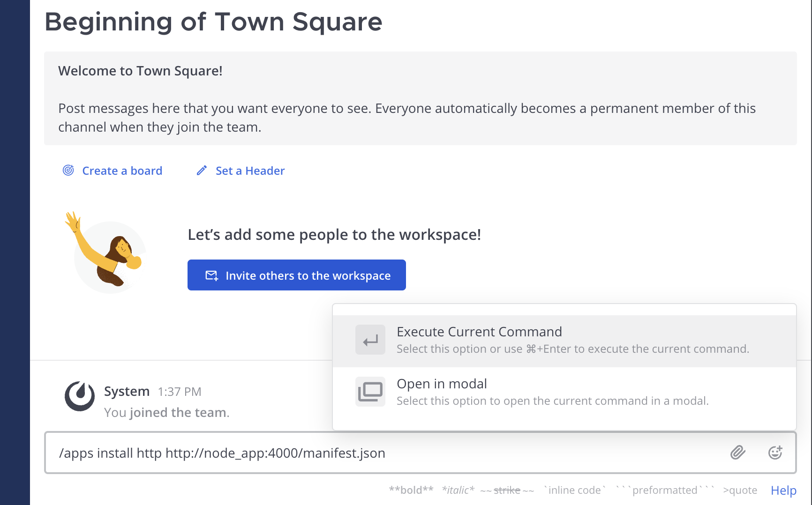
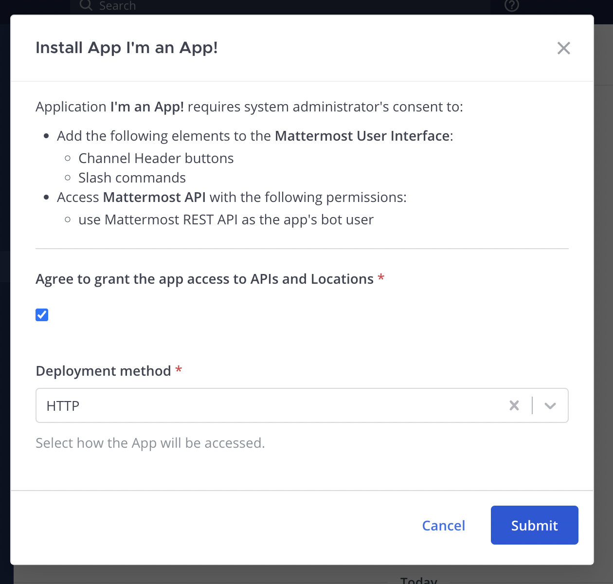
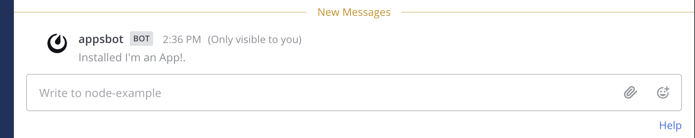
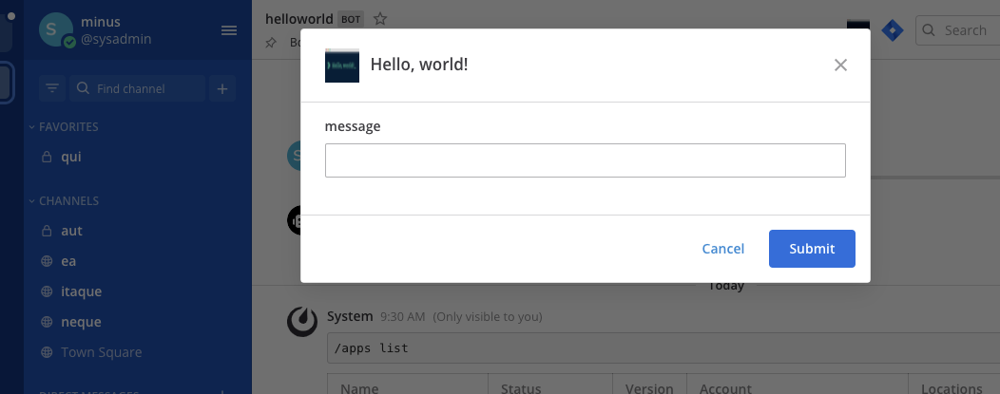
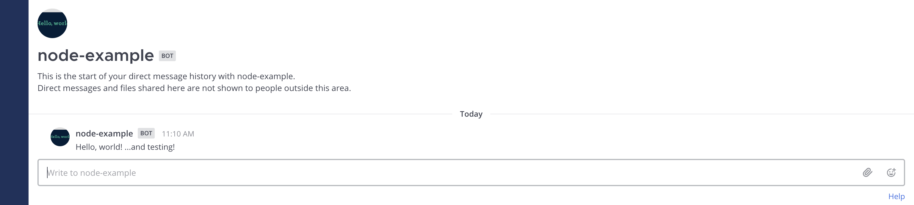

This quick start guide explains the basics of writing a Mattermost app. In this guide you will build an app using TypeScript that:

- Contains a `manifest.json`, declares itself an HTTP application that acts as a bot, and attaches to locations in the user interface.
- Contains a `form` with a `submit` function that can launch a modal (if applicable) and send an interpolated message back to the user.
- Attaches an icon button to the channel header and creates a `/node-example` slash command to provide functionality.

You can utilize a working development environment for this example [here](https://github.com/mattermost/mattermost-plugin-apps/tree/master/dev/).

## Prerequisites

Before you can start building your app, you first need to set up a local developer environment. Make sure you have [the latest version of Docker](https://docs.docker.com/get-docker/) installed and that it has the `docker compose` command available. You can use the [dev](https://github.com/mattermost/mattermost-plugin-apps/tree/master/dev/) folder in the `mattermost-plugin-apps` repository:

```
git clone https://github.com/mattermost/mattermost-plugin-apps.git
cd mattermost-plugin-apps/dev
```

The `dev` folder has a `docker-compose.yml` and a `node_app` folder that contains the example below. To spin up your development environment, use the following command:

```
docker-compose up
```

After everything comes online, you can navigate to [http://localhost:8065/](http://localhost:8065/) to see your local Mattermost server that's configured for building apps locally.

## Building the app

By using `docker-compose up` in the [dev](https://github.com/mattermost/mattermost-plugin-apps/tree/master/dev) folder, you will automatically bring your `app.ts` file online and watch for changes (hot reloading) via [nodemon](https://www.npmjs.com/package/nodemon). In the file, you can see the relevant lines for creating a simple HTTP server. This is the core of your Mattermost app, which is implemented with a RESTful API:

```ts
import express from 'express';

const host = process.env.NODE_HOST || 'localhost';
const port = process.env.PORT || 4000;

const app = express();
app.use(express.json());

app.listen(port, () => {
    console.log(`app listening on port ${port}`);
});
```

### Providing a manifest

Your app has to provide a manifest, which declares the app's metadata required for installation. In this example, the following permissions and locations are requested:
- Create posts as a bot (`act_as_bot`)
- Render icons in the channel header (`/channel_header`)
- Create slash commands (`/command`)

```ts
const manifest = {
    app_id: 'node-example',
    display_name: "I'm an App!",
    description: "Example app written with Node.js",
    homepage_url: 'https://github.com/mattermost/mattermost-plugin-apps',
    app_type: 'http',
    icon: 'icon.png',
    root_url: `http://${host}:${port}`,
    requested_permissions: [
        'act_as_bot',
    ],
    requested_locations: [
        '/channel_header',
        '/command',
    ],
} as AppManifest;
```

As a RESTful API, your app needs to serve the manifest via HTTP. Therefore you need to attach a new HTTP handler to the expected `/manifest.json` path:

```ts
app.get('/manifest.json', (req, res) => {
    res.json(manifest);
});
```

### Bindings and locations

Locations are named elements in the Mattermost user interface (e.g., the channel header). Bindings specify how an app's calls should be displayed and invoked from these locations.

This app adds a channel header button and a `/node-example send` command. In order to register these locations, there is a `POST` handler for the `/bindings` endpoint on your app's API:

```ts
const channelHeaderBindings = {
    location: '/channel_header',
    bindings: [
        {
            location: 'send-button',
            icon: 'icon.png',
            label: 'send hello message',
            form
        },
    ],
} as AppBinding;

const commandBindings = {
    location: '/command',
    bindings: [
        {
            icon: 'icon.png',
            label: 'node-example',
            description: manifest.description,
            hint: '[send]',
            bindings: [
                {
                    location: 'send',
                    label: 'send',
                    form
                },
            ],
        },
    ],
} as AppBinding;

app.post('/bindings', (req, res) => {
    const callResponse: AppCallResponse<AppBinding[]> = {
        type: 'ok',
        data: [
            channelHeaderBindings,
            commandBindings,
        ],
    };

    res.json(callResponse);
});
```

### Providing a form

Forms handle user events on the bindings. This app provides a `form` before `POST`ing to the `/submit` function. In the case of a channel header, the form will launch a modal to collect its fields. In the case of a slash command, the form's fields will be collected as arguments from the user's command.

```ts
const form: AppForm = {
    title: "I'm a form!",
    icon: 'icon.png',
    fields: [
        {
            type: 'text',
            name: 'message',
            label: 'message',
            position: 1,
        },
    ],
    submit: {
        path: '/submit',
    },
};
```

### Serving data

Finally, you can see the application logic that is executed when either the slash command is sent or the channel header's modal is submitted. It collects the user's input, interpolates it with a string, and DMs that string in a message back to the user:

```ts
app.post('/submit', async (req, res) => {
    const call = req.body as AppCallRequest;

    const botClient = new Client4();
    botClient.setUrl(call.context.mattermost_site_url);
    botClient.setToken(call.context.bot_access_token);

    const formValues = call.values as FormValues;

    let message = 'Hello, world!';
    const submittedMessage = formValues.message;
    if (submittedMessage) {
        message += ' ...and ' + submittedMessage + '!';
    }

    const users = [
        call.context.bot_user_id,
        call.context.acting_user.id,
    ] as string[];

    let channel: Channel;
    try {
        channel = await botClient.createDirectChannel(users);
    } catch (e: any) {
        res.json({
            type: 'error',
            error: 'Failed to create/fetch DM channel: ' + e.message,
        });
        return;
    }

    const post = {
        channel_id: channel.id,
        message,
    } as Post;

    try {
        await botClient.createPost(post)
    } catch (e: any) {
        res.json({
            type: 'error',
            error: 'Failed to create post in DM channel: ' + e.message,
        });
        return;
    }

    const callResponse: AppCallResponse = {
        type: 'ok',
        markdown: 'Created a post in your DM channel.',
    };

    res.json(callResponse);
});
```

## Serving static assets

Apps may include static assets (e.g., `icon.png`). Static assets must be served under the `static` path. For example, there is a `icon.png` file in the `dev/node_app/static` directory that this app serves:

```ts
// Serve resources from the static folder
app.use('/static', express.static('./static'));
```

## Installing your app in Mattermost

Since we used `docker-compose up` in the [dev](https://github.com/mattermost/mattermost-plugin-apps/tree/master/dev) folder, your `app.ts` file is already online and watching for changes (hot reloading), allowing for rapid prototyping and development. Use the following slash command on your Mattermost server to install your new web app:

```
/apps install http http://node_app:4000/manifest.json
```



Confirm the installation in the modal that pops up:



Now your app is installed!



## Using the app

Select your app's channel header button in Mattermost, which brings up a modal asking for input:



Type `testing` and click the Submit button to receive a DM from your app:



You can also use the slash command by typing `/node-example send testing` to achieve the same effect. In this case, you're not presented with a modal because the slash command captured your input directly.

## Uninstalling the app

You can uninstall the app using `/apps uninstall node-example`. Alternatively, you can use `/apps debug clean` slash command to remove all apps for the sake of rapid prototyping and testing.

## Conclusion

You now know how to create a Mattermost app in Node.js. You can use this provided `dev` setup to build and test your own apps locally. If you have questions about building apps or want to show off what you're building, join us on the [Integrations & Apps channel in the Mattermost Community server](https://community.mattermost.com/core/channels/integrations)!
