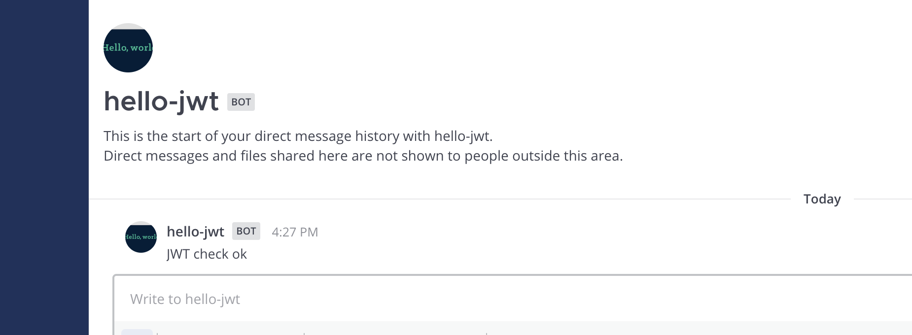

This quick start guide will walk you through the basics of using  in a Mattermost App in Go. In this guide you will review an App that:

- Contains a `manifest.json`, declares itself an HTTP application that uses a bot account, uses JWT, and attaches UI elements to locations in the Mattermost interface.
- Attaches the `send` function to a `/hello-jwt` command and wraps it with a function to authenticate JWT.

Why you would want to use JWT for App development? Using a token, your App can validate the legitimacy of any request by ensuring it's coming from the expected Mattermost server. Simply put, implementing JWT will enhance your App's security and functionality via a handshake.

## Prerequisites

Before you can start with your App, you should first set up your environment by following the [developer setup guide]().

You also need Go v1.16 or later installed. Please follow the  to install the latest version.

## Download and start the App

In the same  you cloned via the [developer setup guide]() above, navigate to the  directory and start the Docker container:

```sh
cd golang/jwt
docker compose up
```

You'll see Docker install the Go modules and then the App will come online and print the following message:

        Use '/apps install http http://mattermost-apps-golang-jwt:8084/manifest.json' to install the app
        Use "1234" as the app's JWT secret

The secret comes from this line in `hello.go`:

```go
var secret = []byte("1234")
```

In a production app, you should generate the secret at random per App installation, and store on the App's end to identify the specific Mattermost server.

## Install the App on Mattermost

Next, access your development Mattermost Server at  and use the `/apps install http http://mattermost-apps-golang-jwt:8084/manifest.json` slash command to install the JWT App. Select `Agree to grant the app access to APIs and Locations`, enter the JWT secret (1234), and click `Submit` to finish the installation.

## Use the App

You can now use the `/hello-jwt send` command. This will cause the App's bot user to direct message (DM) you a response:



## Review the App

To understand the App, examine the following elements:

### Manifest

The App must provide a manifest, which declares App metadata. In this example, the following permissions are requested via the `/manifest.json` endpoint:

- Create posts as a bot.
- Create slash commands.
- Use JWT.

### Bindings and locations

[Bindings]() specify how an App's calls should be displayed and invoked from these locations. Locations are named elements in the Mattermost user interface. 

The App creates a `/hello-jwt send` slash command that checks the validity of the JWT.

### Call handlers

Call handlers are functions that respond to user interactions and webhook events. The JWT App relies on one main call handler:

- `send` that services the command and modal form submissions. This function is wrapped with `withJWT` that requires JWT, which calls `checkJWT` to verify the provided token.

### Assets

Apps may include static assets. Only one asset is used in this example for this App: `icon.png`. Static assets must be served under the `static` path.

## Uninstall the App

Once you're done with the App, you can uninstall it via the `/apps uninstall hello-jwt` slash command. Alternatively, you can use `/apps debug clean` to remove all data for all installed Apps.

To stop and clean up the App from Docker after you're done, use the following command in the `golang/jwt` directory:

```sh
docker compose down
```

## Conclusion

You now know how to create a Mattermost App in Go that uses JWTs. If you have questions about building Apps or want to show off what you're building, join us on the  channel in the Mattermost Community server!
