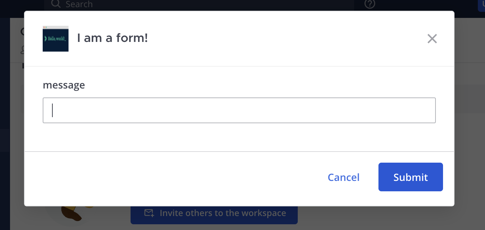
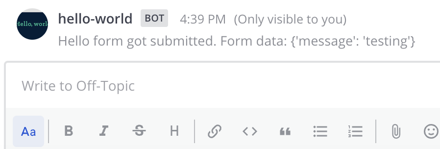
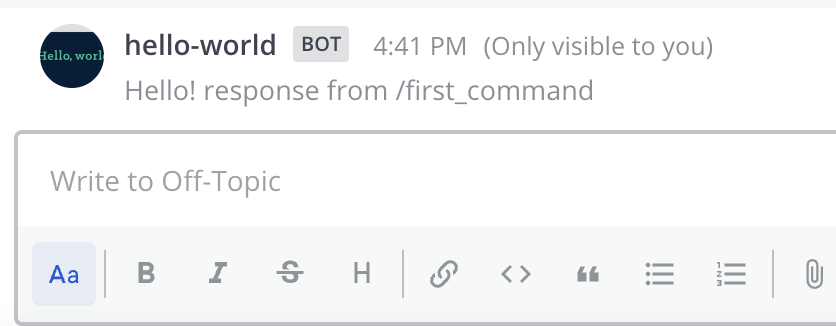

This quick start guide will walk you through the basics of creating a hello world Mattermost app in Python. In this guide you will build an app that:

- Contains a `manifest.json`, declares itself an HTTP application that acts as a bot, and attaches to locations in the user interface.
- Contains a `form` with a `submit` function that can launch a modal (if applicable) and send an interpolated message back to the user.
- Attaches an icon button to the channel header and creates `/first-command` and `/second-command` slash commands to provide functionality.

## Prerequisites

Before you can start with your app, you first need to set up your environment by following the [developer setup guide]().

You also need [Python version 3 installed](https://www.python.org/downloads/).

## Download and start the app

In the same [mattermost-app-examples repository](https://github.com/mattermost/mattermost-app-examples) you cloned via the [developer setup guide]() above, navigate to the `python/hello-world` directory and start the Docker compose:

```sh
cd python/hello-world
docker compose up
```

You'll see Docker install the npm modules and then the app will come online and print the following message:

```
Running on http://mattermost-apps-python-hello-world:8090
```

## Install the app on Mattermost

Next, access your development Mattermost server at [http://localhost:8065](http://localhost:8065) and use the `/apps install http http://mattermost-apps-python-hello-world:8090/manifest.json` slash command to install the hello world app. Select `Agree to grant the app access to APIs and Locations` and click `Submit` to finish the installation.

## Use the app

Select the "Hello World" channel header button in Mattermost, which brings up a modal:



Type `testing` and select **Submit**, you should see:



You can use `/second-command send testing` to achieve the same result.

You can also use the `/first-command` to see a standalone command:



## Review the app

To understand the app, examine the following elements:

### Manifest

The app has to provide a manifest, which declares the app's metadata required for installation. In this example, the following permissions and locations are requested:

- Create posts as a bot (`act_as_bot`)
- Render icons in the channel header (`/channel_header`)
- Create slash commands (`/command`)

### Bindings and locations

This app adds a channel header button and slash commands. In order to register these locations, there is a `POST` handler for the `/bindings` endpoint on your app's API.

### Functions and forms

Forms handle user events on the bindings. This app provides a `form` before `POST`ing to the `/submit` function. In the case of a channel header, the form will launch a modal to collect its fields. In the case of a slash command, the form's fields will be collected as arguments from the user's command.

### Assets

Apps may include static assets (e.g., `icon.png`). Static assets must be served under the `static` path. For example, there is a `icon.png` file in the `src/static` directory that this app serves.

## Uninstall the app

Once you're done with the app, you can uninstall it via the `/apps uninstall hello-world` slash command. Alternatively, you can use `/apps debug clean` to remove all data for all installed apps.

To stop and clean up the app from Docker after you're done, use the following command in the `python/hello-world` directory:

```sh
docker compose down
```

## Conclusion

You now know how to create a Mattermost app in Python. If you have questions about building apps or want to show off what you're building, join us on the [Integrations & Apps channel in the Mattermost Community server](https://community.mattermost.com/core/channels/integrations)!
