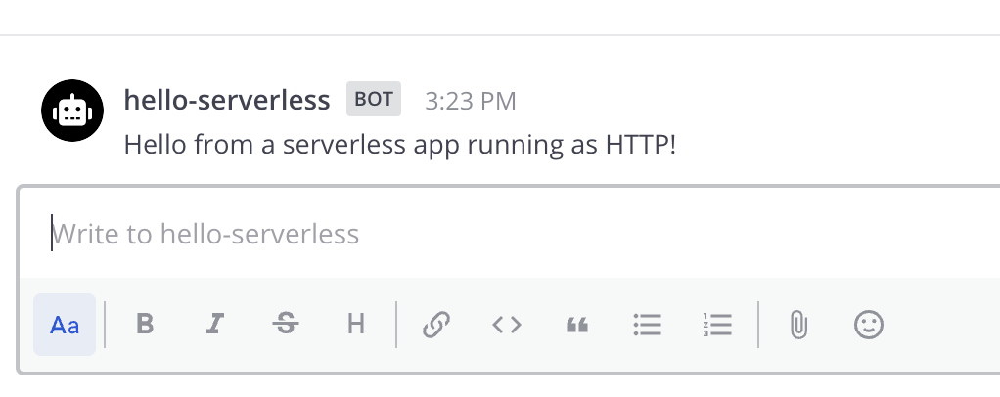

This quick start guide will walk you through the basics of using creating a serverless Mattermost App in Go on AWS or OpenFaaS. In this guide you will review an App that:

- Contains a `manifest.json`, declares itself an HTTP application that uses a bot account, uses webhooks, and attaches UI elements to locations in the Mattermost interface.
- Attaches `send` function to a `/hello-serverless` command, accepting an optional `message` argument.

This App will focus on the functionality of the actual serverless App in this example. For more information about [how to package a Mattermost App for serverless deployments](), [how to deploy a Mattermost App to AWS](), or [how to deploy a Mattermost App to OpenFaaS]() please refer to the corresponding guides.

## Prerequisites

Before you can start with your App, you should first set up your environment by following the [developer setup guide]().

You also need Go v1.16 or later installed. Please follow the  to install the latest version.

## Download and start the App

In the same  you cloned via the [developer setup guide]() above, navigate to the  directory and start the Docker container:

```sh
cd golang/serverless
docker compose up
```

The `docker-compose.yml` uses the [HTTP deployment]() of the serverless App for the sake of trying it out locally. You'll see Docker install the Go modules and then the App will come online and print the following message:

    Install via /apps install http http://mattermost-apps-golang-serverless:8080/manifest.json 

## Install the App on Mattermost

Next, access your development Mattermost Server at  and use the `/apps install http http://mattermost-apps-golang-serverless:8080/manifest.json ` slash command to install the App. Select `Agree to grant the app access to APIs and Locations` and click `Submit` to finish the installation.

## Use the App

You can now use the `/hello-serverless send` command with an optional `message` argument. This will cause the App's bot user to  direct message (DM) you a response:



If you included `message` in the slash command, that would also be included in the response.

## Review the App

To understand the App, examine the following elements:

### Manifest

The App must provide a manifest, which declares App metadata. In this example, the following permissions are requested via the `/manifest.json` endpoint:

- Create posts as a bot.
- Create slash commands.

### Bindings and locations

[Bindings]() specify how an App's calls should be displayed and invoked from these locations.  Locations are named elements in the Mattermost user interface.

### Call handlers

Call handlers are functions that respond to user interactions and webhook events. The serverless App uses only one main call handler via a slash command:

- `/hello-serverless send` slash command with an optional `message` argument that sends DMs the user's channel via the App bot.

All of the logic for the serverless App can be found in `golang/serverless/function/handler.go`, which is the shared function file across all deployment types (HTTP, AWS, and OpenFaaS) for this App. In this file you can review the `send` function that corresponds with the above slash command via a binding. The binding contains a `form` with a `submit` function that sends an interpolated message back to the user. As a slash command, the form's one optional `message` will be collected as an argument from the user's command.

### Assets

Apps may include static assets. Only one asset is used in this example for this App: `icon.png`. Static assets must be served under the `static` path.

## Uninstall the App

Once you're done with the App, you can uninstall it via the `/apps uninstall hello-serverless` slash command. Alternatively, you can use `/apps debug clean` to remove all data for all installed Apps.

To stop and clean up the App from Docker after you're done, use the following command in the `golang/serverless` directory:

```sh
docker compose down
```

## Explore serverless deployments

Now that you've examined the App in HTTP mode, you can next look at deploying them to your desired serverless plaform. Check out the guides on [how to deploy a Mattermost App to AWS]() or [how to deploy a Mattermost App to OpenFaaS](), depending on which platform you're targeting.

## Conclusion

You now know how to create a Mattermost App in Go. If you have questions about building Apps or want to show off what you're building, join us on the  channel in the Mattermost Community server!
