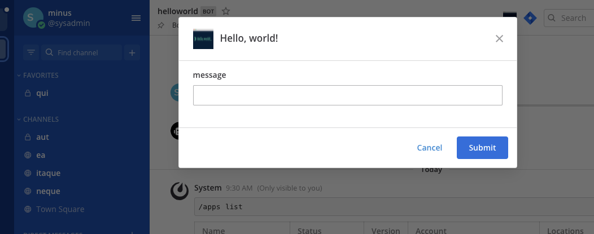

This quick start guide will walk you through the basics of creating a hello world Mattermost App in TypeScript. In this guide you will review an App that:

- Contains a `manifest.json`, declares itself an HTTP application that uses a bot account and attaches UI elements to locations in the user interface.
- Contains a `form` with a `submit` function that can launch a modal (if applicable) and send an interpolated message back to the user.
- Attaches an icon button to the channel header and creates a `/node-example` slash command to provide functionality.

## Prerequisites

Before you can start with your App, you should first set up your environment by following the [developer setup guide]().

You also need .

## Download and start the App

In the same  you cloned via the [developer setup guide]() above, navigate to the  directory and start the Docker container:

```sh
cd typescript/hello-world
docker compose up
```

You'll see Docker install the npm modules and then the App will come online and print the following message:

```
app listening on port 4000
```

## Install the App on Mattermost

Next, access your development Mattermost Server at  and use the `/apps install http http://mattermost-apps-typescript-hello-world:4000/manifest.json` slash command to install the hello world App. Select `Agree to grant the app access to APIs and Locations` and click `Submit` to finish the installation.

## Use the App

Select the "Hello World" channel header button in Mattermost, which brings up a modal:



Type "testing" and select **Submit**, you should see:


You can also use the `/node-example send` command by typing `/node-example send Hi!`.

## Review the App

To understand the App, examine the following elements:

### Manifest

The App has to provide a manifest, which declares the App's metadata required for installation. In this example, the following permissions and locations are requested:

- Create posts as a bot (`act_as_bot`)
- Render icons in the channel header (`/channel_header`)
- Create slash commands (`/command`)

### Bindings and locations

[Bindings]() specify how an App's calls should be displayed and invoked from these locations. This App adds a channel header button and a `/node-example send` slash command. In order to register these locations, there is a `POST` handler for the `/bindings` endpoint on your App's API.

### Call handlers and forms

Call handlers are functions that respond to user interactions and webhook events. Forms handle user events on the bindings via call handlers. This App provides a `form` before `POST`ing to the `/submit` function. In the case of a channel header, the form will launch a modal to collect its fields. In the case of a slash command, the form's fields will be collected as arguments from the user's command.

### Assets

Apps may include static assets (e.g., `icon.png`). Static assets must be served under the `static` path. For example, there is a `icon.png` file in the `dev/node_app/static` directory that this App serves.

## Uninstall the App

Once you're done with the App, you can uninstall it via the `/apps uninstall node-example` slash command. Alternatively, you can use `/apps debug clean` to remove all data for all installed Apps.

To stop and clean up the App from Docker after you're done, use the following command in the `typescript/hello-world` directory:

```sh
docker compose down
```

## Conclusion

You now know how to create a Mattermost App in TypeScript. If you have questions about building Apps or want to show off what you're building, join us on the  channel in the Mattermost Community server!
