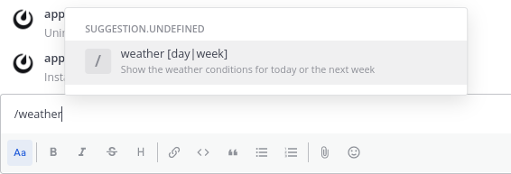
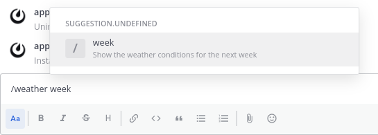

Bindings () establish the relationship between [call]() handlers and [locations]().
Whenever the bindings call is executed the App provides a list of bindings based on the [request context]().

Bindings are refreshed when the App is installed, on every channel switch, and when an OAuth2 process with a third party has completed. Bindings may also be refreshed when the user moves to a different context, such as opening a thread or a post in a search view, or when explicitly specified in a call response.

## Top level bindings

| Name       | Type                                                                                                                             | Description                             |
|:-----------|:---------------------------------------------------------------------------------------------------------------------------------|:----------------------------------------|
| `location` |  (`string`) | Top level location.                     |
| `bindings` |  (list)       | A list of bindings under this location. |


Bindings for `/in_post` locations should not be included in the response to the bindings call.


## Sub-location bindings

Sub-location bindings use the following data structure:

| Name                                                                               | Type                                                                                                                       | Description                                                                                                           | Locations                                         |
|------------------------------------------------------------------------------------|----------------------------------------------------------------------------------------------------------------------------|-----------------------------------------------------------------------------------------------------------------------|---------------------------------------------------|
| `location`                                                                         | string                                                                                                                     | The name of the binding location. Values must be unique within each top level binding.                                | all locations                                     |
| `icon`                                                                             | string                                                                                                                     | The App icon to display, either a fully-qualified URL or a path to an App static asset. Required for web app support. | `/channel_header`<br/>`/post_menu`                |
| `label`                                                                            | string                                                                                                                     | The primary text to display at the binding location; defaults to the value of the `location` field.                   | all locations                                     |
| `hint`                                                                             | string                                                                                                                     | Secondary text to display at the binding location                                                                     | `/channel_header`<br/>`/command`                  |
| `description`                                                                      | string                                                                                                                     | Extended help text used in modal forms and command autocomplete                                                       | `/command`                                        |
| `submit`    | Call                                                                                                                       | Executes an action associated with the binding                                                                        | all locations                                     |
| `form`      | Form                                                                                                                       | The modal form to display                                                                                             | `/channel_header`<br/>`/command`<br/>`/post_menu` |
| `bindings`  |  (list) | Additional sub-location bindings                                                                                      | all locations                                     |


Only one of the `submit`, `form`, and `bindings` fields can be specified in a sub-location binding. Specifying more than one is treated as an error.


## Call context data

The following request context fields will be available to calls invoked at each binding location:

| Location          | Context fields                                                            |
|-------------------|---------------------------------------------------------------------------|
| `/channel_header` | `user_id`<br/>`channel_id`<br/>`team_id`                                  |
| `/command`        | `user_id`<br/>`root_post_id`<br/>`channel_id`<br/>`team_id`               |
| `/post_menu`      | `user_id`<br/>`post_id`<br/>`root_post_id`<br/>`channel_id`<br/>`team_id` |

### Slash command bindings

The slash command (`/command`) location allows the creation of multiple, nested slash commands.
Each slash command can execute a call, display a form, or accept further parameters to trigger a nested command.

The `bindings` field for this location is used to specify nested commands. 
If this field is specified, the `submit` and `form` fields can't also be specified; an error will occur.

For example, a slash command binding that returns one day or one week worth of weather information:

```json
{
  "bindings": [
    {
      "location": "/command",
      "bindings": [         
        {
          "location": "weather",
          "label": "Weather conditions",
          "description": "Show the weather conditions for today or the next week",
          "hint": "[day|week]",
          "bindings": [
            {
              "location": "day",
              "label": "Weather for today",
              "description": "Show the weather conditions for today",
              "call": {
                "path": "/weather/day"
              }
            },
            {
              "location": "week",
              "label": "Weather for the next week",
              "description": "Show the weather conditions for the next week",
              "call": {
                "path": "/weather/week"
              }
            }
          ]
        }
      ]
    }
  ]
}
```

In the Mattermost UI, typing `/weather` shows the details of the slash command:



Typing `/weather week` shows the details of the nested command:



A user could invoke the slash command using `/weather day` or `/weather week` to get weather conditions for one day or one week, respectively.

## Bindings call response

The response to the bindings call should take the form of an `ok` [call response]() where the `data` field contains the bindings.


Bindings for `/in_post` locations should not be included in the response.


For example:
```json
{
	"type": "ok",
	"data": [
		{
			"location": "/channel_header",
			"bindings": [
				{
					"location": "send-button",
					"icon": "icon.png",
					"label":"send hello message",
					"call": {
						"path": "/send-modal"
					}
				}
			]
		},
		{
			"location": "/command",
			"bindings": [
				{
					"icon": "icon.png",
					"label": "helloworld",
					"description": "Hello World app",
					"hint": "[send]",
					"bindings": [
						{
							"location": "send",
							"label": "send",
							"call": {
								"path": "/send"
							}
						}
					]
				}
			]
		}
	]
}
```

## Example request and response



`GET /plugins/com.mattermost.apps/api/v1/bindings?user_id=ws4o4macctyn5ko8uhkkxmgfur&channel_id=qphz13bzbf8c7j778tdnaw3huc&scope=webapp`





`POST /plugins/com.mattermost.apps/example/hello/bindings`

```json
{
    "path": "/bindings",
    "context": {
        "app_id": "helloworld",
        "bot_user_id": "i4wzxbk1hbbufq8rnecso96oxr",
        "acting_user_id": "81bqom3kjjbo7bcjcnzs6dc8uh",
        "user_id": "81bqom3kjjbo7bcjcnzs6dc8uh",
        "team_id": "",
        "channel_id": "ytqokpzzcinszf7ywrbdfitusw",
        "mattermost_site_url": "http://localhost:8065",
        "user_agent": "webapp",
        "bot_access_token": "gcn6r3ac178zbxwiw5pc38e8zc"
    }
}
```





```json
{
    "type": "ok",
    "data": [
        {
            "location": "/channel_header",
            "bindings": [
                {
                    "location": "send-button",
                    "icon": "icon.png",
                    "label": "send hello message",
                    "call": {
                        "path": "/send-modal"
                    }
                }
            ]
        },
        {
            "location": "/post_menu",
            "bindings": [
                {
                    "location": "send-button",
                    "icon": "icon.png",
                    "label": "send hello message",
                    "call": {
                        "path": "/send",
                        "expand": {
                            "post": "all"
                        }
                    }
                }
            ]
        },
        {
            "location": "/command",
            "bindings": [
                {
                    "icon": "icon.png",
                    "description": "Hello World app",
                    "hint": "[send]",
                    "bindings": [
                        {
                            "location": "send",
                            "label": "send",
                            "call": {
                                "path": "/send-modal"
                            }
                        }
                    ]
                }
            ]
        }
    ]
}
```


