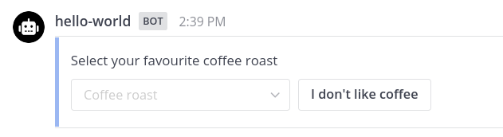

Posts can be embedded with bindings which display form-like [elements](#embedded-binding-elements), specifically buttons and selects, to the user for asynchronous interaction. Any number of button and select elements can be used.

A post property, `app_bindings`, defines the embedded bindings. These bindings take the same form as other [App bindings]().

## Post a message using HTTP REST

To post a message using HTTP REST, the  is used.
The  responsible for posting a message is `/api/v4/posts`.

Requests to the REST API must include an `Authorization` header with a bearer token set to the acting user or bot token.

## Embedded bindings using HTTP REST

The following example shows an HTTP REST request that posts a message with embedded bindings:


```http request
POST /api/v4/posts HTTP/1.1
Host: mattermost:8066
Authorization: Bearer <acting_user_or_bot_token>
Content-Type: application/json

{
    "channel_id": "<channel_id>",
    "props": {
        "app_bindings": [
            {
                "app_id": "<app_id>",
                "location": "embedded",
                "description": "Select your favourite coffee roast",
                "bindings": [
                    {
                        "location": "coffee-roast",
                        "label": "Coffee roast",
                        "bindings": [
                            {
                                "location": "dark-roast",
                                "label": "Dark roast",
                                "submit": {
                                    "path": "/set-roast-preference"
                                }
                            },
                            {
                                "location": "medium-roast",
                                "label": "Medium roast",
                                "submit": {
                                    "path": "/set-roast-preference"
                                }
                            },
                            {
                                "location": "light-roast",
                                "label": "Light roast",
                                "submit": {
                                    "path": "/set-roast-preference"
                                }
                            }
                        ]
                    },
                    {
                        "location": "i-dont-like-coffee",
                        "label": "I don't like coffee",
                        "submit": {
                            "path": "/set-roast-preference"
                        }
                    }
                ]
            }
        ]
    }
}
```



## Embedded bindings using Golang


```go
post := &models.Post{
    ChannelID: callRequest.Context.Channel.ID,
}
postAppBindings := []apps.Binding{
    {
        Location:    "embedded",
        AppID:       appManifest.AppID,
        Description: "Select your favourite coffee roast",
        Bindings: []apps.Binding{
            {
                Location: "coffee-roast",
                Label:    "Coffee roast",
                Bindings: []apps.Binding{
                    {
                        Location: "dark-roast",
                        Label:    "Dark roast",
                        Submit:   apps.NewCall("/set-roast-preference"),
                    },
                    {
                        Location: "medium-roast",
                        Label:    "Medium roast",
                        Submit:   apps.NewCall("/set-roast-preference"),
                    },
                    {
                        Location: "light-roast",
                        Label:    "Light roast",
                        Submit:   apps.NewCall("/set-roast-preference"),
                    },
                },
            },
            {
                Location: "i-dont-like-coffee",
                Label:    "I don't like coffee",
                Submit:   apps.NewCall("/set-roast-preference"),
            },
        },
    },
}
// NOTE: apps.PropAppBindings == "app_bindings"
post.AddProp(apps.PropAppBindings, postAppBindings)
client := appclient.AsBot(callRequest.Context)
createdPost, err := client.CreatePost(post)
if err != nil {
    // handle the error
}
```




## Call request

The call request from selecting an option looks like the following:

```json
{
    "path": "/set-roast-preference",
    "expand": {},
    "context": {
        "app_id": "hello-world",
        "location": "/in_post/embedded/coffee-roast/medium-roast",
        "user_agent": "webapp",
        "track_as_submit": true,
        "mattermost_site_url": "http://mattermost:8066",
        "developer_mode": true,
        "app_path": "/plugins/com.mattermost.apps/apps/hello-world",
        "bot_user_id": "mgbd1czngjbbdx6eqruqabdeie",
        "bot_access_token": "pb7g98amypdkiymcwr9f7qtqdw",
        "acting_user": {
            "id": "7q7kaakokfdsdycy3pr9ctkc5r"
            // additional fields omitted for brevity
        },
        "oauth2": {}
    }
}
```

The value of the `location` context field indicates which option was selected by the user.

## Embedded binding elements

Embedded bindings can use two types of form elements: buttons and selects. Any number of button and select elements can be used. 
When a button is clicked or a select is changed, the binding element's `submit` call is performed. The call will include the App, user, post, root post (if any), channel, and team IDs.

### Buttons

Button bindings contain the following fields:

| Name                                                                              | Type                                                | Description                                                                                                                              |
|:----------------------------------------------------------------------------------|:----------------------------------------------------|:-----------------------------------------------------------------------------------------------------------------------------------------|
| `location`                                                                        | string                                              | Location name. The whole location path will be provided in the context.                                                                  |
| `label`                                                                           | string                                              | Label that will show in the button. Defaults to location. Must be unique in its level.                                                   |
| `submit` | [Call]()  | Call to be made when the button is selected. You must provide a call if there is no form, or the form itself does not have a call.       |
| `form`   | [Form]() | Form to open in a modal form when the button is clicked. You must provide a form with a call if there is no call defined in the binding. |


At least one of the `submit` or `form` fields must be specified for an embedded button binding.


### Selects

Select bindings contain the following fields:

| Name       | Type                                                             | Description                                                             |
|:-----------|:-----------------------------------------------------------------|:------------------------------------------------------------------------|
| `location` | string                                                           | Location name. The whole location path will be provided in the context. |
| `label`    | string                                                           | Placeholder text displayed when there has been no selection.            |
| `submit`   | [Call]()               | (_Optional_) Call to be made inherited by the options.                  |
| `form`     | [Form]()              | (_Optional_) Form to be inherited by the options.                       |
| `bindings` | [Binding]() (list) | Options for the select.                                                 |

#### Select options

Select options contain the following fields:

| Name                                                                              | Type                                                | Description                                                                                                                                            |
|:----------------------------------------------------------------------------------|:----------------------------------------------------|:-------------------------------------------------------------------------------------------------------------------------------------------------------|
| `location`                                                                        | string                                              | Option name. The whole location path will be provided in the context.                                                                                  |
| `label`                                                                           | string                                              | User-facing string. Defaults to location. Must be unique in its level.                                                                                 |
| `submit` | [Call]()  | (_Optional_) Call to perform when the option is selected. You must provide a call if there is no form, or the form itself does not have a call.        |
| `form`   | [Form]() | (_Optional_) Form to open in a modal form when the option is selected. You must provide a Form with a Call if there is no Call defined in the Binding. |


At least one of the `submit` or `form` fields must be specified for each embedded select option.

