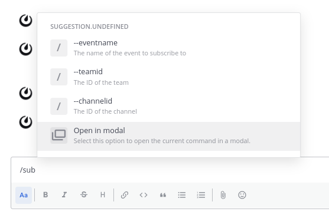
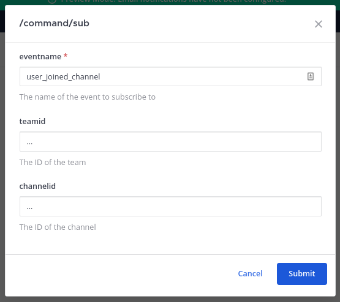
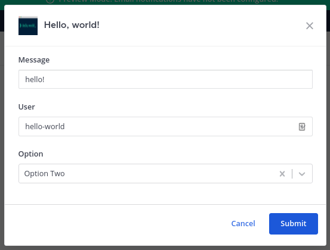

Mattermost Apps use a single data structure for user input: the Form. A form gets input from a modal dialog or from slash command arguments.
Forms in a modal dialog open on the user interface as a result of a [call]() response.

## Data structure

The structure of a form () is defined in the following table:

| Name                                                   | Type                     | Description                                                                                                                                                   |
|:-------------------------------------------------------|:-------------------------|:--------------------------------------------------------------------------------------------------------------------------------------------------------------|
| `title`  | string                   | Title of the form, shown in modal dialogs.                                                                                                                    |
| `submit` | [Call]() | Call to perform when the form is submitted or the slash command is executed.                                                                                  |
| `fields` | [Fields](#fields)        | List of fields in the form.                                                                                                                                   |
| `source` | [Call]() | Call to perform when a form's fields are not defined or when the form needs to be refreshed.                                                                  |
| `header`                                               | string                   | Text used as introduction in modal dialogs.                                                                                                                   |
| `footer`                                               | string                   | Text used at the end of modal dialogs.                                                                                                                        |
| `icon`                                                 | string                   | Either a fully-qualified URL, or a path for an app's [static asset]().                                                               |
| `submit_buttons`                                       | string                   | Name of the form field to be used as the list of submit buttons. Must be a `static_select` or `dynamic_select` field. Default value is a single button: `OK`. |


- Fields with mandatory values are marked by a .
- At least one of `fields` or `source` must be defined.


### Fields

The structure of a form field () is defined in the following table:

| Name                                                 | Type                                              | Description                                                                                                                                           |
|:-----------------------------------------------------|:--------------------------------------------------|:------------------------------------------------------------------------------------------------------------------------------------------------------|
| `name` | string                                            | Key to use in the values field of the call. Cannot include spaces or tabs.                                                                            |
| `type` | [FieldType](#field-types) (string)                | The type of the field.                                                                                                                                |
| `is_required`                                        | bool                                              | Whether the field has a mandatory value.                                                                                                              |
| `readonly`                                           | bool                                              | Whether a field's value is read-only.                                                                                                                 |
| `value`                                              | _any_                                             | The field's default value.                                                                                                                            |
| `description`                                        | string                                            | Short description of the field, displayed beneath the field in modal dialogs.                                                                         |
| `label`                                              | string                                            | The label of the flag parameter; used with autocomplete. Ignored for positional parameters.                                                           |
| `hint`                                               | string                                            | The hint text for the field; used with autocomplete.                                                                                                  |
| `position`                                           | int                                               | The index of the positional argument. A value greater than zero indicates the position this field is in. A value of `-1` indicates the last argument. |
| `multiselect`                                        | bool                                              | Whether a select field allows multiple values to be selected.                                                                                         |
| `modal_label`                                        | string                                            | Label of the field in modal dialogs. Defaults to `label` if not defined.                                                                              |
| `refresh`                                            | bool                                              | Allows the form to be refreshed when the value of the field has changed.                                                                              |
| `options`                                            | [SelectOption](#select-options)                   | A list of options for static select fields.                                                                                                           |
| `lookup`                                             | [Call]()                          | A call that returns a list of options for dynamic select fields.                                                                                      |
| `subtype`                                            | [TextFieldSubtype](#text-field-subtypes) (string) | The subtype of `text` field that will be shown.                                                                                                       |
| `min_length`                                         | int                                               | The minimum length of `text` field input.                                                                                                             |
| `max_length`                                         | int                                               | The maximum length of `text` field input.                                                                                                             |

### Field types

The types of form fields are:

| Name                      | Description                                                           |
|:--------------------------|:----------------------------------------------------------------------|
| `text`                    | A plain text field.                                                   |
| `static_select`           | A dropdown select with static elements.                               |
| `dynamic_select`          | A dropdown select that loads the elements dynamically.                |
| `bool`                    | A boolean selector represented as a checkbox.                         |
| `user`                    | A dropdown to select users.                                           |
| `channel`                 | A dropdown to select channels.                                        |
| `markdown`                | An arbitrary markdown text; only visible in modal dialogs. Read-only. |

#### Text fields

##### Text field subtypes

The `text` field subtypes, except `textarea`, map to the types of the HTML `input` form element. The available subtypes are listed in the following table:

| Subtype Name                                                                                                     | Description                                                      |
|------------------------------------------------------------------------------------------------------------------|------------------------------------------------------------------|
|         | A single-line text input field.                                  |
|        | A multi-line text input field; uses the HTML `textarea` element. |
|        | A field for editing an email address.                            |
|      | A field for entering a number; includes a spinner component.     |
|  | A single-line text input field whose value is obscured.          |
|            | A field for entering a telephone number.                         |
|            | A field for entering a URL.                                      |

#### Select fields

##### Select options

The data structure of an option (`SelectOption`) in a select field is defined by the following table:

| Name                                                  | Type   | Description                                                                                     |
|:------------------------------------------------------|:-------|:------------------------------------------------------------------------------------------------|
| `label` | string | User-facing string. Defaults to `value` and must be unique on this field.                       |
| `value` | string | Machine-facing value. Must be unique on this field.                                             |
| `icon_data`                                           | string | Either a fully-qualified URL, or a path for an app's [static asset](). |

##### Dynamic select options

A dynamic select field gets its options by performing the `lookup` call.
The [call response]() is expected to contain the list of select field options in the `items` key of the `data` map. Each option is of the type [SelectOption](#select-options).

Example `lookup` call response:

```json
{
    "type": "ok",
    "data": {
        "items": [
            {
                "label": "Option One",
                "value": "option_1"
            },
            {
                "label": "Option Two",
                "value": "option_2"
            }
        ]
    }
}
```

##### Select field refresh

If the `refresh` value is set to `true`, the form's `source` call is performed any time the field's value changes. The call request will include the current values of the form.
The call response is expected to contain a full, updated form definition.

#### Markdown fields

Markdown fields are a special field that allows you to better format your form. They will not generate any value in the form submission sent to the App. The content is defined in the `description` property of the field.

### Form submission

When the form is submitted, either by executing a slash command or clicking a submit button, the form's `submit` call is performed.

## Slash command arguments

Slash command arguments and flags are defined by form fields. When a slash command is typed, the command arguments are retrieved from the command's form.
If a form was not included with the command binding, the binding's call will be invoked to provide a form response.



```json
{
    "location": "sub",
    "label": "sub",
    "description": "Subscribe to an event",
    "form": {
        "title": "Subscribe to an event",
        "header": "Subscribe to a Mattermost Server event",
        "icon": "icon.png",
        "fields": [
            {
                "name": "eventname",
                "label": "eventname",
                "type": "text",
                "subtype": "input",
                "description": "The name of the event to subscribe to",
                "is_required": true
            },
            {
                "name": "teamid",
                "label": "teamid",
                "type": "text",
                "subtype": "input",
                "description": "The ID of the team"
            },
            {
                "name": "channelid",
                "label": "channelid",
                "type": "text",
                "subtype": "input",
                "description": "The ID of the channel"
            }
        ],
        "submit": {
            "path": "/sub"
        }
    }
}
```




```json
{
    "location": "sub",
    "label": "sub",
    "description": "Subscribe to an event",
    "form": {
        "title": "Subscribe to an event",
        "header": "Subscribe to a Mattermost Server event",
        "icon": "icon.png",
        "fields": [
            {
                "name": "eventname",
                "label": "eventname",
                "type": "text",
                "subtype": "input",
                "description": "The name of the event to subscribe to",
                "is_required": true,
                "position": 1
            },
            {
                "name": "teamid",
                "label": "teamid",
                "type": "text",
                "subtype": "input",
                "description": "The ID of the team",
                "position": 2
            },
            {
                "name": "channelid",
                "label": "channelid",
                "type": "text",
                "subtype": "input",
                "description": "The ID of the channel",
                "position": 3
            }
        ],
        "submit": {
            "path": "/sub"
        }
    }
}
```



During [autocomplete](), the user can open the form in a modal dialog to finish entering command arguments.
Any fields not supported by commands, such as markdown fields, or form attributes not visible in commands, such as the title, will be shown when the form is opened as a modal dialog.





When the slash command is executed, the form's `submit` call will be performed.

## End-to-end examples

### Click a button in the channel header



```http request
POST /send HTTP/1.1
Content-Type: application/json

{
    "path": "/send",
    "expand": {},
    "context": {
        "app_id": "hello-world",
        "location": "/channel_header/send-button",
        "user_agent": "webapp",
        "track_as_submit": true,
        "mattermost_site_url": "http://mattermost:8066",
        "developer_mode": true,
        "app_path": "/plugins/com.mattermost.apps/apps/hello-world",
        "bot_user_id": "mgbd1czngjbbdx6eqruqabdeie",
        "bot_access_token": "fpbrjjnp5if59fazjjn794f3zy",
        "acting_user": {
            "id": "7q7kaakokfdsdycy3pr9ctkc5r"
            // additional fields omitted for brevity
        },
        "oauth2": {}
    }
}

```




```json
{
    "type": "form",
    "form": {
        "title": "Hello, world!",
        "icon": "icon.png",
        "fields": [
            {
                "type": "text",
                "name": "message",
                "label": "Message"
            },
            {
                "type": "user",
                "name": "user",
                "label": "User"
            },
            {
                "type": "static_select",
                "name": "option",
                "label": "Option",
                "options": [
                    {
                        "label": "Option One",
                        "value": "option_1"
                    },
                    {
                        "label": "Option Two",
                        "value": "option_2"
                    }
                ]
            }
        ],
        "call": {
            "path": "/send"
        }
    }
}
```





### Select from a user field in a modal dialog



```http request
POST /send-form-source HTTP/1.1
Content-Type: application/json

{
    "path": "/send-form-source",
    "expand": {},
    "values": {
        "message": null,
        "option": null,
        "user": {
            "label": "hello-world",
            "value": "mgbd1czngjbbdx6eqruqabdeie"
        }
    },
    "context": {
        "app_id": "hello-world",
        "location": "/channel_header/send-button",
        "user_agent": "webapp",
        "mattermost_site_url": "http://localhost:8066",
        "developer_mode": true,
        "app_path": "/plugins/com.mattermost.apps/apps/hello-world",
        "bot_user_id": "mgbd1czngjbbdx6eqruqabdeie",
        "bot_access_token": "omppotxyt3ddbdczsjddzxuqro",
        "acting_user": {
            "id": "7q7kaakokfdsdycy3pr9ctkc5r"
            // additional fields omitted for brevity
        },
        "oauth2": {}
    },
    "selected_field": "user"
}
```




```json
{
    "type": "form",
    "form": {
        "source": {
            "path": "/send-form-source"
        },
        "title": "Hello, world!",
        "icon": "icon.png",
        "submit": {
            "path": "/modal-submit"
        },
        "fields": [
            {
                "name": "message",
                "type": "text",
                "label": "Message"
            },
            {
                "name": "user",
                "type": "user",
                "value": {
                    "label": "hello-world",
                    "value": "mgbd1czngjbbdx6eqruqabdeie"
                },
                "label": "User",
                "refresh": true
            },
            {
                "name": "option",
                "type": "static_select",
                "label": "Option",
                "options": [
                    {
                        "label": "Option One",
                        "value": "option_1"
                    },
                    {
                        "label": "Option Two",
                        "value": "option_2"
                    }
                ]
            }
        ]
    }
}
```

`"refresh": true` is used to tell the client to notify the server when a value is selected from this field




### Dynamic select field lookup



```http request
POST /send-dynamic-form HTTP/1.1
Content-Type: application/json

{
    "type": "form",
    "form": {
        "title": "Dynamic field test",
        "icon": "icon-info.png",
        "submit": {
            "path": "/dynamic-form-submit"
        },
        "fields": [
            {
                "name": "option",
                "type": "dynamic_select",
                "label": "Option",
                "lookup": {
                    "path": "/dynamic-form-lookup"
                }
            }
        ]
    }
}
```




```http request
POST /dynamic-form-lookup HTTP/1.1
Content-Type: application/json

{
    "path": "/dynamic-form-lookup",
    "expand": {},
    "values": {
        "option": null
    },
    "context": {
        "app_id": "hello-world",
        "location": "/channel_header/info-button",
        "user_agent": "webapp",
        "mattermost_site_url": "http://localhost:8066",
        "developer_mode": true,
        "app_path": "/plugins/com.mattermost.apps/apps/hello-world",
        "bot_user_id": "mgbd1czngjbbdx6eqruqabdeie",
        "bot_access_token": "fqez47d1jtnbzcty3xnydjoq6h",
        "acting_user": {
            "id": "7q7kaakokfdsdycy3pr9ctkc5r"
            // additional fields omitted for brevity
        },
        "oauth2": {}
    },
    "selected_field": "option"
}
```




```json
{
    "type": "ok",
    "data": {
        "items": [
            {
                "label": "Option One",
                "value": "option_1"
            },
            {
                "label": "Option Two",
                "value": "option_2"
            }
        ]
    }
}
```



### Submit from a modal dialog



```json
{
    "type": "form",
    "form": {
        "source": {
            "path": "/send-form-source"
        },
        "title": "Hello, world!",
        "icon": "icon.png",
        "submit": {
            "path": "/modal-submit"
        },
        "fields": [
            {
                "name": "message",
                "type": "text",
                "label": "Message"
            },
            {
                "name": "user",
                "type": "user",
                "label": "User",
                "refresh": true
            },
            {
                "name": "option",
                "type": "static_select",
                "label": "Option",
                "options": [
                    {
                        "label": "Option One",
                        "value": "option_1"
                    },
                    {
                        "label": "Option Two",
                        "value": "option_2"
                    }
                ]
            }
        ]
    }
}
```




```http request
POST /modal-submit HTTP/1.1
Content-Type: application/json

{
    "path": "/modal-submit",
    "expand": {},
    "values": {
        "message": "hello!",
        "option": {
            "label": "Option Two",
            "value": "option_2"
        },
        "user": {
            "label": "hello-world",
            "value": "mgbd1czngjbbdx6eqruqabdeie"
        }
    },
    "context": {
        "app_id": "hello-world",
        "location": "/channel_header/send-button",
        "user_agent": "webapp",
        "track_as_submit": true,
        "mattermost_site_url": "http://localhost:8066",
        "developer_mode": true,
        "app_path": "/plugins/com.mattermost.apps/apps/hello-world",
        "bot_user_id": "mgbd1czngjbbdx6eqruqabdeie",
        "bot_access_token": "gqouzbhrb3rw9n9qr43nykyuoy",
        "acting_user": {
            "id": "7q7kaakokfdsdycy3pr9ctkc5r"
           // additional fields omitted for brevity
        },
        "oauth2": {}
    }
}
```




```json
{
    "type": "ok",
    "text": "## Form values\n- message: \"hello!\"\n- option: {\"label\":\"Option Two\", \"value\":\"option_2\"}\n- user: {\"label\":\"hello-world\", \"value\":\"mgbd1czngjbbdx6eqruqabdeie\"}\n"
}
```



## Example error responses

### Single error

```json
{
    "type": "error",
    "text": "This is the error."
}
```

### Errors for specific fields

```json
{
    "type": "error",
    "data": {
        "errors": {
            "field_name": "This field seems to have an invalid value."
        }
    }
}
```

### A root error and specific field errors
```json
{
    "type": "error",
    "text": "This is the root error.",
    "data": {
        "errors": {
            "field_name": "This field seems to have an invalid value."
        }
    }
}
```
