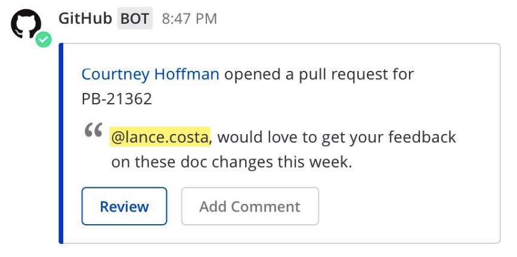
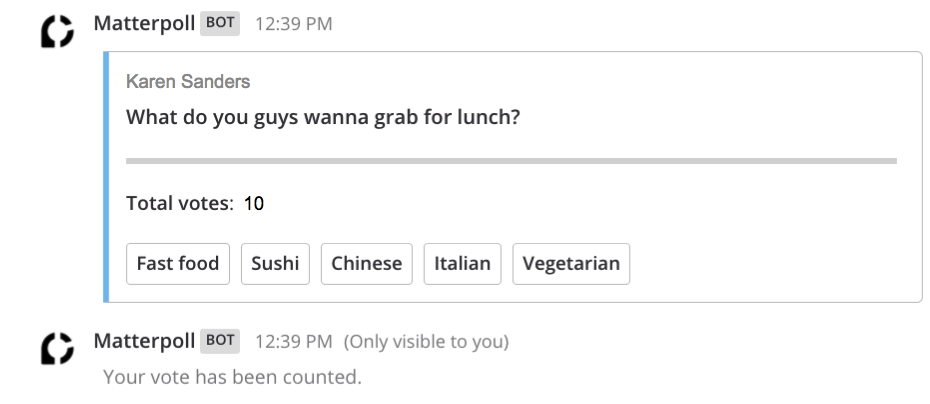
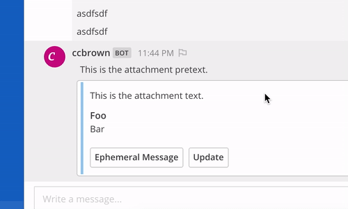
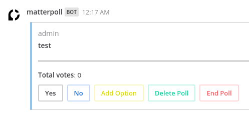

For information on interactive dialogs, [see here](../admin-interactive-dialogs).

Use interactive messages to simplify complex workflows by allowing users to take quick actions directly through your integration post. For example, they enable your integration to:

- Mark a task complete in your project management tracker.
- Conduct a customer survey or a poll.
- Initiate a command to merge a branch into a release.

To try it out, you can use this [Matterpoll plugin](https://github.com/matterpoll/matterpoll) to add polling to Mattermost channels via a `/poll` slash command.



## Message Buttons

Add message buttons as `actions` in your integration [message attachments](https://docs.mattermost.com/developer/message-attachments.html).

The following payload gives an example that uses message buttons.

```
{
  "attachments": [
    {
      "pretext": "This is the attachment pretext.",
      "text": "This is the attachment text.",
      "actions": [
        {
          "id": "message",
          "name": "Ephemeral Message",
          "integration": {
            "url": "http://127.0.0.1:7357",
            "context": {
              "action": "do_something_ephemeral"
            }
          }
        }, {
          "id": "update",
          "name": "Update",
          "integration": {
            "url": "http://127.0.0.1:7357",
            "context": {
              "action": "do_something_update"
            }
          }
        }
      ]
    }
  ]
}
```

In the HTTP response for this request, the integration can choose to update the original post, and/or respond with an ephemeral message:

```
{
  "update": {
    "message": "Updated!",
    "props": {}
  },
  "ephemeral_text": "You updated the post!"
}
```



Button actions support a style parameter to change the color of the button. The possible values for style are: `good`, `warning`, `danger`, `default`, `primary`, and `success`. It's also possible to pass a theme variable or a hex color, but we discourage this approach because it won't be resilient against theme changes.



The actions used in the previous example include the following:

```
[
  {
    "id": "vote0",
    "type": "button",
    "name": "Yes",
    "style": "default"
  },
  {
    "id": "vote1",
    "type": "button",
    "name": "No",
    "style": "primary"
  },
  {
    "id": "addOption",
    "type": "button",
    "name": "Add Option",
    "style": "warning"
  },
  {
    "id": "deletePoll",
    "type": "button",
    "name": "Delete Poll",
    "style": "success"
  },
  {
    "id": "endPoll",
    "type": "button",
    "name": "End Poll",
    "style": "danger"
  }
]
```

## Message Menus

Similar to buttons, add message menus as `actions` in your integration [message attachments]().


The following payload gives an example that uses message menus.

```
{
  "attachments": [
    {
      "pretext": "This is the attachment pretext.",
      "text": "This is the attachment text.",
      "actions": [
        {
          "id": "action_options",
          "name": "Select an option...",
          "integration": {
            "url": "http://127.0.0.1:7357/action_options",
            "context": {
              "action": "do_something"
            }
          },
          "type": "select",
          "options": [
                  {
                      "text": "Option1",
                      "value": "opt1"
                  },
                  {
                      "text": "Option2",
                      "value": "opt2"
                  },
                  {
                      "text": "Option3",
                      "value": "opt3"
                  }
          ]
        }
      ]
    }
  ]
}
```

The integration can respond with an update to the original post, or with an ephemeral message:

```
{
  "update": {
    "message": "Updated!",
    "props": {}
  },
  "ephemeral_text": "You updated the post!"
}
```

### Message Menus for Channels

You can provide a list of channels for message menus for users to select from. Users can only select from public channels in their teams.

Specify `channels` as your action's `data_source` as follows:

```
{
  "attachments": [
    {
      "pretext": "This is the attachment pretext.",
      "text": "This is the attachment text.",
      "actions": [
        {
          "id": "action_options",
          "name": "Select an option...",
          "integration": {
            "url": "http://127.0.0.1:7357/action_options",
            "context": {
              "action": "do_something"
            }
          },
          "type": "select",
          "data_source": "channels"
        }
      ]
    }
  ]
}
```

### Message Menus for Users

Similar to channels, you can also provide a list of users for message menus. The user can choose the user who is part of the Mattermost system.

Specify `users` as your action's `data_source` as follows:

```
{
  "attachments": [
    {
      "id": "action_options",
      "pretext": "This is the attachment pretext.",
      "text": "This is the attachment text.",
      "actions": [
        {
          "name": "Select an option...",
          "integration": {
            "url": "http://127.0.0.1:7357/action_options",
            "context": {
              "action": "do_something"
            }
          },
          "type": "select",
          "data_source": "users"
        }
      ]
    }
  ]
}
```

### Parameters

Below is a brief description of each parameter to help you customize the interactive message button and menu in Mattermost. For more information on message attachments, [see our documentation](https://docs.mattermost.com/developer/message-attachments.html).

ID
  A per post unique identifier.

Name
  Give your action a descriptive name.

URL
  The actions are backed by an integration that handles HTTP POST requests when users select the message button. The URL parameter determines where this action is sent. The request contains an `application/json` JSON string. As of 5.14, relative URLs are accepted, simplifying the workflow when a plugin handles the action.

Context
  The requests sent to the specified URL contain the user ID, post ID, channel ID, team ID, and any context that was provided in the action definition. If the post was of type `Message Menus`, then context also contains the `selected_option` field with the user-selected option value. The post ID can be used to, for example, delete or edit the post after selecting a message button.
  
  A simple example of a request is given below:

```
  {
  "user_id": "rd49ehbqyjytddasoownkuqrxe",
  "post_id": "gqrnh3675jfxzftnjyjfe4udeh",
  "channel_id": "j6j53p28k6urx15fpcgsr20psq",
  "team_id": "5xxzt146eax4tul69409opqjlf",
  "context": {
    "action": "do_something"
    }
  }
```

In most cases, your integration will do one or both of these things:
  
  1. **Identifying which action was triggered**. For example, a GitHub integration might store something like this in the context:

```
    {
    "user_id": "rd49ehbqyjytddasoownkuqrxe",
    "post_id": "gqrnh3675jfxzftnjyjfe4udeh",
    "channel_id": "j6j53p28k6urx15fpcgsr20psq",
    "team_id": "5xxzt146eax4tul69409opqjlf",
    "context": {
      "repo": "mattermost/mattermost-server"
      "pr": 1234,
      "action": "merge"
      }
    }
```   

In the example above, when the message button is selected, your integration sends a request to the specified URL with the intention to merge the pull request identified by the context.

  2. **Authenticating the server**. An important property of the context parameter is that it's kept confidential. If your integration is not behind a firewall, you could add a token to your context without users ever being able to see it:

```
    {
    "user_id": "rd49ehbqyjytddasoownkuqrxe",
    "post_id": "gqrnh3675jfxzftnjyjfe4udeh",
    "channel_id": "j6j53p28k6urx15fpcgsr20psq",
    "team_id": "5xxzt146eax4tul69409opqjlf",
    "context": {
      "repo": "mattermost/mattermost-server"
      "pr": 1234,
      "action": "merge",
      "token": "somerandomlygeneratedsecret"
      }
    }
```

Then, when your integration receives the request, it can verify that the token matches one that you previously generated and know that the request is legitimately coming from the Mattermost server and is not forged.

Depending on the application, integrations can also perform authentication statelessly with cryptographic signatures such as:

```
    {
    "user_id": "rd49ehbqyjytddasoownkuqrxe",
    "post_id": "gqrnh3675jfxzftnjyjfe4udeh",
    "channel_id": "j6j53p28k6urx15fpcgsr20psq",
    "team_id": "5xxzt146eax4tul69409opqjlf",
    "context": {
      "repo": "mattermost/mattermost-server"
      "pr": 1234,
      "action": "merge",
      "signature": "mycryptographicsignature"
      }
    }
```

It's also possible for integrations to do both of these things with a single token and use something like this as context:

```
    {
    "user_id": "rd49ehbqyjytddasoownkuqrxe",
    "post_id": "gqrnh3675jfxzftnjyjfe4udeh",
    "channel_id": "j6j53p28k6urx15fpcgsr20psq",
    "team_id": "5xxzt146eax4tul69409opqjlf",
    "context": {
      "action_id": "someunguessableactionid"
      }
    }
```

Then, when the integration receives the request, it can act based on the action ID.

Tips and Best Practices

1. The external application may be written in any programming language. It needs to provide a URL which receives the request sent by your Mattermost server and responds within the required JSON format.
2. To get started, you can use this `sample plugin <https://github.com/matterpoll/matterpoll>`__ to add polling to Mattermost channels via a `/poll` slash command.

## Share Your Integration

If you've built an integration for Mattermost, please consider sharing your work in our [app directory](https://integrations.mattermost.com).

The [app directory](https://integrations.mattermost.com) lists open source integrations developed by the Mattermost community and are available for download, customization, and deployment to your private cloud or self-hosted infrastructure.

## Slack Compatibility

Like Slack, actions are specified in an **Actions** list within the message attachment. Moreover, your integrations can react with ephemeral messages or message updates similar to Slack.

However, the schema for these objects is slightly different given Slack requires a Slack App and action URL to be pre-configured beforehand. Mattermost instead allows an integration to create an interactive message without pre-configuration.

If your `ephemeral_text` gets incorrectly handled by the Slack-compatibility logic, send `"skip_slack_parsing":true` along your `ephemeral_text` to bypass it.

```
{
  "update": {
    "message": "Updated!"
  },
  "ephemeral_text": "You updated the post!",
  "skip_slack_parsing": true
}
```

## Frequently Asked Questions

### Are message buttons and menus supported in ephemeral messages?

Yes, message buttons and menus are supported in ephemeral messages in Mattermost 5.10 and later. This applies to integrations using plugins, the RESTful API and webhooks, across the browser and Desktop App.

As an advanced feature, you can also use plugins to update the contents of an ephemeral message with message buttons or menus with the [UpdateEphemeralMessage plugin API]().

### Why does an interactive button or menu return a 400 error?

It is likely for one of three reasons:

1. Mattermost wasn't able to connect to the integration. If the integration is on your internal infrastructure, it'll need to be whitelisted (see ["AllowedUntrustedInternalConnections" config.json setting](https://docs.mattermost.com/configure/configuration-settings.html#allow-untrusted-internal-connections-to)). The log will include the text `err=address forbidden` in the error message.
2. The integration didn't return HTTP status 200. The log will include the text `status=XXX` in the error message.
3. The integration didn't return a valid JSON response. The log will include the text `err=some json error message` in the error message.

### How do I manage properties of an interactive message?

Use `update.Props` in the following ways to manage properties (`Props`) of an interactive message after a user performs an action via an interactive button or menu:

 - `update.Props == nil` - Do not update `Props` field.
 - `update.Props == {}` - Clear all properties, except the username and icon of the original message, as well as whether the message was pinned to channel or contained emoji reactions.
 - `update.Props == some_props` - Post will be updated to `some_props`. Username and icon of the original message, and whether the message was pinned to channel or contained emoji reactions will not be updated.
