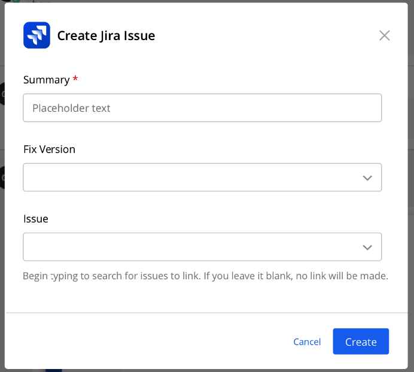
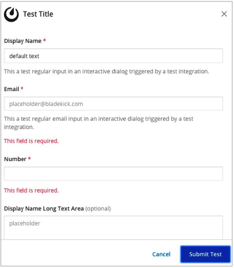
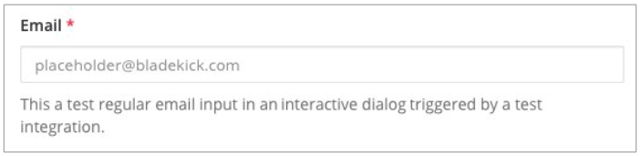
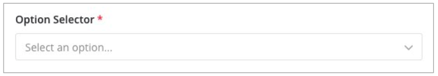
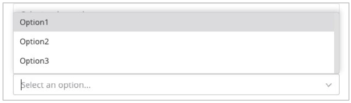
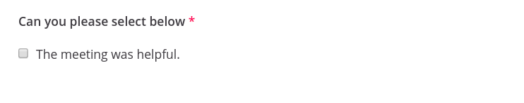
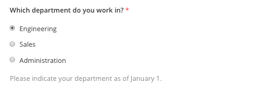
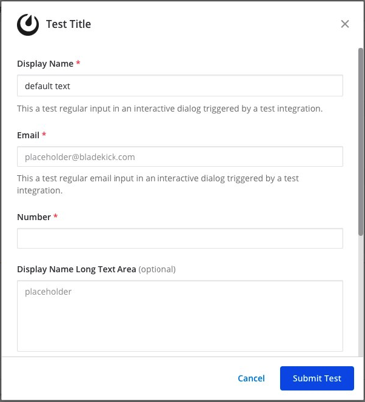

Integrations open dialogs by sending an `HTTP POST`, containing some data in the request body, to an endpoint on the Mattermost server. Integrations can use this endpoint to open dialogs when users [click message buttons or select an option from a menu](), or use a
[custom slash command]().

Moreover, [plugins]() can trigger a dialog based on user actions. For instance, if a plugin adds a button in the channel header, clicking that button may open a dialog.

Here is an example of what a dialog looks like for creating a Jira issue within the Mattermost user interface:



## Open a dialog

To open a dialog, your integration must first receive an HTTP request from the Mattermost server. This request will be triggered by a slash command or an interactive message. It will include a trigger ID.

Once you have the trigger ID you can use it to open the interactive dialog by sending an `HTTP POST` request to `https://<your-mattermost-url>/api/v4/actions/dialogs/open`. See the below section for what to include in the body of that HTTP request.

## Parameters

Interactive dialogs support the following parameters:

| Parameter           | Type    | Description                                                                                                                                                                        |
|---------------------|---------|------------------------------------------------------------------------------------------------------------------------------------------------------------------------------------|
| `title`             | String  | Title of the dialog. Maximum 24 characters.                                                                                                                                        |
| `introduction_text` | String  | Markdown-formatted introduction text which is displayed above the dialog `elements`.                                                                                               |
| `elements`          | Array   | See below for more details on elements. If none are supplied the dialog box acts as a simple confirmation.                                    |
| `url`               | String  | The URL to send the submitted dialog payload to.                                                                                                                                   |
| `icon_url`          | String  | (Optional) The URL of the icon used for your dialog. If none specified, no icon is displayed.                                                                                      |
| `submit_label`      | String  | (Optional) Label of the button to complete the dialog. Default is `Submit`.                                                                                                        |
| `notify_on_cancel`  | Boolean | (Optional) When `true`, sends an event back to the integration whenever there's a user-induced dialog cancellation. No other data is sent back with the event. Default is `false`. |
| `state`             | String  | (Optional) String provided by the integration that will be echoed back with dialog submission. Default is the empty string.                                                        |
| `is_multistep`      | Boolean | (Optional) Set to `true` to enable multi-step dialog functionality. Default is `false`.                                                                                           |
| `refresh_on_select` | Boolean | (Optional) When `true`, sends field refresh requests when select field values change. Default is `false`.                                                                         |

Sample JSON is given below. Form submissions are sent back to the URL defined by the integration. You must also include the trigger ID you received from the slash command or interactive message.

```json
{
    "trigger_id": "<unique ID generated by the server>",
    "url": "<URL to send the submitted request to>",
    "dialog": {
        "callback_id": "<ID specified by the integration to identify the request>",
        "title": "<title of the dialog>",
        "introduction_text": "<Text describing the dialog box content>",
        "elements": ["<Array of UI elements to display in the dialog>"],
        "submit_label": "<label of the button to complete the dialog>",
        "notify_on_cancel": false,
        "state": "<string provided by the integration that will be echoed back with dialog submission>",
        "is_multistep": false,
        "refresh_on_select": false
    }
}
```

## Elements

Each dialog supports elements for users to enter information.

- `text`: Single-line plain text field. Use this for inputs such as names, email addresses, or phone numbers.
- `textarea`: Multi-line plain text field. Use this field when the answer is expected to be longer than 150 characters.
- `select`: Message menu. Use this for pre-selected choices. Can either be static menus or dynamic menus generated from users and Public channels of the system. For more information on message menus, see [the documentation]().
- `bool`: Checkbox option. Use this for binary selection.
- `radio`: Radio button option. Use this to quickly select an option from pre-selected choices.
- `date`: Date picker field. Use this for selecting dates without time information.
- `datetime`: Date and time picker field. Use this for selecting both date and time with timezone support.

Each element is required by default, otherwise the client will return an error as shown below. Note that the error message will appear below the help text, if one is specified. To make an element optional, set the field `"optional": "true"`.



### Text elements

Text elements are single-line plain text fields. Below is an example of a `text` element that asks for an email address.



```json
{
    "display_name": "Email",
    "name": "email",
    "type": "text",
    "subtype": "email",
    "placeholder": "placeholder@example.com"
}
```

There is an optional `"subtype": "email"` field in the above example, which specifies the keyboard layout used on mobile. For this example, the email keypad is shown to the user given the subtype is set to `email`.

The full list of supported fields is included below:

| Field          | Type    | Description                                                                                                                                                                                      |
|----------------|---------|--------------------------------------------------------------------------------------------------------------------------------------------------------------------------------------------------|
| `display_name` | String  | Display name of the field shown to the user in the dialog. Maximum 24 characters.                                                                                                                |
| `name`         | String  | Name of the field element used by the integration. Maximum 300 characters. You should use unique `name` fields in the same dialog.                                                               |
| `type`         | String  | Set this value to `text` for a text element.                                                                                                                                                     |
| `subtype`      | String  | (Optional) One of `text`, `email`, `number`, `password` (as of v5.14), `tel`, or `url`. Default is `text`. Use this to set which keypad is presented to users on mobile when entering the field. |
| `min_length`   | Integer | (Optional) Minimum input length allowed for an element. Default is 0.                                                                                                                            |
| `max_length`   | Integer | (Optional) Maximum input length allowed for an element. Default is 150. If you expect the input to be greater 150 characters, consider using a `textarea` type element instead.                  |
| `optional`     | Boolean | (Optional) Set to `true` if this form element is not required. Default is `false`.                                                                                                               |
| `help_text`    | String  | (Optional) Set help text for this form element. Maximum 150 characters.                                                                                                                          |
| `default`      | String  | (Optional) Set a default value for this form element. Maximum 150 characters.                                                                                                                    |
| `placeholder`  | String  | (Optional) A string displayed to help guide users in completing the element. Maximum 150 characters.                                                                                             |

### Textarea elements

Textarea elements are multi-line plain text fields. A sample JSON is provided below:

```json
{
    "display_name": "Ticket Description",
    "name": "ticket_description",
    "type": "textarea",
    "help_text": "Provide description for your ticket."
}
```

The maximum length for a `textarea` is 3,000 characters.

The list of supported fields is the same as for the `textarea` type element.


| Field          | Type    | Description                                                                                                                                                                                      |
|----------------|---------|--------------------------------------------------------------------------------------------------------------------------------------------------------------------------------------------------|
| `display_name` | String  | Display name of the field shown to the user in the dialog. Maximum 24 characters.                                                                                                                |
| `name`         | String  | Name of the field element used by the integration. Maximum 300 characters. You should use unique `name` fields in the same dialog.                                                               |
| `type`         | String  | Set this value to `texareat` for a textarea element.                                                                                                                                             |
| `subtype`      | String  | (Optional) One of `text`, `email`, `number`, `password` (as of v5.14), `tel`, or `url`. Default is `text`. Use this to set which keypad is presented to users on mobile when entering the field. |
| `min_length`   | Integer | (Optional) Minimum input length allowed for an element. Default is 0.                                                                                                                            |
| `max_length`   | Integer | (Optional) Maximum input length allowed for an element. Default is 3000.                                                                                                                         |
| `optional`     | Boolean | (Optional) Set to `true` if this form element is not required. Default is `false`.                                                                                                               |
| `help_text`    | String  | (Optional) Set help text for this form element. Maximum 150 characters.                                                                                                                          |
| `default`      | String  | (Optional) Set a default value for this form element. Maximum 3000 characters.                                                                                                                   |
| `placeholder`  | String  | (Optional) A string displayed to help guide users in completing the element. Maximum 3000 characters.                                                                                            |

### Select elements

Select elements are message menus that allow users to select one or multiple predefined options from a list. Below is an example of a `select` element that asks for one of three different options.





```json
{
    "display_name": "Option Selector",
    "name": "options",
    "type": "select",
    "options": [
         {
             "text": "Option1",
             "value": "opt1"
         },
         {
             "text": "Option2",
             "value": "opt2"
         },
         {
             "text": "Option3",
             "value": "opt3"
         }
    ]
}
```

#### Multiselect support
##### Minimum Server Version: 11.0

Select elements can be configured to allow multiple selections by setting the `multiselect` parameter to `true`. When multiselect is enabled, users can choose multiple options from the list.

```json
{
    "display_name": "Multiple Options",
    "name": "multi_options",
    "type": "select",
    "multiselect": true,
    "default": "opt1,opt3",
    "options": [
         {
             "text": "Option1",
             "value": "opt1"
         },
         {
             "text": "Option2",
             "value": "opt2"
         },
         {
             "text": "Option3",
             "value": "opt3"
         }
    ]
}
```

For multiselect elements, default values can be specified as a comma-separated string (e.g., `"opt1,opt3"` to pre-select Option1 and Option3).

#### Dynamic select support
##### Minimum Server Version: 11.0

Select elements can be configured to load options dynamically from an external API endpoint. This enables real-time filtering, searching, and loading of options based on user input.

To use dynamic select, set `data_source: "dynamic"` and provide a `data_source_url` that points to your lookup endpoint:

```json
{
    "display_name": "Dynamic Options",
    "name": "dynamic_field",
    "type": "select",
    "data_source": "dynamic",
    "data_source_url": "https://your-mattermost-server.com/plugins/your-plugin-id/api/lookup",
    "placeholder": "Search for options..."
}
```

When users interact with a dynamic select field, Mattermost will send HTTP POST requests to your `data_source_url` with the following payload:

```json
{
    "user_id": "user_id_here",
    "channel_id": "channel_id_here", 
    "team_id": "team_id_here",
    "term": "user_search_input"
}
```

Your endpoint should respond with an array of options:

```json
{
    "items": [
        {
            "text": "Option 1",
            "value": "option1"
        },
        {
            "text": "Option 2", 
            "value": "option2"
        }
    ]
}
```

**Security Requirements:**
- Dynamic select URLs must use HTTPS
- URLs must be within the `/plugins/` path for security
- The lookup endpoint should validate user permissions

**Dynamic select with multiselect:**

```json
{
    "display_name": "Multiple Dynamic Options",
    "name": "multi_dynamic_field",
    "type": "select",
    "multiselect": true,
    "data_source": "dynamic",
    "data_source_url": "https://your-mattermost-server.com/plugins/your-plugin-id/api/lookup",
    "placeholder": "Search and select multiple options..."
}
```

The `select` element can also be generated dynamically from users and channels of the system.

For users, use:

```json
{
    "display_name": "Assignee",
    "name": "assignee",
    "type": "select",
    "data_source": "users"
}
```

For multiple user selection:

```json
{
    "display_name": "Multiple Assignees",
    "name": "assignees",
    "type": "select",
    "multiselect": true,
    "data_source": "users"
}
```

For Public channels, use:

```json
{
    "display_name": "Post this message to",
    "name": "channel",
    "type": "select",
    "data_source": "channels"
}
```

For multiple channel selection:

```json
{
    "display_name": "Post to multiple channels",
    "name": "channels",
    "type": "select",
    "multiselect": true,
    "data_source": "channels"
}
```

The list of supported fields for the `select` type element is included below:

| Field              | Type    | Description                                                                                                                        |
|--------------------|---------|------------------------------------------------------------------------------------------------------------------------------------|
| `display_name`     | String  | Display name of the field shown to the user in the dialog. Maximum 24 characters.                                                  |
| `name`             | String  | Name of the field element used by the integration. Maximum 300 characters. You should use unique `name` fields in the same dialog. |
| `type`             | String  | Set this value to `select` for a `select` element.                                                                                 |
| `multiselect`      | Boolean | (Optional) Set to `true` to allow multiple selections from the list. Default is `false`.                                           |
| `data_source`      | String  | (Optional) One of `users`, `channels`, or `dynamic`. If none specified, assumes a manual list of options is provided by the integration. |
| `data_source_url`  | String  | (Optional) URL for dynamic option loading when `data_source` is `dynamic`. Must be HTTPS and within `/plugins/` path.             |
| `optional`         | Boolean | (Optional) Set to `true` if this form element is not required. Default is `false`.                                                 |
| `options`          | Array   | (Optional) An array of options for the select element. Not applicable for `users`, `channels`, or `dynamic` data sources.         |
| `help_text`        | String  | (Optional) Set help text for this form element. Maximum 150 characters.                                                            |
| `default`          | String  | (Optional) Set a default value for this form element. For multiselect, use comma-separated values. Maximum 3,000 characters.      |
| `placeholder`      | String  | (Optional) A string displayed to help guide users in completing the element. Maximum 3,000 characters.                             |


### Checkbox element

From Mattermost v5.16 you can use `checkbox` elements. It looks like a plain text field with a checkbox to be selected. Below is an example of a `checkbox` element that asks for meeting feedback.



```json
{
    "display_name": "Can you please select below",
    "placeholder": "The meeting was helpful.",
    "name": "meeting_input",
    "type": "bool"
}
```

The full list of supported fields is included below:

| Field          | Type    | Description                                                                                                                        |
|----------------|---------|------------------------------------------------------------------------------------------------------------------------------------|
| `display_name` | String  | Display name of the field shown to the user in the dialog. Maximum 24 characters.                                                  |
| `name`         | String  | Name of the field element used by the integration. Maximum 300 characters. You should use unique `name` fields in the same dialog. |
| `type`         | String  | Set this value to `bool` for a checkbox element.                                                                                   |
| `optional`     | Boolean | (Optional) Set to `true` if this form element is not required. Default is `false`.                                                 |
| `help_text`    | String  | (Optional) Set help text for this form element. Maximum 150 characters.                                                            |
| `default`      | String  | (Optional) Set a default value for this form element. `true` or `false`.                                                           |
| `placeholder`  | String  | (Optional) A string displayed to include a label besides the checkbox. Maximum 150 characters.                                     |

### Radio element

From Mattermost v5.16 you can use `radio` elements. It looks like a plain text field with a radio button to be selected. Below is an example of a `radio` element that asks for a department.



```json
{
    "display_name": "Which department do you work in?",
    "name": "department",
    "type": "radio",
    "options": [
        {
            "text": "Engineering",
            "value": "engineering"
        },
        {
            "text": "Sales",
            "value": "sales"
        },
        {
            "text": "Administration",
            "value": "administration"
        }
    ],
    "help_text": "Please indicate your department as of January 1.",
    "default": "engineering"
}
```

The full list of supported fields are included below:

| Field          | Type   | Description                                                                                                                        |
|----------------|--------|------------------------------------------------------------------------------------------------------------------------------------|
| `display_name` | String | Display name of the field shown to the user in the dialog. Maximum 24 characters.                                                  |
| `name`         | String | Name of the field element used by the integration. Maximum 300 characters. You should use unique `name` fields in the same dialog. |
| `type`         | String | Set this value to `radio` for a radio element.                                                                                     |
| `options`      | Array  | (Optional) An array of options for the radio element.                                                                              |
| `help_text`    | String | (Optional) Set help text for this form element. Maximum 150 characters.                                                            |
| `default`      | String | (Optional) Set a default value for this form element.                                                                              |

### Date elements
##### Minimum Server Version: 11.1

Date elements provide native date picker functionality for selecting dates without time information. Below is an example of a `date` element for event scheduling.


```json
{
    "display_name": "Event Date",
    "name": "event_date",
    "type": "date",
    "default": "2024-03-15",
    "placeholder": "Select a date",
    "help_text": "Choose the date for your event",
    "optional": false,
    "min_date": "today",
    "max_date": "+30d"
}
```

The full list of supported fields for `date` elements is included below:

| Field          | Type    | Description                                                                                                                        |
|----------------|---------|------------------------------------------------------------------------------------------------------------------------------------|
| `display_name` | String  | Display name of the field shown to the user in the dialog. Maximum 24 characters.                                                  |
| `name`         | String  | Name of the field element used by the integration. Maximum 300 characters. You should use unique `name` fields in the same dialog. |
| `type`         | String  | Set this value to `date` for a date element.                                                                                       |
| `default`      | String  | (Optional) Default value in ISO date format (YYYY-MM-DD) or relative format (`today`, `tomorrow`, `+1d`, `+1w`, `+1M`, `+1y`). Full ISO datetime strings are accepted but only the date part is parsed; timezone information is ignored. |
| `placeholder`  | String  | (Optional) Placeholder text shown in the input field. Maximum 150 characters.                                                      |
| `help_text`    | String  | (Optional) Help text displayed below the field. Maximum 150 characters.                                                            |
| `optional`     | Boolean | (Optional) Set to `true` if this form element is not required. Default is `false`.                                                 |
| `min_date`     | String  | (Optional) Earliest selectable date. Supports ISO date format (YYYY-MM-DD) or relative formats (`today`, `tomorrow`, `+1d`, `-7d`, etc.). Full ISO datetime strings are accepted but only the date part is parsed; timezone information is ignored. |
| `max_date`     | String  | (Optional) Latest selectable date. Supports ISO date format (YYYY-MM-DD) or relative formats (`today`, `+30d`, `+1y`, etc.). Full ISO datetime strings are accepted but only the date part is parsed; timezone information is ignored. |

#### Date field usage examples

**Basic date selection:**
```json
{
    "display_name": "Project Deadline",
    "name": "deadline",
    "type": "date",
    "help_text": "When is this project due?",
    "min_date": "today",
    "optional": false
}
```

**Date range with relative defaults:**
```json
{
    "display_name": "Flexible Date",
    "name": "any_date",
    "type": "date",
    "help_text": "Any date within the next year",
    "min_date": "today",
    "max_date": "+1y",
    "default": "+1w",
    "optional": true
}
```

### DateTime elements
##### Minimum Server Version: 11.1

DateTime elements provide combined date and time picker functionality with timezone support. Below is an example of a `datetime` element for meeting scheduling.


```json
{
    "display_name": "Meeting Time",
    "name": "meeting_time",
    "type": "datetime",
    "default": "2024-03-15T14:30:00Z",
    "placeholder": "Select date and time",
    "help_text": "Choose when the meeting should start",
    "optional": false,
    "time_interval": 30,
    "min_date": "today",
    "max_date": "+7d"
}
```

The full list of supported fields for `datetime` elements is included below:

| Field           | Type    | Description                                                                                                                        |
|-----------------|---------|------------------------------------------------------------------------------------------------------------------------------------|
| `display_name`  | String  | Display name of the field shown to the user in the dialog. Maximum 24 characters.                                                  |
| `name`          | String  | Name of the field element used by the integration. Maximum 300 characters. You should use unique `name` fields in the same dialog. |
| `type`          | String  | Set this value to `datetime` for a datetime element.                                                                               |
| `default`       | String  | (Optional) Default value in ISO datetime format (RFC3339) or relative format. For relative dates, time defaults to noon. When specifying a time, it must align with the `time_interval` (be a multiple of the interval). |
| `placeholder`   | String  | (Optional) Placeholder text shown in the input field. Maximum 150 characters.                                                      |
| `help_text`     | String  | (Optional) Help text displayed below the field. Maximum 150 characters.                                                            |
| `optional`      | Boolean | (Optional) Set to `true` if this form element is not required. Default is `false`.                                                 |
| `min_date`      | String  | (Optional) Earliest selectable date. Supports ISO format or relative formats (`today`, `tomorrow`, `+1d`, `-7d`, etc.).           |
| `max_date`      | String  | (Optional) Latest selectable date. Supports ISO format or relative formats (`today`, `+30d`, `+1y`, etc.).                        |
| `time_interval` | Integer | (Optional) Time selection interval in minutes. Must be between 1 and 1440, and must be a divisor of 1440 to create evenly spaced intervals throughout the day. Common values: 15, 30, 60, 90, 120. Default is 60. |

#### DateTime field usage examples

**Meeting scheduler with business hours:**
```json
{
    "display_name": "Meeting Time",
    "name": "meeting_time",
    "type": "datetime",
    "help_text": "Select a time during business hours",
    "time_interval": 30,
    "min_date": "+1d",
    "max_date": "+14d",
    "optional": false
}
```

**Event with custom time intervals:**
```json
{
    "display_name": "Event Start Time",
    "name": "event_start",
    "type": "datetime",
    "help_text": "When does your event begin?",
    "time_interval": 15,
    "min_date": "today",
    "max_date": "+90d",
    "default": "today"
}
```

#### Date and DateTime field specifications

**Relative Date Formats:**
- `today`: Current date
- `tomorrow`: Next day
- `yesterday`: Previous day
- `+Nd`: N days from today (e.g., `+1d`, `+7d`)
- `+Nw`: N weeks from today (e.g., `+1w`, `+2w`)
- `+NM`: N months from today (e.g., `+1M`, `+6M`)
- `+Ny`: N years from today (e.g., `+1y`)
- `-Nd`: N days ago (e.g., `-1d`, `-7d`)

**ISO Format Examples:**
- Date: `2024-03-15` (YYYY-MM-DD)
- DateTime: `2024-03-15T14:30:00Z` (RFC3339 format)
- DateTime with timezone: `2024-03-15T14:30:00-05:00`

**Form Submission Format:**
- Date fields submit in ISO date format: `2024-03-15`
- DateTime fields submit in RFC3339 format with user's timezone: `2024-03-15T14:30:00-05:00`

**Localization:**
- Date fields automatically format according to user's locale (e.g., "Mar 15, 2024" for en-US)
- DateTime fields respect user's 12/24 hour preference and locale-specific formatting
- Time picker displays times according to user's timezone

**Validation:**
- Client validates date formats and range constraints
- Server validates relative date resolution and field configuration
- For datetime fields, `time_interval` must be a divisor of 1440 (24 hours in minutes)
- Default times must align with the specified `time_interval` (be a multiple of the interval)
- Invalid dates, times, or out-of-range selections show appropriate error messages

**Time Interval Examples:**
- `time_interval: 15` creates options: 00:00, 00:15, 00:30, 00:45, 01:00, etc.
- `time_interval: 30` creates options: 00:00, 00:30, 01:00, 01:30, etc.
- `time_interval: 60` creates options: 00:00, 01:00, 02:00, 03:00, etc.
- Invalid: `time_interval: 7` (7 is not a divisor of 1440)

#### Advanced DateTime Configuration (v11.6)

For more advanced datetime field features, use the `datetime_config` object to group related properties. This approach provides better organization and enables new features like timezone support and manual time entry.

**DialogDateTimeConfig Structure:**

```json
{
    "display_name": "Event Time",
    "name": "event_time",
    "type": "datetime",
    "help_text": "When is your event?",
    "datetime_config": {
        "time_interval": 30,
        "location_timezone": "America/New_York",
        "allow_manual_time_entry": true
    }
}
```

**datetime_config Properties:**

| Property | Type | Description |
|----------|------|-------------|
| `time_interval` | Integer | Time selection interval in minutes (1-1440, must be divisor of 1440). Default: 60. |
| `location_timezone` | String | IANA timezone for displaying times (e.g., "America/New_York", "Europe/London", "Asia/Tokyo"). When set, times are shown in this timezone with an indicator. Values are still stored in UTC. |
| `allow_manual_time_entry` | Boolean | When `true`, shows a text input for typing times instead of dropdown. Supports formats: `9am`, `3:45pm`, `14:30`, `12a`. Default: `false`. |

**Backward Compatibility:**

The original flat structure is still supported:
```json
{
    "type": "datetime",
    "time_interval": 30,    // Legacy format
    "min_date": "today",
    "max_date": "+7d"
}
```

New features require `datetime_config`:
```json
{
    "type": "datetime",
    "min_date": "today",        // Can use legacy fields alongside datetime_config
    "datetime_config": {
        "time_interval": 30,
        "location_timezone": "Asia/Tokyo"
    }
}
```

**Timezone Support Example:**

Display event times in a specific timezone (useful for global teams):

```json
{
    "display_name": "London Office Hours",
    "name": "london_time",
    "type": "datetime",
    "help_text": "Times shown in GMT (with 🌍 indicator)",
    "datetime_config": {
        "location_timezone": "Europe/London",
        "time_interval": 60
    }
}
```

**Behavior:**
- User in Denver (UTC-7) sees times in London (GMT)
- Dropdown shows: 00:00, 01:00, 02:00 (London time)
- User selects 14:00 (2 PM London)
- Value submitted: `2024-03-15T14:00:00Z` (UTC)
- 🌍 indicator shows "Times in GMT"

**Manual Time Entry Example:**

Allow users to type exact times instead of selecting from dropdown:

```json
{
    "display_name": "Precise Event Time",
    "name": "event_time",
    "type": "datetime",
    "help_text": "Type exact time: 9am, 14:30, 3:45pm",
    "datetime_config": {
        "allow_manual_time_entry": true
    }
}
```

**Behavior:**
- Text input shown instead of dropdown
- Accepts formats: `12a`, `3:45pm`, `14:30`, `9pm`
- No rounding - exact minutes preserved
- Respects user's 12h/24h display preference
- Shows placeholder `--:--` until time entered

**Combined Example (Timezone + Manual Entry):**

```json
{
    "display_name": "Tokyo Meeting Time",
    "name": "tokyo_meeting",
    "type": "datetime",
    "help_text": "Enter time in JST (Japan Standard Time)",
    "datetime_config": {
        "location_timezone": "Asia/Tokyo",
        "allow_manual_time_entry": true
    }
}
```

**Behavior:**
- Shows times in Tokyo timezone
- User can type exact time (e.g., `10:30am`)
- 🌍 indicator shows "Times in JST"
- Value stored in UTC after conversion

**Supported Time Formats (Manual Entry):**
- Short 12-hour: `9a`, `3p`
- Full 12-hour: `9:15am`, `3:45pm`, `12:30 PM`
- 24-hour: `14:30`, `09:15`, `00:00`
- Without minutes: `9am` → `09:00`, `14` → `14:00`

#### Date and DateTime Range Selection (v11.6)

Date and DateTime fields can be configured as range selectors, allowing users to select a start and end date (and optionally time). This is useful for booking systems, event scheduling, and time-period selections.

##### Date Range Configuration

Date ranges use the `datetime_config` object to enable range functionality:

```json
{
    "display_name": "Event Date Range",
    "name": "event_dates",
    "type": "date",
    "help_text": "Select start and end dates for your event",
    "optional": false,
    "datetime_config": {
        "is_range": true,
        "allow_single_day_range": false
    }
}
```

**Date Range Behavior:**
- Users select both a start date and end date using a single calendar picker
- The calendar allows drag-selection for quickly choosing a range
- Once a start date is selected, users can click to select the end date
- Submitted as an array: `["2024-03-15", "2024-03-20"]`

##### DateTime Range Configuration

DateTime ranges display separate start and end fields with both date and time selection:

```json
{
    "display_name": "Meeting Time Range",
    "name": "meeting_times",
    "type": "datetime",
    "help_text": "Select start and end times for your meeting",
    "optional": false,
    "datetime_config": {
        "is_range": true,
        "range_layout": "horizontal",
        "allow_single_day_range": true,
        "time_interval": 30
    }
}
```

**DateTime Range Behavior:**
- Displays two separate datetime pickers labeled "Start Date & Time" and "End Date & Time"
- Each picker has independent date and time selection
- End date picker automatically disables dates before the start date
- Submitted as an array: `["2024-03-15T09:00:00-05:00", "2024-03-15T17:00:00-05:00"]`

##### Range Configuration Options

The `datetime_config` object supports the following range-specific properties:

| Field                   | Type    | Description                                                                                                                        |
|-------------------------|---------|------------------------------------------------------------------------------------------------------------------------------------|
| `is_range`              | Boolean | Set to `true` to enable range selection. Default is `false`.                                                                       |
| `range_layout`          | String  | (DateTime ranges only) Layout for start/end fields: `"horizontal"` (side-by-side) or `"vertical"` (stacked). Default is `"horizontal"`. |
| `allow_single_day_range`| Boolean | Set to `true` to allow selecting the same day for start and end dates. Default is `false`.                                         |
| `time_interval`         | Integer | (DateTime ranges only) Time selection interval in minutes. Applies to both start and end time pickers. Default is 60.             |

**Note:** When using `datetime_config` for ranges, the `time_interval` property within `datetime_config` takes precedence over the top-level `time_interval` field.

##### Range Usage Examples

**Basic date range (vacation booking):**
```json
{
    "display_name": "Vacation Dates",
    "name": "vacation",
    "type": "date",
    "help_text": "Select your vacation start and end dates",
    "optional": false,
    "min_date": "today",
    "max_date": "+365d",
    "datetime_config": {
        "is_range": true,
        "allow_single_day_range": false
    }
}
```

**DateTime range with horizontal layout (meeting scheduler):**
```json
{
    "display_name": "Meeting Window",
    "name": "meeting_window",
    "type": "datetime",
    "help_text": "Select the meeting start and end times",
    "optional": false,
    "min_date": "today",
    "max_date": "+30d",
    "datetime_config": {
        "is_range": true,
        "range_layout": "horizontal",
        "allow_single_day_range": true,
        "time_interval": 15
    }
}
```

**DateTime range with vertical layout (conference session):**
```json
{
    "display_name": "Session Time Slot",
    "name": "session_slot",
    "type": "datetime",
    "help_text": "Select when your session starts and ends",
    "optional": false,
    "datetime_config": {
        "is_range": true,
        "range_layout": "vertical",
        "allow_single_day_range": true,
        "time_interval": 30
    }
}
```

**Date range allowing single-day events:**
```json
{
    "display_name": "Event Duration",
    "name": "event_duration",
    "type": "date",
    "help_text": "Select event dates (can be a single day)",
    "optional": false,
    "min_date": "today",
    "datetime_config": {
        "is_range": true,
        "allow_single_day_range": true
    }
}
```

##### Range Validation

**Required Range Fields:**
- Both start and end dates must be selected for required fields
- Submitting with only a start date will show a validation error with code `"range_incomplete"`
- Optional range fields with only a start date are considered valid

**Date Constraints:**
- For datetime ranges, the end date picker automatically disables dates before the start date
- If `allow_single_day_range` is `false`, the start date itself is also disabled in the end picker
- If `allow_single_day_range` is `true`, users can select the same date for both start and end

**Form Submission Format:**
- Date ranges submit as string arrays: `["2024-03-15", "2024-03-20"]`
- DateTime ranges submit as string arrays with timezone: `["2024-03-15T09:00:00-05:00", "2024-03-15T17:00:00-05:00"]`
- Empty optional range fields submit as `null` or empty array

##### Combining Range with Other Features

Range functionality can be combined with other `datetime_config` properties:

**Range with timezone:**
```json
{
    "display_name": "Global Meeting Window",
    "name": "global_meeting",
    "type": "datetime",
    "help_text": "Select times in London timezone",
    "datetime_config": {
        "is_range": true,
        "range_layout": "horizontal",
        "location_timezone": "Europe/London",
        "time_interval": 30
    }
}
```

**Range with manual time entry:**
```json
{
    "display_name": "Precise Event Timeframe",
    "name": "event_timeframe",
    "type": "datetime",
    "help_text": "Type exact start and end times",
    "datetime_config": {
        "is_range": true,
        "allow_manual_time_entry": true,
        "allow_single_day_range": true
    }
}
```

## Dialog submission

When a user submits a dialog, Mattermost will perform client-side input validation to make sure:

  - All required fields are filled.
  - All formats are correct (e.g. email, telephone number, etc.).

The submission payload sent to the integration is:

```json
{
    "type": "dialog_submission",
    "callback_id": "<callback ID provided by the integration>",
    "state": "<state provided by the integration>",
    "user_id": "<user ID of the user who submitted the dialog>",
    "channel_id": "<channel ID the user was in when submitting the dialog>",
    "team_id": "<team ID the user was on when submitting the dialog>",
    "submission": {
        "some_element_name": "<value of that element>",
        "some_other_element": "<value of some other element>"
    },
    "cancelled": false
}
```

Optionally, the dialog can send an event back to the integration if `notify_on_cancel` parameter is set to `true`. If this happens, `cancelled` will be set to `true` on the above payload, and `submission` will be empty.

Moreover, Mattermost also allows the integration itself to perform input validation. This can be done by responding to the dialog submission request with a JSON body containing an `errors` field. The `errors` field can contain a JSON object, mapping input field names to string error messages you would like to display to the user. For example, if you have a field named `num_between_0_and_10`, you can enforce the user to enter a number between 0 and 10 by returning the following response body if the condition isn't satisfied:

```json
{"errors": {"num_between_0_and_10": "Enter a number between 0 and 10."}}
```

The integration may also return a generic error message to the user that is not attached to a specific field. This can be done by responding to the dialog submission request with a JSON body containing an `error` field. The `error` field should contain a string with the error message to display to the user. For example, if a server-side error occurs, you can return a message explaining it:

```json
{"error": "Failed to fetch additional data. Please try again."}
```

Support for generic error messages was added in Mattermost v5.18.

Finally, once the request is submitted, we recommend that the integration responds with a system message or an ephemeral message confirming the submission. This should be a separate request back to Mattermost once the service has received and responded to a submission request from a dialog. This can be done either via , or via the [Plugin API]() if you're developing a plugin.

## Multi-step dialogs
##### Minimum Server Version: 11.1

Multi-step dialogs enable wizard-like form experiences where users can navigate through multiple steps to complete a complex workflow. Each step can have different fields, and form values are preserved as users progress through the steps.

To enable multi-step functionality, set `is_multistep: true` in your dialog configuration.

### Multi-step workflow

1. **Initial dialog**: Open with `is_multistep: true` and provide the first step's elements
2. **Step navigation**: Users can navigate between steps using Next/Previous buttons
3. **State preservation**: Form values are automatically preserved across steps
4. **Final submission**: Submit the completed form with all step data

### Multi-step submission handling

When a user submits a multi-step dialog, your integration will receive webhook calls to handle step transitions and final submission:

#### Step transition webhook

When users navigate between steps, Mattermost sends a request to your configured URL with the following payload:

```json
{
    "type": "dialog_multistep",
    "callback_id": "<callback ID provided by the integration>",
    "state": "<state provided by the integration>",
    "user_id": "<user ID>",
    "channel_id": "<channel ID>",
    "team_id": "<team ID>",
    "step": 2,
    "direction": "next",
    "submission": {
        "field_name_from_step_1": "value",
        "field_name_from_step_2": "value"
    }
}
```

Your integration should respond with the next step's dialog configuration:

```json
{
    "dialog": {
        "title": "Step 2 of 3",
        "elements": [
            {
                "display_name": "Step 2 Field",
                "name": "step2_field",
                "type": "text"
            }
        ],
        "submit_label": "Next",
        "state": "updated_state_for_step_2"
    }
}
```

#### Final submission

The final step submission uses the same format as regular dialog submissions, but includes data from all steps:

```json
{
    "type": "dialog_submission",
    "callback_id": "<callback ID>",
    "state": "<final state>",
    "user_id": "<user ID>",
    "channel_id": "<channel ID>",
    "team_id": "<team ID>",
    "submission": {
        "step1_field": "value_from_step_1",
        "step2_field": "value_from_step_2",
        "step3_field": "value_from_step_3"
    },
    "cancelled": false
}
```

### Multi-step example

```json
{
    "trigger_id": "trigger_id_here",
    "url": "https://your-integration.com/dialog",
    "dialog": {
        "callback_id": "multistep_wizard",
        "title": "Setup Wizard - Step 1 of 3",
        "introduction_text": "Welcome to the setup wizard",
        "is_multistep": true,
        "elements": [
            {
                "display_name": "Project Name",
                "name": "project_name",
                "type": "text",
                "placeholder": "Enter project name"
            }
        ],
        "submit_label": "Next",
        "state": "step_1"
    }
}
```

## Dynamic field refresh
##### Minimum Server Version: 11.1

Interactive dialogs support dynamic field refresh functionality, allowing fields to be updated based on user input. This is useful for dependent dropdowns or conditional form fields.

To enable field refresh, set `refresh_on_select: true` in your dialog configuration. When users change select field values, Mattermost will send a field refresh request to your configured URL.

### Field refresh webhook

The field refresh webhook payload includes the current form state and the changed field:

```json
{
    "type": "dialog_field_refresh",
    "callback_id": "<callback ID>",
    "state": "<current state>",
    "user_id": "<user ID>",
    "channel_id": "<channel ID>",
    "team_id": "<team ID>",
    "field_name": "changed_field_name",
    "submission": {
        "changed_field_name": "new_value",
        "other_field": "existing_value"
    }
}
```

Your integration should respond with updated field configurations:

```json
{
    "elements": [
        {
            "display_name": "Updated Field",
            "name": "dependent_field",
            "type": "select",
            "options": [
                {
                    "text": "New Option 1",
                    "value": "new_opt1"
                },
                {
                    "text": "New Option 2", 
                    "value": "new_opt2"
                }
            ]
        }
    ]
}
```

### Field refresh example

```json
{
    "trigger_id": "trigger_id_here",
    "url": "https://your-integration.com/dialog",
    "dialog": {
        "callback_id": "dynamic_form",
        "title": "Dynamic Form",
        "refresh_on_select": true,
        "elements": [
            {
                "display_name": "Category",
                "name": "category",
                "type": "select",
                "options": [
                    {"text": "Software", "value": "software"},
                    {"text": "Hardware", "value": "hardware"}
                ]
            },
            {
                "display_name": "Subcategory",
                "name": "subcategory",
                "type": "select",
                "options": []
            }
        ]
    }
}
```


If the dialog is closed by clicking **Cancel** or **X**, no data will be submitted. If a user clicks away from the dialog, the dialog won’t close. This is to prevent accidentally losing any answers they've made to an unsubmitted dialog.


## Example

Below is a full example of a JSON payload that creates an interactive dialog in Mattermost:

```json
{
  "trigger_id":"nbt1dxzqwpn6by14sfs66ganhc",
  "url":"http://localhost:5000/dialog_submit",
  "dialog":{
    "callback_id":"somecallbackid",
    "title":"Test Title",
    "icon_url":"https://mattermost.com/wp-content/uploads/2022/02/icon.png",
    "elements":[
       {
          "display_name":"Display Name",
          "name":"realname",
          "type":"text",
          "subtype":"",
          "default":"default text",
          "placeholder":"placeholder",
          "help_text":"This a regular input in an interactive dialog triggered by a test integration.",
          "optional":false,
          "min_length":0,
          "max_length":0,
          "data_source":"",
          "options":null
       },
       {
          "display_name":"Email",
          "name":"someemail",
          "type":"text",
          "subtype":"email",
          "default":"",
          "placeholder":"placeholder@bladekick.com",
          "help_text":"This a regular email input in an interactive dialog triggered by a test integration.",
          "optional":false,
          "min_length":0,
          "max_length":0,
          "data_source":"",
          "options":null
       },
       {
          "display_name":"Number",
          "name":"somenumber",
          "type":"text",
          "subtype":"number",
          "default":"",
          "placeholder":"",
          "help_text":"",
          "optional":false,
          "min_length":0,
          "max_length":0,
          "data_source":"",
          "options":null
       },
       {
          "display_name":"Display Name Long Text Area",
          "name":"realnametextarea",
          "type":"textarea",
          "subtype":"",
          "default":"",
          "placeholder":"placeholder",
          "help_text":"",
          "optional":true,
          "min_length":5,
          "max_length":100,
          "data_source":"",
          "options":null
       },
       {
          "display_name":"User Selector",
          "name":"someuserselector",
          "type":"select",
          "subtype":"",
          "default":"",
          "placeholder":"Select a user...",
          "help_text":"",
          "optional":false,
          "min_length":0,
          "max_length":0,
          "data_source":"users",
          "options":null
       },
       {
          "display_name":"Channel Selector",
          "name":"somechannelselector",
          "type":"select",
          "subtype":"",
          "default":"",
          "placeholder":"Select a channel...",
          "help_text":"Choose a channel from the list.",
          "optional":true,
          "min_length":0,
          "max_length":0,
          "data_source":"channels",
          "options":null
       },
       {
          "display_name":"Option Selector",
          "name":"someoptionselector",
          "type":"select",
          "subtype":"",
          "default":"",
          "placeholder":"Select an option...",
          "help_text":"",
          "optional":false,
          "min_length":0,
          "max_length":0,
          "data_source":"",
          "options":[
             {
                "text":"Option1",
                "value":"opt1"
             },
             {
                "text":"Option2",
                "value":"opt2"
             },
             {
                "text":"Option3",
                "value":"opt3"
             }
          ]
       },
       {
          "display_name":"Multiple Option Selector",
          "name":"somemultioptionselector",
          "type":"select",
          "multiselect":true,
          "default":"opt1,opt3",
          "placeholder":"Select multiple options...",
          "help_text":"You can select multiple options from this list.",
          "optional":true,
          "data_source":"",
          "options":[
             {
                "text":"Option1",
                "value":"opt1"
             },
             {
                "text":"Option2",
                "value":"opt2"
             },
             {
                "text":"Option3",
                "value":"opt3"
             },
             {
                "text":"Option4",
                "value":"opt4"
             }
          ]
       },
       {
          "display_name":"Dynamic Lookup",
          "name":"somedynamicfield",
          "type":"select",
          "data_source":"dynamic",
          "data_source_url":"https://your-mattermost-server.com/plugins/your-plugin-id/api/lookup",
          "placeholder":"Search for dynamic options...",
          "help_text":"Type to search for options from external API",
          "optional":true
       },
       {
          "display_name":"Event Date",
          "name":"eventdate",
          "type":"date",
          "default":"today",
          "placeholder":"Select event date",
          "help_text":"Choose when your event takes place",
          "min_date":"today",
          "max_date":"+30d",
          "optional":false
       },
       {
          "display_name":"Meeting Time",
          "name":"meetingtime",
          "type":"datetime",
          "default":"",
          "placeholder":"Select meeting date and time",
          "help_text":"Schedule your meeting with date and time",
          "time_interval":30,
          "min_date":"today",
          "max_date":"+14d",
          "optional":true
       }
    ],
    "submit_label":"Submit",
    "notify_on_cancel":true,
    "state":"somestate"
  }
}
```



## Share your integration

If you've built an integration for Mattermost, please consider [sharing your work]() in our .

The  lists open source integrations developed by the Mattermost community and are available for download, customization and deployment to your private cloud or self-hosted infrastructure.

## Slack compatibility

Like Slack, dialogs are triggered by an interactive message menu or button, or by a custom slash command. Additionally, Mattermost can trigger dialogs via plugins.

The schema for these objects is the same as Slack's, except for the following differences:

  - `url` field must be specified for Mattermost dialogs, which specifies where the request is sent to. In Slack, this is handled by specifying the URL within the Slack app that uses the dialog.
  - `icon_url` is an optional field to set the icon for Mattermost dialogs. In Slack, the dialogs use the icon set for the app that uses the dialog.
  - `label` in Slack dialogs is `display_name` in Mattermost dialogs for a more consistent naming convention with other integration types.
  - `hint` in Slack dialogs is `help_text` in Mattermost dialogs for a more consistent naming convention with other integration types.
  - `value` in Slack dialogs is `default` in Mattermost dialogs for a more consistent naming convention with other integration types.

Moreover, the JSON payload for `select` type elements matches [interactive message menus]().
