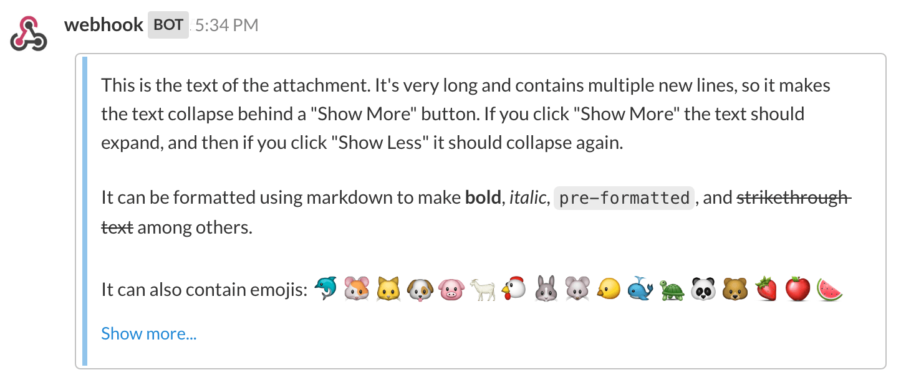
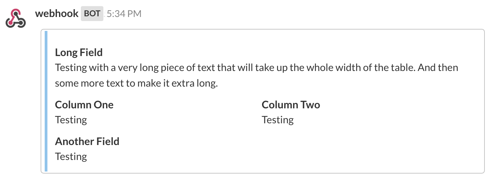
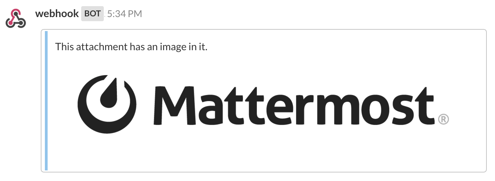
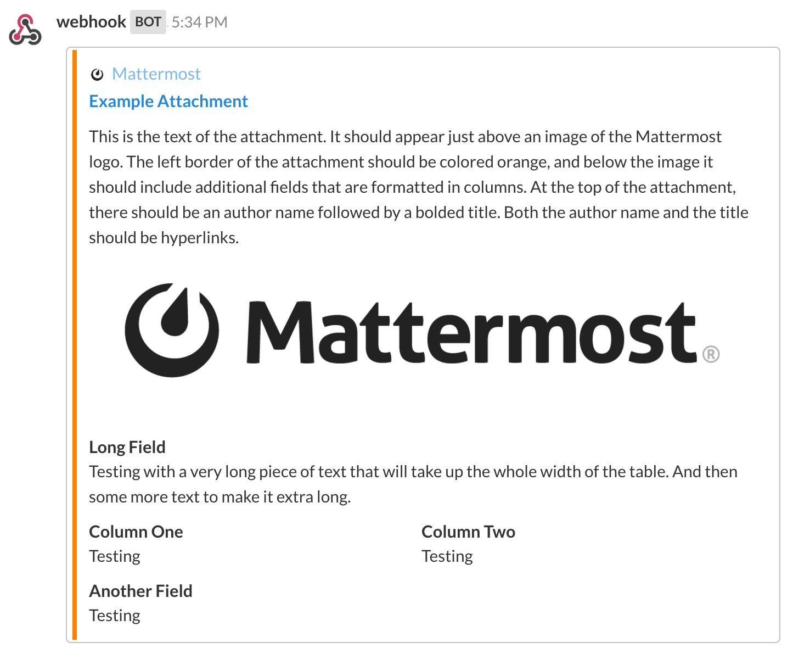

For additional formatting options, and for compatibility with Slack non-markdown integrations, an `attachments` array can be sent by integrations and rendered by Mattermost.

You can also add interactive message buttons as part of attachments. They help make your integrations richer by completing common tasks inside Mattermost conversations, increasing user engagement and productivity. For more information, see [documentation]().

## Attachment options

When sending an attachment, you can use any of the following to format how you want the posted message to look.

`fallback`: A required plain-text summary of the attachment. This is used in notifications, and in clients that don’t support formatted text (e.g. IRC).

`color`: A hex color code that will be used as the left border color for the attachment. If not specified, it will default to match the channel sidebar header background color.


`pretext`: An optional line of text that will be shown above the attachment.


`text`: The text to be included in the attachment. It can be formatted using . For long texts, the message is collapsed and a “Show More” link is added to expand the message.



### Author details

`author_name`: An optional name used to identify the author. It will be included in a small section at the top of the attachment.

`author_link`: An optional URL used to hyperlink the `author_name`. If no `author_name` is specified, this field does nothing.

`author_icon`: An optional URL used to display a 16x16 pixel icon beside the `author_name`.


### Titles

`title`: An optional title displayed below the author information in the attachment.

`title_link`: An optional URL used to hyperlink the `title`. If no `title` is specified, this field does nothing.


### Fields

Fields can be included as an optional array within `attachments`, and are used to display information in a table format inside the attachment.

`title`: A title shown in the table above the `value`.  As of v5.14 a title will render emojis properly.

`value`: The text value of the field. It can be formatted using .

`short`: Optionally set to true or false (boolean) to indicate whether the `value` is short enough to be displayed beside other values.



### Images

`image_url`: An optional URL to an image file (GIF, JPEG, PNG, BMP, or SVG) that is displayed inside a message attachment.

Large images are resized to a maximum width of 400px or a maximum height of 300px, while still maintaining the original aspect ratio.



`thumb_url`: An optional URL to an image file (GIF, JPEG, PNG, BMP, or SVG)  that is displayed as a 75x75 pixel thumbnail on the right side of an attachment. We recommend using an image that is already 75x75 pixels, but larger images will be scaled down with the aspect ratio maintained.


## Example message attachment

Here is an example message attachment:

```json
{
    "attachments": [
        {
            "fallback": "test",
            "color": "#FF8000",
            "pretext": "This is optional pretext that shows above the attachment.",
            "text": "This is the text of the attachment. It should appear just above an image of the Mattermost logo. The left border of the attachment should be colored orange, and below the image it should include additional fields that are formatted in columns. At the top of the attachment, there should be an author name followed by a bolded title. Both the author name and the title should be hyperlinks.",
            "author_name": "Mattermost",
            "author_icon": "https://mattermost.com/wp-content/uploads/2022/02/icon_WS.png",
            "author_link": "https://mattermost.org/",
            "title": "Example Attachment",
            "title_link": "https://developers.mattermost.com/integrate/reference/message-attachments/",
            "fields": [
                {
                    "short":false,
                    "title":"Long Field",
                    "value":"Testing with a very long piece of text that will take up the whole width of the table. And then some more text to make it extra long."
                },
                {
                    "short":true,
                    "title":"Column One",
                    "value":"Testing"
                },
                {
                    "short":true,
                    "title":"Column Two",
                    "value":"Testing"
                },
                {
                    "short":false,
                    "title":"Another Field",
                    "value":"Testing"
                }
            ],
            "image_url": "https://mattermost.com/wp-content/uploads/2022/02/icon_WS.png"
        }
    ]
}
```

And here is how it renders in Mattermost:



### Footer

`footer`: An optional line of text that will be displayed at the bottom of the attachment. Footers with more than 300 characters will be truncated with an ellipsis (``…``).

`footer_icon`: An optional URL to an image file (GIF, JPEG, PNG, BMP, or SVG) that is displayed as a 16x16 pixel thumbnail before the footer text.


## Known issues

1. The footer timestamp field (`ts`) is not yet supported.
2. Message Attachment contents do not show up in search.

## Frequently asked questions

### Can I send a message attachment via the API?

Yes, you can use the .

You need to add an `attachments` key to the post’s `props` JSON field. The value is an array of message attachments you want attached to the post. See below for an example curl command.

`curl -i -X POST -H 'Content-Type: application/json' -d '{"channel_id":"qmd5oqtwoibz8cuzxzg5ekshgr", "message":"Test message #testing", "props":{"attachments": [{"pretext": "This is the attachment pretext.","text": "This is the attachment text."}]}}' https://{your-mattermost-site}/api/v4/posts`

Below is an example HTTP request:

```http request
POST /api/v4/posts HTTP/1.1
Host: {your-mattermost-site}
User-Agent: curl/7.63.0
Accept: */*
Content-Type: application/json
Content-Length: 192

{"channel_id":"qmd5oqtwoibz8cuzxzg5ekshgr", "message":"Test message #testing", "props":{"attachments": [{"pretext": "This is the attachment pretext.","text": "This is the attachment text."}]}}
```

### Can I post a message attachment using a webhook?

Yes, you can also use an [incoming webhook]() to post a message attachment.

You need to add an `attachments` key to the post's JSON. The value is an array of message attachments you want attached to the post. See below for an example curl command.

`curl -i -X POST -H 'Content-Type: application/json' -d '{"text":"Test message #testing", "attachments": [{"pretext": "This is the attachment pretext.","text": "This is the attachment text."}]}' https://{your-mattermost-site}/hooks/{your-webhook-id}`

Below is an example HTTP request:

```http request
POST /hooks/{your-webhook-id} HTTP/1.1
Host: {your-mattermost-site}
User-Agent: curl/7.63.0
Accept: */*
Content-Type: application/json
Content-Length: 192

{"text":"Test message #testing", "attachments": [{"pretext": "This is the attachment pretext.","text": "This is the attachment text."}]}
```
