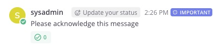

Messages can be sent with a priority level to help users identify the importance of the message. For more information about message priority, see [formatting text](https://docs.mattermost.com/collaborate/message-priority.html).

## Priority options

When sending a message, you can use any of the following to format how you want the posted message to look.

`priority`: A required plain-text summary of the message. This is used in notifications, and in clients that don’t support formatted text (e.g. IRC).

`requested_ack`: If set to `true`, the message will be marked as requiring an acknowledgment from the users by displaying a checkmark icon next to the message. Keep in mind that this requires the message priority to be set to _Important_ or _Urgent_.

`persistent_notifications`: Only for _Urgent_ messages. If set to `true` recipients will receive a persistent notification every five minutes until they acknowledge the message.

## Example of post priority

```json
{
    "priority": {
        "priority": "urgent",
    }
}
```

And this is how it renders on Mattermost:


## Example of post priority with requested acknowledgment

```json
{
    "priority": {
        "priority": "important",
        "requested_ack": true
    }
}
```

And this is how it renders on Mattermost:



## Related documentation

- [Message priority](https://docs.mattermost.com/collaborate/message-priority.html)
- [CreatePost API](https://api.mattermost.com/#operation/CreatePost)
