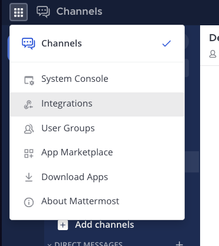
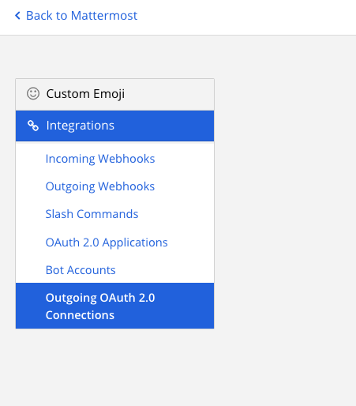
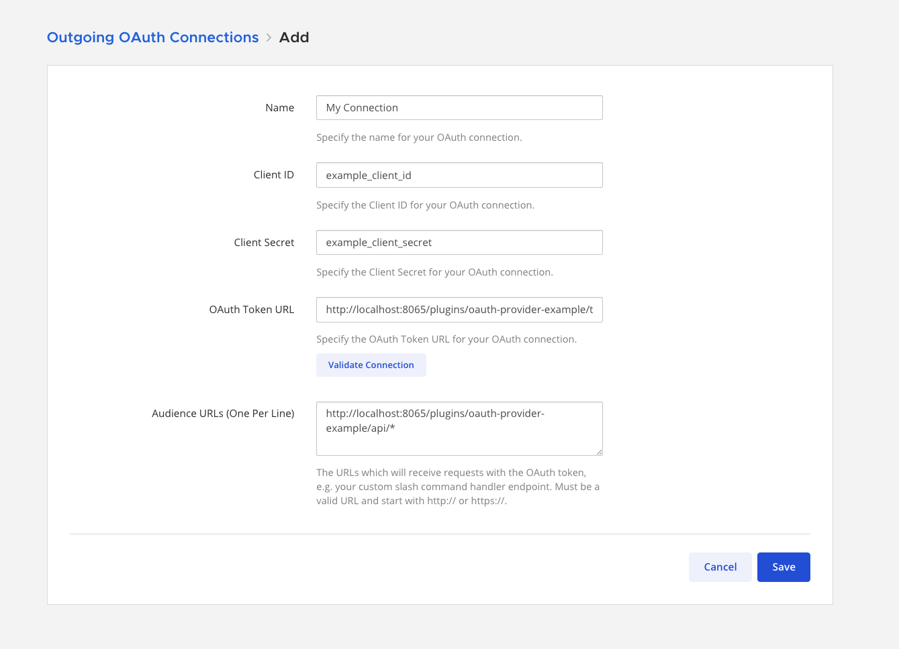
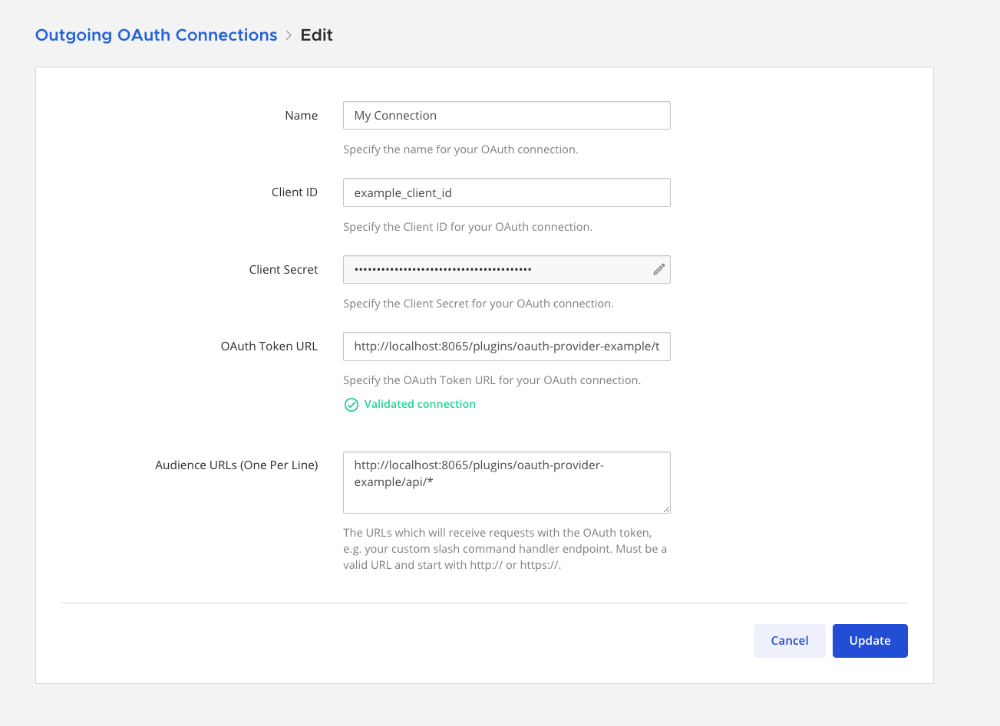
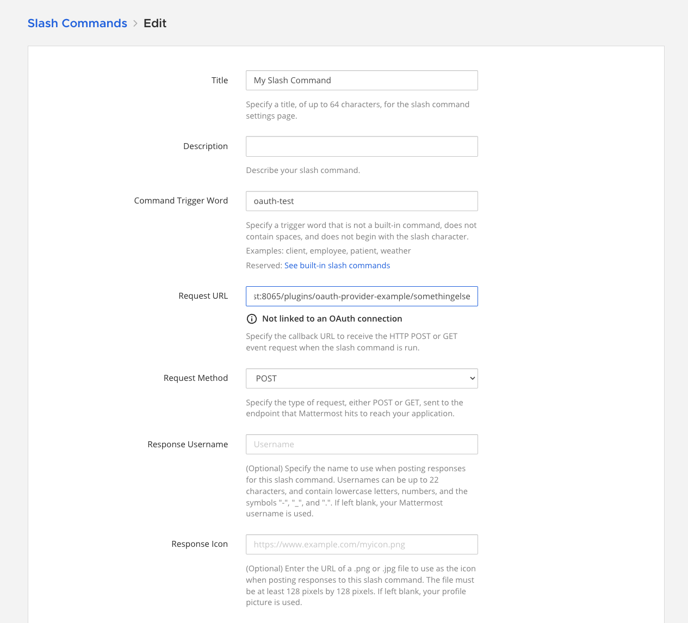
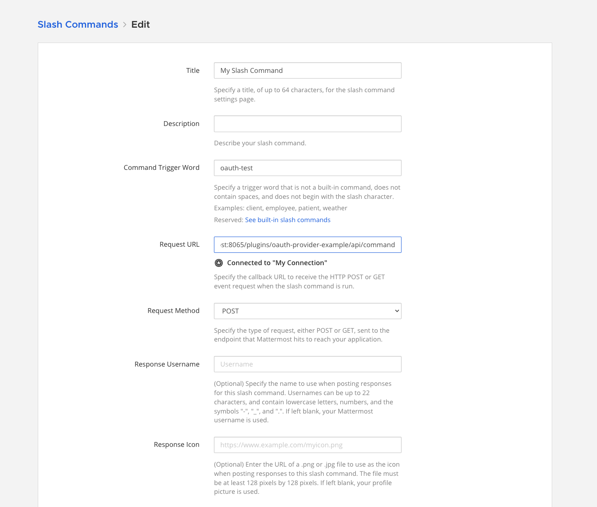

From Mattermost v9.6, you can integrate Mattermost with custom integrations hosted within your internal OAuth infrastructure. More specifically, integrations like [slash commands](https://developers.mattermost.com/integrate/slash-commands/custom), [outgoing webhooks](https://developers.mattermost.com/integrate/webhooks/outgoing), [interactive dialogs](https://developers.mattermost.com/integrate/plugins/interactive-dialogs), and [interactive messages](https://developers.mattermost.com/integrate/plugins/interactive-messages) support communicating via both the [Client Credentials](https://oauth.net/2/grant-types/client-credentials) and [Password](https://oauth.net/2/grant-types/password) OAuth 2.0 grant types.

To configure Mattermost to communicate with your OAuth system, you first need to create an Outgoing OAuth Connection in Mattermost. This involves providing the following values in the connection configuration form:

- `Client Id` & `Client Secret`
- `Token URL` - The URL that Mattermost will contact to retrieve a new token for each request to your integration.
- `Audience URLs` - The URLs that your custom integration hosts to process requests, e.g. slash command submission requests.

Once this is set up, whenever Mattermost sends a request to your custom integration, Mattermost will first fetch an access token from the `Token URL`, and include the access token in the request to your integration. A new token will be requested for every request sent to your integration.

### Configure the Outgoing OAuth Connection

To configure a new outgoing OAuth connection, navigate to your Mattermost server's integrations backstage console, as shown below, then go to the **Outgoing OAuth 2.0 Connections** tab, and select **Add Outgoing OAuth Connection**. If you don't have the **Integrations** option, integrations may not be enabled on your Mattermost Server, or integrations may be disabled for non-admins. Enable integrations by going to **System Console > Integrations > Integration Management** or ask your Mattermost system admin to do so.

Now we can configure our OAuth connection. With the values configured in the example below, Mattermost will perform the following operations when a user interacts with your integration, e.g. when the user submits a slash command associated with your integration.

- Mattermost will request an access token from `Token URL`, by providing the `Client Id` and `Client Secret` via a URL-encoded form submission.
- Mattermost will send a request to your slash command submission handler, with the access token in the request's `Authorization` HTTP header, in the format of `Bearer (token)`.

Any further requests to your integration (such as interactive dialog submissions) will perform the above steps as well.

Notice that the `Audience URL` configured below ends in a wildcard `*`. This means that an access token will be retrieved for any integration request that matches that URL, i.e. any URL that has the prefix of the string leading up to the `*` character. If you would like to restrict the OAuth connection to exact URLs, simply omit the `*`, and supply the exact URLs you would like to configure for your integration. You can come back to this form to update these values at any time. Note that the `Client Secret` will not be shown again when you return to this form.

You can validate that the connection is set up properly by selecting the **Validate Connection** button. This will cause Mattermost to request a token from the `Token URL` using the provided credentials. If a token is retrieved successfully, a **Validated Connection** message will be shown in the UI. If the token retrieval was unsuccessful for any reason, an error will be shown in the UI. Note that validating the connection here is optional, though a warning will be shown upon submitting the form if the connection was not validated before submission.

### Configure a Slash Command to use the Outgoing OAuth Connection

In order to configure your custom Slash Command to use the OAuth connection, we just need to provide a request URL that matches the `Audience URL` provided in the OAuth connection form. If you have at least one OAuth connection configured on your Mattermost instance, you will see a message in the slash command configuration form stating whether or not your slash command will use a configured OAuth connection.

