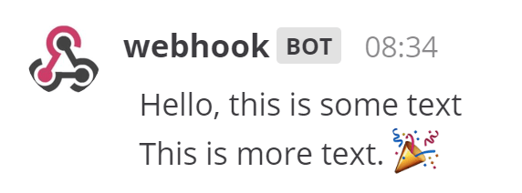

## Create an incoming webhook

Let's learn how to create a simple incoming webhook that posts the following message to Mattermost.



1. In Mattermost, go to **Product menu > Integrations > Incoming Webhook**.
    - If you don't have the **Integrations** option, incoming webhooks may not be enabled on your Mattermost server or may be disabled for non-admins. They can be enabled by a System Admin from **System Console > Integrations > Integration Management**. Once incoming webhooks are enabled, continue with the steps below.
2. Select **Add Incoming Webhook** and add a name and description for the webhook. The description can be up to 500 characters.
3. Select the channel to receive webhook payloads, then select **Add** to create the webhook.

You will end up with a webhook endpoint that looks like so:

```
https://your-mattermost-server.com/hooks/xxx-generatedkey-xxx
```

__Treat this endpoint as a secret.__ Anyone who has it will be able to post messages to your Mattermost instance.

## Use an incoming webhook

To use the endpoint, have your application make the following request:

```http request
POST /hooks/xxx-generatedkey-xxx HTTP/1.1
Host: your-mattermost-server.com
Content-Type: application/json
Content-Length: 63

{
    "text": "Hello, this is some text\nThis is more text. :tada:"
}
```

For example, here is the same request using `cURL`:

```bash
curl -i -X POST -H 'Content-Type: application/json' -d '{"text": "Hello, this is some text\nThis is more text. :tada:"}' https://your-mattermost-server.com/hooks/xxx-generatedkey-xxx
```

For compatibility with Slack incoming webhooks, if no `Content-Type` header is set then the request body must be prefixed with `payload=`, like so:

```
payload={"text": "Hello, this is some text\nThis is more text. :tada:"}
```

A successful request will get the following response:

```
HTTP/1.1 200 OK
Content-Type: text/plain
X-Request-Id: hoan6o9ws7rp5xj7wu9rmysrte
X-Version-Id: 4.7.1.dev.12799cd77e172e8a2eba0f9091ec1471.false
Date: Sun, 04 Mar 2018 17:19:09 GMT
Content-Length: 2

ok
```

All webhook posts will display a `BOT` indicator next to the username in Mattermost clients to help prevent against .


### Parameters

Incoming webhooks support more than just the `text` field. Here is a full list of supported parameters.

| Parameter     | Description                                                                                                                                                                                                                                                                                                                                                                                                                                                                                                                                                                                                                                                                                                                                                                                                                  | Required                         |
|---------------|------------------------------------------------------------------------------------------------------------------------------------------------------------------------------------------------------------------------------------------------------------------------------------------------------------------------------------------------------------------------------------------------------------------------------------------------------------------------------------------------------------------------------------------------------------------------------------------------------------------------------------------------------------------------------------------------------------------------------------------------------------------------------------------------------------------------------|----------------------------------|
| `text`        |  message to display in the post.<br/>To trigger notifications, use `@<username>`, `@channel`, and `@here` like you would in other Mattermost messages.                                                                                                                                                                                                                                                                                                                                                                                                                                                                                                                                                           | If `attachments` is not set, yes |
| `channel`     | Overrides the channel the message posts in. Use the channel's name and not the display name, e.g. use `town-square`, not `Town Square`.<br/>Use an "@" followed by a username to send to a Direct Message.<br/>Defaults to the channel set during webhook creation.<br/>The webhook can post to any Public channel and Private channel the webhook creator is in.<br/>Posts to Direct Messages will appear in the Direct Message between the targeted user and the webhook creator.                                                                                                                                                                                                                                                                                                                                          | No                               |
| `username`    | Overrides the username the message posts as.<br/>Defaults to the username set during webhook creation; if no username was set during creation, `webhook` is used.<br/>The  configuration setting must be enabled for the username override to take effect.                                                                                                                                                                                                                                                                                                                                                                               | No                               |
| `icon_url`    | Overrides the profile picture the message posts with.<br/>Defaults to the URL set during webhook creation; if no icon was set during creation, the standard webhook icon () is displayed.<br/>The  configuration setting must be enabled for the icon override to take effect.                                                                                                                                                                                                                                                                                                    | No                               |
| `icon_emoji`  | Overrides the profile picture and `icon_url` parameter.<br/>Defaults to none and is not set during webhook creation.<br/>The expected value is an emoji name as typed in a message, either with or without colons (`:`).<br/>The  configuration setting must be enabled for the override to take effect..                                                                                                                                                                                                                                                                                                        | No                               |
| `attachments` | [Message attachments]() used for richer formatting options.                                                                                                                                                                                                                                                                                                                                                                                                                                                                                                                                                                                                                                                                                                              | If `text` is not set, yes        |
| `type`        | Sets the post `type`, mainly for use by plugins.<br/>If not blank, must begin with "`custom_`".                                                                                                                                                                                                                                                                                                                                                                                                                                                                                                                                                                                                                                                                                                                              | No                               |
| `props`       | Sets the post `props`, a JSON property bag for storing extra or meta data on the post.<br/>Mainly used by other integrations accessing posts through the REST API.<br/>The following keys are reserved: `from_webhook`, `override_username`, `override_icon_url`, `override_icon_emoji`, `webhook_display_name`, `card`, and `attachments`.<br/>Props `card` allows for extra information (Markdown-formatted text) to be sent to Mattermost that will only be displayed in the RHS panel after a user selects the **info** icon displayed alongside the post.<br/>The **info** icon cannot be customized and is only rendered visible to the user if there is `card` data passed into the message.<br/>This property is available from Mattermost v5.14.<br/>There is currently no Mobile support for `card` functionality. | No                               |

An example request using more parameters would look like this:

```http request
POST /hooks/xxx-generatedkey-xxx HTTP/1.1
Host: your-mattermost-server.com
Content-Type: application/json
Content-Length: 630

{
  "channel": "town-square",
  "username": "test-automation",
  "icon_url": "https://mattermost.com/wp-content/uploads/2022/02/icon.png",
  "text": "#### Test results for July 27th, 2017\n@channel please review failed tests.\n\n| Component  | Tests Run   | Tests Failed                                   |\n|:-----------|:-----------:|:-----------------------------------------------|\n| Server     | 948         | :white_check_mark: 0                           |\n| Web Client | 123         | :warning: 2 [(see details)](https://linktologs) |\n| iOS Client | 78          | :warning: 3 [(see details)](https://linktologs) |"
}
```

This content will be displayed in the Town Square channel:


An example request displaying additional data in the right-hand side panel, by passing Markdown text into the `card` field of the `props` object would look like this:

```http request
POST /hooks/xxx-generatedkey-xxx HTTP/1.1
Host: your-mattermost-server.com
Content-Type: application/json

{
  "channel": "town-square",
  "username": "Winning-bot",
  "text": "#### We won a new deal!",
  "props": {
    "card": "Salesforce Opportunity Information:\n\n [Opportunity Name](https://salesforce.com/OPPORTUNITY_ID)\n\n-Salesperson: **Bob McKnight** \n\n Amount: **$300,020.00**"
  }
}
```

When there is a `props` object with a `card` property attached to the webhook payload, the posted message displays a small info icon next to the timestamp. Clicking this icon expands the right-hand side panel to display the Markdown included in the `card` property:


### Slack compatibility

Mattermost makes it easy to migrate integrations written for Slack to Mattermost. Using the Slack ``icon_emoji`` parameter overrides the profile icon and the `icon_url` parameter and is supported from Mattermost v5.14.

#### Translate Slack's data format to Mattermost

Mattermost automatically translates the data coming from Slack:

1. JSON payloads written for Slack, that contain the following, are translated to Mattermost markdown and rendered equivalently to Slack:

    - `<>` to denote a URL link, such as `{"text": "<https://mattermost.com/>"}`
    - `|` within a `<>` to define linked text, such as `{"text": "Click <https://mattermost.com/|here> for a link."}`
    - `<userid>`  to trigger a mention to a user, such as `{"text": "<5fb5f7iw8tfrfcwssd1xmx3j7y> this is a notification."}`
    - `<!channel>`, `<!here>`, or `<!all>` to trigger a mention to a channel, such as `{"text": "<!channel> this is a notification."}`

2. You can override the channel name with a *@username*, such as `payload={"text": "Hi", channel: "@jim"}` to send a direct message like in Slack.
3. You can prepend a channel name with *#* and the message will still be sent to the correct channel like in Slack.

#### Mattermost webhooks in GitLab using Slack UI

GitLab is the leading open-source alternative to GitHub and offers built-in integrations with Slack. You can use the Slack interface in GitLab to add Mattermost webhooks directly without changing code:

1. In GitLab, go to **Settings > Services** and select **Slack**.
2. Paste the incoming webhook URL provided by Mattermost from **Main Menu > Integrations > Incoming Webhooks**.
3. Optionally set the **Username** you'd like displayed when the notification is made. Leave the **Channel** field blank.
4. Select **Save**, then test the settings to confirm messages are sent successfully to Mattermost.

#### Known Slack compatibility issues

1. Referencing  channels using `<#CHANNEL_ID>` does not link to the channel.
2. `<!everyone>` and `<!group>` are not supported.
3. Parameters "mrkdwn", "parse", and "link_names" are not supported. Mattermost converts Markdown by default and automatically links @mentions.
4. Bold formatting as `*bold*` is not supported (must be done as `**bold**`).
5. Webhooks cannot direct message the user who created the webhook.

### Tips and best practices


1. If the `text` is longer than the allowable character limit per post, the message is split into multiple consecutive posts, each within the character limit. From Mattermost Server v5.0,  .
2. Your webhook integration may be written in any programming language as long as it supports sending an HTTP POST request.
3. Both `application/x-www-form-urlencoded` and `multipart/form-data` are supported `Content-Type` headers. If no `Content-Type` is provided, `application/json` is assumed.
4. To send a message to a direct message channel, add an "@" symbol followed by the username to the channel parameter. You can add your own username to send the webhook posts to a direct message channel with yourself.

    ```
    payload={"channel": "@username", "text": "Hello, this is some text\nThis is more text. :tada:"}
    ```

   This will send a message from the account that has set up the incoming webhook to the username after the "@" symbol. For example, if you create a webhook with the user `alice` and send a direct message to `bob` using a webhook, it will show up as a direct message from `alice` to `bob` regardless of other settings such as username.

   To send a message to a different direct message channel between two other users, you can specify the channel with the user IDs for the users separated with two underscore (_) symbols. To find the user ID you can use .


    ```
    payload={"channel": "6w41z1q367dujfaxr1nrykr5oc__94dzjnkd8igafdraw66syi1cde", "text": "Hello, this is some text\nThis is more text. :tada:"}
    ```

### Troubleshoot incoming webhooks

To debug incoming webhooks in **System Console > Logs**, set **System Console > Logging > Enable Webhook Debugging** to **true**, and set **System Console > Logging > Console Log Level** to **DEBUG**.

Some common error messages include:

1. `Couldn't find the channel`: Indicates that the channel doesn't exist or is invalid. Please modify the ``channel`` parameter before sending another request.
2. `Couldn't find the user`: Indicates that the user doesn't exist or is invalid. Please modify the ``user`` parameter before sending another request.
3. `Unable to parse incoming data`: Indicates that the request received is malformed. Try reviewing that the JSON payload is in a correct format and doesn't have typos such as extra `"`.
4. `curl: (3) [globbing] unmatched close brace/bracket in column N`: Typically an error when using cURL on Windows, when:

    - You have space around JSON separator colons, `payload={"Hello" : "test"}` or
    - You are using single quotes to wrap the `-d` data, `-d 'payload={"Hello":"test"}'`

If your integration prints the JSON payload data instead of rendering the generated message, make sure your integration is returning the `application/json` content-type.

For further assistance, review the  for previously reported errors, or  for troubleshooting help.

